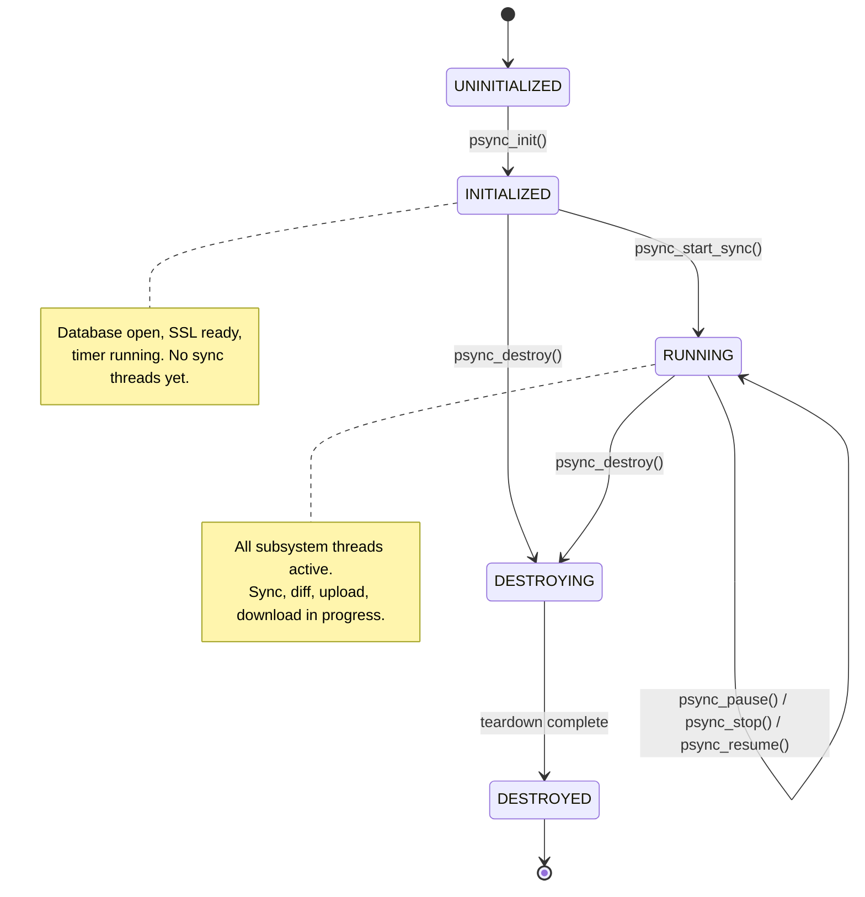
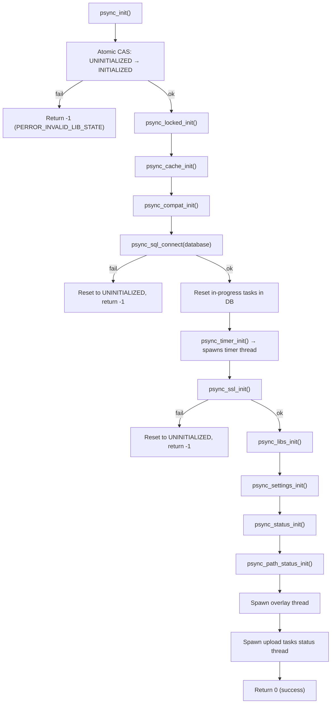
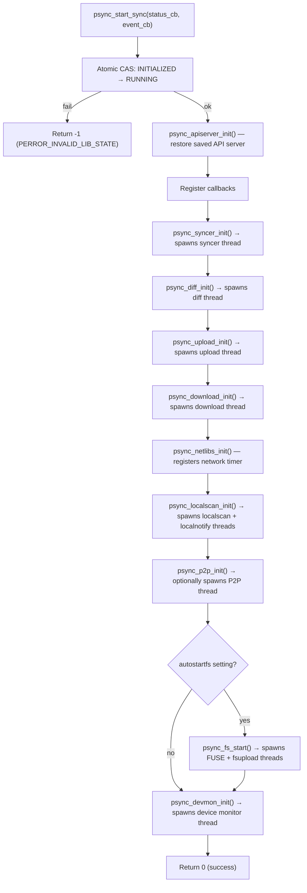
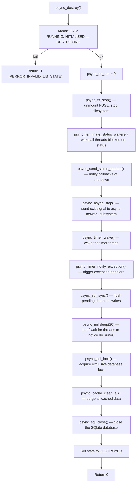

# Library Lifecycle

The pclsync library follows a strict lifecycle governed by atomic state transitions. Understanding this lifecycle is essential for anyone integrating with the library, debugging startup or shutdown issues, or working on the sync engine internals. Every public API call checks the current lifecycle state and will reject operations that are invalid for that state, returning `PERROR_INVALID_LIB_STATE`.

This document covers the full journey from an uninitialized library through initialization, sync startup, runtime operation, and teardown -- including every thread spawned along the way.

## Lifecycle States

The library defines five lifecycle states in `psynclib.h`:

```c
#define PSYNC_LIB_STATE_UNINITIALIZED  0
#define PSYNC_LIB_STATE_INITIALIZED    1
#define PSYNC_LIB_STATE_RUNNING        2
#define PSYNC_LIB_STATE_DESTROYING     3
#define PSYNC_LIB_STATE_DESTROYED      4
```

State transitions are enforced with atomic compare-and-swap operations (`psync_atomic_compare_and_set_uint32`), which makes them thread-safe and ensures only one thread can drive a transition at a time.



**Important:** `psync_pause()`, `psync_stop()`, and `psync_resume()` do NOT change the lifecycle state. They change the internal *run status* (`PSTATUS_RUN_PAUSE`, `PSTATUS_RUN_STOP`, `PSTATUS_RUN_RUN`) which controls whether subsystem threads actively process work, but the library remains in `PSYNC_LIB_STATE_RUNNING`.

## Pre-Initialization Configuration

Several functions must be called BEFORE `psync_init()` if they are used at all:

| Function | Purpose |
|----------|---------|
| `psync_set_database_path()` | Set path to SQLite database file (default: platform-specific) |
| `psync_set_data_directory()` | Set data directory for config, cache, and temp files |
| `psync_set_alloc()` | Replace the default allocator (malloc/realloc/free) |
| `psync_set_software_string()` | Set software name/version sent to the API server |
| `psync_set_os_string()` | Override OS name/version (auto-detected if not set) |

The pointer passed to `psync_set_software_string()` must remain valid for the lifetime of the library -- it does not make a copy. In contrast, `psync_set_database_path()` and `psync_set_data_directory()` make internal copies.

## Phase 1: Initialization (`psync_init`)

```c
int psync_init();  /* Returns 0 on success, -1 on failure */
```

`psync_init()` transitions the library from `UNINITIALIZED` to `INITIALIZED`. It sets up the foundational infrastructure but does NOT start any sync activity. After a successful `psync_init()`, the caller can list remote folders, list/edit syncs, and configure settings -- but no synchronization threads are running yet.

### Initialization Sequence



### What Each Init Function Does

| Call | Source File | Purpose |
|------|-----------|---------|
| `psync_locked_init()` | `pmemlock.c` | Initializes the recursive mutex for the memory-locked page allocator used by crypto |
| `psync_cache_init()` | `pcache.c` | Initializes hash table and mutexes for the general-purpose key-value cache |
| `psync_compat_init()` | `pcompat.c` | Platform setup: raises `RLIMIT_NOFILE` to 2048 (POSIX), ignores `SIGPIPE`, enables core dumps in debug |
| `psync_sql_connect()` | `plibs.c` | Opens the SQLite database with WAL journal, exclusive locking, 4096 page size, cache_size=8000 |
| `psync_timer_init()` | `ptimer.c` | Initializes timer wheel data structures and **spawns the timer thread** |
| `psync_ssl_init()` | SSL backend | Initializes the selected SSL/TLS backend (WolfSSL, OpenSSL, mbedTLS, etc.) |
| `psync_libs_init()` | `pstrings.c` | Populates the filename normalization table (replaces `:`  `/`  `\` with `_`) |
| `psync_settings_init()` | `psettings.c` | Loads settings from the database into memory |
| `psync_status_init()` | `pstatus.c` | Initializes the status subsystem mutexes and condition variables |
| `psync_path_status_init()` | `ppathstatus.c` | Initializes the per-path status tracking system |

After these calls, `psync_init()` also:
- Resets all in-progress tasks and uploads in the database (ensures clean state after a crash)
- Spawns the **overlay main thread** (platform-specific IPC for shell extensions)
- Spawns the **upload tasks status monitor thread** (tracks upload task progress)
- Generates a device ID if none exists in the database
- Initializes the `lost_and_found_fid` to 0

### Failure Modes

`psync_init()` can fail with these error codes (retrievable via `psync_get_last_error()`):

| Error | Cause |
|-------|-------|
| `PERROR_INVALID_LIB_STATE` | Library is not in `UNINITIALIZED` state (double init) |
| `PERROR_NO_HOMEDIR` | No database path set and default path could not be determined |
| `PERROR_DATABASE_OPEN` | SQLite database could not be opened |
| `PERROR_SSL_INIT_FAILED` | SSL backend initialization failed |

On failure, the library resets itself back to `UNINITIALIZED`, so the caller can fix the issue and retry.

## Phase 2: Starting Sync (`psync_start_sync`)

```c
int psync_start_sync(
    pstatus_change_callback_t status_callback,
    pevent_callback_t event_callback
);
```

`psync_start_sync()` transitions from `INITIALIZED` to `RUNNING`. This is where the sync engine comes alive -- it spawns the subsystem threads that perform the actual synchronization work. Both callback parameters may be `NULL`, but setting at least `status_callback` is recommended.

After first run, applications should expect an immediate `status_callback` with `PSTATUS_LOGIN_REQUIRED` until credentials are provided.

### Startup Sequence



### What Each Init Function Does

| Call | Source File | Purpose |
|------|-----------|---------|
| `psync_apiserver_init()` | `psynclib.c` | Restores the previously saved API server address and location ID from settings |
| `psync_syncer_init()` | `psyncer.c` | Loads existing sync folders from DB and **spawns the syncer thread** |
| `psync_diff_init()` | `pdiff.c` | **Spawns the diff thread** which polls the server for remote changes |
| `psync_upload_init()` | `pupload.c` | Registers an exception handler for upload wake and **spawns the upload thread** |
| `psync_download_init()` | `pdownload.c` | Registers an exception handler for download wake and **spawns the download thread** |
| `psync_netlibs_init()` | `pnetlibs.c` | Registers a periodic timer for connection pool management and initializes the API pool semaphore |
| `psync_localscan_init()` | `plocalscan.c` | **Spawns the localscan thread**, then calls `psync_localnotify_init()` which **spawns the localnotify thread** (inotify/kqueue/FSEvents watcher) |
| `psync_p2p_init()` | `pp2p.c` | Generates a random computer name; if the `p2psync` setting is enabled, **spawns the P2P thread** |
| `psync_fs_start()` | `pfs.c` | Only if `autostartfs` is true. Initializes FUSE, **spawns the fuse thread** and the **fsupload thread** (via `psync_fstask_init` and `psync_pagecache_init`) |
| `psync_devmon_init()` | `pdevice_monitor.c` | **Spawns the device monitor thread** (udev on Linux, IOKit on macOS) |

## Thread Map

The following table lists all persistent threads spawned during the library lifecycle. Many additional short-lived threads are spawned on demand (for individual file uploads/downloads, callback dispatch, etc.) but are not listed here.

### Threads Spawned During `psync_init()` (Phase 1)

| Thread Name | Source File | Entry Function | Purpose |
|-------------|-----------|----------------|---------|
| `timer` | `ptimer.c` | `timer_thread` | Fires periodic and one-shot timers, manages `psync_current_time`, drives timed callbacks and exception handlers |
| `Overlay main thread` | `poverlay_lin.c` / `poverlay_mac.c` / `poverlay_win.c` | `overlay_main_loop` | Listens for IPC requests from shell extensions (file status overlay icons) |
| `Upload tasks status monitor thread.` | `psynclib.c` | `upload_tasks_status_thread` | Monitors and reports progress of upload tasks |

### Threads Spawned During `psync_start_sync()` (Phase 2)

| Thread Name | Source File | Entry Function | Purpose |
|-------------|-----------|----------------|---------|
| `syncer` | `psyncer.c` | `psync_syncer_thread` | Orchestrates sync operations, detects conflicts, dispatches sync work for each sync folder |
| `diff` | `pdiff.c` | `psync_diff_thread` | Long-polls the server for remote changes and applies them to the local database |
| `upload main` | `pupload.c` | `upload_thread` | Picks pending upload tasks from the database and spawns per-file upload worker threads |
| `download main` | `pdownload.c` | `download_thread` | Picks pending download tasks from the database and spawns per-file download worker threads |
| `localscan` | `plocalscan.c` | `scanner_thread` | Periodically scans local sync folders for changes not caught by filesystem notifications |
| `localnotify` | `plocalnotify.c` | `psync_localnotify_thread` | Watches local sync folders for real-time changes via inotify (Linux), kqueue (BSD/macOS), FSEvents (macOS), or ReadDirectoryChangesW (Windows) |
| `p2p` | `pp2p.c` | `psync_p2p_thread` | Listens for peer-to-peer transfer requests (only if `p2psync` setting is enabled) |
| `Device monitor main thread` | `pdevice_monitor.c` | `device_monitor_thread` | Monitors USB device connect/disconnect events |

### Threads Spawned Conditionally (FUSE)

These threads are spawned only when the FUSE filesystem is started, either automatically (if `autostartfs` is true during `psync_start_sync`) or manually via `psync_fs_start()`.

| Thread Name | Source File | Entry Function | Purpose |
|-------------|-----------|----------------|---------|
| `fuse` | `pfs.c` | `psync_fuse_thread` | Runs the FUSE event loop, servicing all filesystem requests |
| `fsupload main` | `pfsupload.c` | `psync_fsupload_thread` | Uploads files written through the FUSE filesystem to the cloud |

### On-Demand Threads (Not Exhaustive)

These are spawned dynamically during runtime in response to specific events:

| Thread Name | Source File | Trigger |
|-------------|-----------|---------|
| `upload file` | `pupload.c` | Per-file upload worker |
| `download file` | `pdownload.c` | Per-file download worker |
| `notifications` | `pnotifications.c` | First notification callback registration |
| `extender` | `pfscrypto.c` | Encrypted file on-demand growth |
| `flush pages *` | `ppagecache.c` | Page cache pressure |
| `p2p tcp` | `pp2p.c` | Incoming P2P connection |
| `async transfer` | `pasyncnet.c` | Async network operations |
| `cli IPC listener` | `cli_ipc.c` | CLI mode IPC server |
| `syncer` (per-sync) | `psyncer.c` | `psync_do_sync_thread` per sync folder |
| `status change` / `event` | `pcallbacks.c` | Callback dispatch |

## Global State

The library maintains significant global state, declared primarily in `pcore.h` and `plibs.c`:

| Variable | Type | Purpose |
|----------|------|---------|
| `psync_do_run` | `int` | Master run flag. Set to 0 during `psync_destroy()`. All long-running threads check this in their main loops |
| `psync_diff_run` | `int` | Controls whether the diff thread should continue running |
| `psync_diff_waiting` | `int` | Indicates the diff thread is in a wait state |
| `psync_status` | `pstatus_t` | Current library status (download/upload progress, speed, file counts) |
| `psync_my_auth` | `char[64]` | Current authentication token |
| `psync_my_userid` | `uint64_t` | Current user ID |
| `psync_my_auth_mutex` | `pthread_mutex_t` | Held by writers of `psync_my_auth` (see note below) |
| `psync_error` | `PSYNC_THREAD uint32_t` | Thread-local last error code |
| `psync_flag_online` | `int` | Indicates whether the library is online; tasks are not failed while offline |
| `lost_and_found_fid` | `psync_folderid_t` | Folder ID for the lost-and-found recovery folder |
| `psync_current_time` | (in `ptimer.c`) | Cached UNIX timestamp, updated by the timer thread |

Note that `psync_error` is thread-local (`PSYNC_THREAD`), so each thread has its own last-error value. `psync_my_auth_mutex` is held when **writing** `psync_my_auth` (five sites in `pdiff.c`, `ptools.c`, and `psynclib.c`). Readers across the codebase do not take the lock — torn reads of the 64-byte buffer are tolerated because a bad token causes a server-side rejection followed by reconnection. The mutex historically also guarded the removed `psync_my_user`/`psync_my_pass` heap pointers.

## Phase 3: Runtime

Once in the `RUNNING` state, the library operates autonomously. The sync engine threads continuously:

1. **Diff thread** long-polls the server for remote changes and applies them to the local metadata database
2. **Syncer thread** detects discrepancies between local and remote state and creates upload/download tasks
3. **Localscan thread** periodically scans local folders; **localnotify thread** provides real-time change detection
4. **Upload/download threads** pick tasks from the database and spawn per-file worker threads
5. **Timer thread** drives periodic maintenance (connection pool cleanup, cache flushing, etc.)

### Pause, Stop, and Resume

These functions change the internal run status without affecting the lifecycle state:

```c
int psync_pause();   /* Sets PSTATUS_RUN_PAUSE — threads stay alive but stop processing */
int psync_stop();    /* Sets PSTATUS_RUN_STOP — threads stay alive, sync halted */
int psync_resume();  /* Sets PSTATUS_RUN_RUN — resumes normal operation */
```

All three persist the status to the database via `psync_set_uint_value("runstatus", ...)`. The subsystem threads use `psync_wait_statuses()` to block until the run status allows them to proceed.

## Phase 4: Shutdown (`psync_destroy`)

```c
int psync_destroy();  /* Returns 0 on success, -1 on failure */
```

`psync_destroy()` transitions from either `INITIALIZED` or `RUNNING` to `DESTROYING`, performs teardown, and then sets the state to `DESTROYED`. It is designed to return relatively fast regardless of blocked network calls or slow-to-finish tasks.

### Shutdown Sequence



### How Threads Shut Down

The master run flag `psync_do_run` is the primary shutdown signal. Every long-running thread checks this flag in its main loop:

```
while (psync_do_run) {
    /* ... do work ... */
}
```

When `psync_destroy()` sets `psync_do_run = 0`:
- The **timer thread** exits its loop on the next iteration
- The **diff thread** exits its long-poll loop
- The **upload/download threads** stop picking new tasks
- The **localscan** and **localnotify threads** exit their event loops
- The **syncer thread** stops dispatching sync work
- Status waiters (threads blocked in `psync_wait_statuses()`) are woken via `pthread_cond_broadcast`

The library does NOT `pthread_join()` on its threads. Shutdown is cooperative: threads are signaled and the library proceeds with cleanup after a brief 20ms sleep. This means `psync_destroy()` returns quickly even if some threads have not yet fully exited.

### Calling `psync_destroy()` from `INITIALIZED`

If `psync_start_sync()` was never called, `psync_destroy()` still works. In this case, fewer threads are running (only timer, overlay, and upload status monitor), and FUSE is not mounted. The same shutdown sequence applies.

## FFI Considerations

For integrators consuming pclsync through FFI bindings:

- **Thread safety of state queries:** `psync_get_lib_state()` uses atomic reads and is safe to call from any thread at any time.
- **Thread safety of `psync_get_status()`:** This function copies status under a lock and is safe to call from multiple threads.
- **Callback thread:** Status and event callbacks fire from internal library threads, not the caller's thread. Callback implementations must be thread-safe and handle synchronization appropriately.
- **Single init:** Calling `psync_init()` a second time without a full `psync_destroy()` cycle will fail. The library does not support re-initialization to `UNINITIALIZED` from `DESTROYED`.
- **Error codes:** After any function returns -1, read `psync_get_last_error()` from the SAME thread to get the error code (it is thread-local).
- **Shutdown is non-blocking:** `psync_destroy()` does not guarantee all threads have exited when it returns. If the process is exiting, this is fine. If you need to re-initialize, the library does not currently support that.

## Quick Reference

| Operation | Required State | New State | Key Function |
|-----------|---------------|-----------|-------------|
| Configure paths/allocator | Any (before init) | No change | `psync_set_database_path()`, etc. |
| Initialize | `UNINITIALIZED` | `INITIALIZED` | `psync_init()` |
| Start sync engine | `INITIALIZED` | `RUNNING` | `psync_start_sync()` |
| Pause/stop/resume sync | `RUNNING` | `RUNNING` (status changes) | `psync_pause()`, `psync_stop()`, `psync_resume()` |
| Start FUSE manually | `RUNNING` | `RUNNING` | `psync_fs_start()` |
| Tear down | `INITIALIZED` or `RUNNING` | `DESTROYED` | `psync_destroy()` |
| Query state | Any | No change | `psync_get_lib_state()` |
