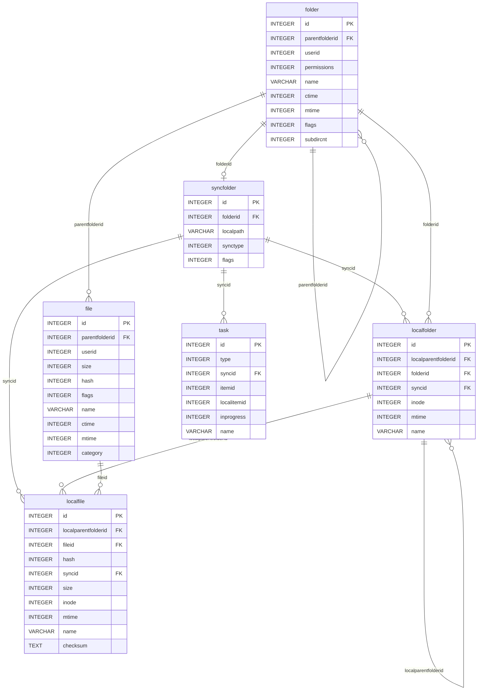

# Database and Storage

pclsync uses a single **SQLite3 database** as its persistent store for all metadata, sync state, cryptographic keys, task queues, settings, and the FUSE page cache index. The database is the library's source of truth for what exists remotely and locally, what has been synced, and what work remains. Every subsystem -- diff processing, local scanning, uploads, downloads, FUSE, and encryption -- reads from and writes to this shared database, coordinated through a custom read-write lock.

## Database Location

The database path is determined during `psync_init()` in `psynclib.c`. The caller may set a custom path before initialization via `psync_set_database_path()` or `psync_set_pcloud_path()`. If neither is called, the library resolves a default:

| Platform | Default path |
|----------|-------------|
| Linux / macOS | `$HOME/.pcloud/data.db` |
| Windows | `%LOCALAPPDATA%\pCloud\pcloud.db` |

The resolution logic lives in `pcompat.c`:

1. `psync_get_default_database_path()` builds the path `<pcloud_dir>/data.db` (the constant `PSYNC_DEFAULT_DB_NAME`).
2. If that file does not exist, it checks for a legacy database at the old location (`$HOME/.pclouddb` on POSIX, `%UserProfile%\pcloud.db` on Windows) and migrates it by renaming.
3. The pCloud directory itself (`$HOME/.pcloud` or `%LOCALAPPDATA%\pCloud`) is created automatically if missing.

The CLI application's `--datadir` flag calls `psync_set_pcloud_path()` to override the base directory, which shifts the database to `<datadir>/data.db`.

## SQLite Pragmas

When the database connection opens in `psync_sql_connect()` (`plibs.c`), the library executes `PSYNC_DATABASE_CONFIG` defined in `pdatabase.h`:

```sql
PRAGMA page_size=4096;
PRAGMA journal_mode=WAL;
PRAGMA synchronous=1;
PRAGMA locking_mode=EXCLUSIVE;
PRAGMA cache_size=8000;
PRAGMA foreign_keys=ON;
```

| Pragma | Value | Rationale |
|--------|-------|-----------|
| `page_size` | 4096 | Matches the filesystem page size and `PSYNC_FS_PAGE_SIZE`; aligns page cache entries with database pages. |
| `journal_mode` | WAL | Write-Ahead Logging allows concurrent readers during writes, critical for the multi-threaded architecture. A WAL checkpoint is triggered automatically when the log reaches `PSYNC_DB_CHECKPOINT_AT_PAGES` (2000 pages). |
| `synchronous` | 1 (NORMAL) | Balances durability and performance. The WAL is synced at checkpoints but not after every commit. |
| `locking_mode` | EXCLUSIVE | The database is held exclusively by the single pclsync process. This avoids repeated lock acquisition overhead and prevents external tools from corrupting state. |
| `cache_size` | 8000 | Approximately 32 MB of in-memory page cache (8000 x 4096 bytes). |
| `foreign_keys` | ON | Enforces referential integrity. Cascading deletes propagate correctly (e.g., deleting a sync folder removes its local entries). |

The WAL checkpoint hook is registered via `sqlite3_wal_hook()` and spawns a background thread (`checkpoint charlie`) when the threshold is reached.

## Schema Overview

All tables are defined in the `PSYNC_DATABASE_STRUCTURE` macro in `pdatabase.h`. The schema is created inside a single transaction when the database file does not yet exist.

### Entity Relationship Diagram



### Complete Table Reference

#### Remote Metadata

These tables mirror the server-side state and are populated by `pdiff.c` from API diff responses.

| Table | Purpose | Key Columns |
|-------|---------|-------------|
| `folder` | Remote folder tree. Seeded with root folder `id=0`. | `id`, `parentfolderid`, `name`, `permissions`, `flags`, `subdircnt` |
| `file` | Remote file metadata including media attributes. | `id`, `parentfolderid`, `name`, `size`, `hash`, `category`, `mtime` |
| `filerevision` | Historical file revisions keyed by (fileid, hash). | `fileid` (FK to `file`), `hash`, `ctime`, `size` |

The `hash` column on `file` is a server-assigned content hash (not a cryptographic hash). It changes whenever the file content changes and is used to detect modifications and match page cache entries.

#### Sync Configuration

| Table | Purpose | Key Columns |
|-------|---------|-------------|
| `syncfolder` | Active sync folder pairs mapping a remote folder to a local path. | `id`, `folderid` (FK to `folder`), `localpath`, `synctype`, `flags` |
| `syncfolderdelayed` | Sync folders pending creation (added via `psync_add_sync_by_path_delayed()`; resolved once the remote folder exists). | `id`, `localpath`, `remotepath`, `synctype` |
| `syncedfolder` | Tracks which remote folders are actively synced under which sync pair. | `syncid` (FK to `syncfolder`), `folderid`, `localfolderid`, `synctype` |

The `synctype` column encodes the sync direction: download-only, upload-only, or bidirectional.

#### Local Metadata

These tables track the state of files and folders on the local filesystem. The local scan and notification subsystems (`plocalscan.c`, `plocalnotify.c`) keep them current.

| Table | Purpose | Key Columns |
|-------|---------|-------------|
| `localfolder` | Local folder tree. Root entry `id=0` is seeded at creation. | `id` (autoincrement), `localparentfolderid` (FK to self), `folderid` (FK to `folder`), `syncid`, `inode`, `mtime`, `name` |
| `localfile` | Local file entries with inode and checksum tracking. | `id` (autoincrement), `localparentfolderid` (FK to `localfolder`), `fileid` (FK to `file`), `hash`, `syncid`, `size`, `inode`, `mtime`, `checksum` |
| `localfileupload` | Links local files to in-progress upload IDs. | `localfileid` (FK to `localfile`), `uploadid` |
| `hashchecksum` | Maps (hash, size) pairs to content checksums; used to skip redundant uploads. | `hash`, `size`, `checksum` |

The relationship between local and remote entries: `localfolder.folderid` references `folder.id`, and `localfile.fileid` references `file.id`. When a sync task completes, both sides are linked. A local file whose `fileid` is NULL has not yet been uploaded; a remote file with no corresponding `localfile` row has not yet been downloaded.

#### Task Queues

| Table | Purpose | Key Columns |
|-------|---------|-------------|
| `task` | Sync tasks: download, upload, rename, delete operations queued by the sync engine. | `id`, `type`, `syncid`, `itemid`, `localitemid`, `newitemid`, `inprogress`, `name` |
| `fstask` | FUSE filesystem tasks: pending operations from the virtual filesystem that have not yet been committed to the server. | `id`, `type`, `status`, `folderid`, `sfolderid`, `fileid`, `text1`, `text2`, `int1`, `int2` |
| `fstaskdepend` | Dependency graph between FUSE tasks (e.g., a file create depends on its parent folder create). | `fstaskid` (FK to `fstask`), `dependfstaskid` (FK to `fstask`) |
| `fstaskupload` | Links FUSE tasks to upload IDs. | `fstaskid` (FK to `fstask`), `uploadid` |
| `fstaskfileid` | Links FUSE tasks to file IDs once assigned by the server. | `fstaskid` (FK to `fstask`), `fileid` |
| `upload_tasks` | Standalone upload task queue (separate from sync-driven uploads). | `id` (autoincrement), `type`, `status`, `level`, `parentfid`, `fname`, `fpath`, `size`, `checksum`, `error_code` |
| `uptask_fileupload` | Links upload tasks to upload IDs. | `localfileid` (FK to `upload_tasks`), `uploadid` |

The `fstask.status` field encodes task lifecycle states:
- `0` -- ready for execution
- `1` -- file is still open, will become 0 on close
- `2` -- large upload task
- `3` -- upload finished but not yet added to cache
- `10` -- "rename from" half of a rename pair
- `11` -- cancelled
- `12` -- new file that is open and marked deleted

#### Page Cache

| Table | Purpose | Key Columns |
|-------|---------|-------------|
| `pagecache` | Index for the on-disk read cache; maps file content pages to positions in the cache file. | `id`, `hash`, `pageid`, `type`, `flags`, `lastuse`, `usecnt`, `size`, `crc` |
| `pagecachetask` | Pending page cache operations (e.g., uploading modified pages). | `id`, `type`, `taskid`, `hash`, `oldhash` |

Page types (defined in `ppagecache.c`):
- `0` (`PAGE_TYPE_FREE`) -- slot available for reuse
- `1` (`PAGE_TYPE_READ`) -- contains valid cached read data
- `2` (`PAGE_TYPE_CACHE`) -- general cache entry

#### Encryption

| Table | Purpose | Key Columns |
|-------|---------|-------------|
| `cryptofolderkey` | Encrypted symmetric keys for crypto folders; decrypted at runtime with the user's RSA private key. | `folderid` (FK to `folder`), `enckey` (BLOB) |
| `cryptofilekey` | Encrypted symmetric keys for individual files. | `fileid` (FK to `file`), `hash`, `enckey` (BLOB) |

Both tables use cascading deletes from their parent `folder`/`file` rows.

#### Sharing and Business Accounts

| Table | Purpose | Key Columns |
|-------|---------|-------------|
| `sharerequest` | Pending share requests (incoming and outgoing). | `id`, `isincoming`, `folderid`, `permissions`, `userid`, `mail` |
| `sharedfolder` | Active shared folders. | `id`, `isincoming`, `folderid`, `permissions`, `userid`, `bsharedfolderid` |
| `bsharedfolder` | Business account shared folders with team/user granularity. | `id`, `isincoming`, `folderid`, `permissions`, `touserid`, `toteamid`, `fromuserid` |
| `baccountemail` | Business account email directory. | `id`, `mail`, `firstname`, `lastname` |
| `baccountteam` | Business account teams. | `id`, `name` |
| `myteams` | Teams the current user belongs to. | `id`, `name` |

#### Other Tables

| Table | Purpose | Key Columns |
|-------|---------|-------------|
| `setting` | Key-value store for all configuration and runtime state. | `id` (VARCHAR PK), `value` (TEXT) |
| `links` | Public and upload links. | `id`, `code`, `fulllink`, `folderid`, `fileid`, `type`, `expire` |
| `contacts` | User's contact list. | `id`, `mail`, `name` |
| `resolver` | DNS resolution cache to avoid repeated lookups. | `hostname`, `port`, `prio`, `data` |
| `fsxattr` | Extended attributes for FUSE filesystem objects. | `objectid`, `name`, `value` (BLOB) |
| `devices` | Connected device registry. | `id`, `type`, `vendor`, `product`, `device_id`, `connected`, `enabled` |

## The `setting` Table

The `setting` table is pclsync's general-purpose key-value store. It holds everything from authentication tokens to diff cursors. Key entries include:

| Key | Type | Description |
|-----|------|-------------|
| `dbversion` | integer | Schema version number (see next section). |
| `auth` | string | Authentication token for the current session. |
| `pass` | string | Stored password (when `saveauth` is enabled). |
| `deviceid` | string | Unique device identifier registered with the server. |
| `userid` | integer | Current user's numeric ID. |
| `username` | string | Current user's email address. |
| `diffid` | integer | Cursor for incremental diff polling; the server returns changes after this ID. |
| `cryptosetup` | integer | Whether client-side encryption has been configured (0 or 1). |
| `cryptoexpires` | integer | Crypto subscription expiry timestamp. |
| `BackupRootFoId` | integer | Root folder ID for backup operations. |

The public API exposes typed accessors for the setting table:

```c
uint64_t psync_get_uint_value(const char *valuename);
void     psync_set_uint_value(const char *valuename, uint64_t value);
char    *psync_get_string_value(const char *valuename);  /* caller must free */
void     psync_set_string_value(const char *valuename, const char *value);
```

Internally, the library also uses a separate **typed settings system** (`psettings.h`) for compile-time-defined settings like `usessl`, `maxdownloadspeed`, `ignorepatterns`, etc. These are accessed via numeric IDs (`psync_settingid_t`) with typed getters/setters:

```c
int         psync_setting_get_bool(psync_settingid_t settingid);
int64_t     psync_setting_get_int(psync_settingid_t settingid);
uint64_t    psync_setting_get_uint(psync_settingid_t settingid);
const char *psync_setting_get_string(psync_settingid_t settingid);
```

## Schema Versioning and Migration

The schema version is stored in the `setting` table under the key `dbversion`. The current version is defined as `PSYNC_DATABASE_VERSION` in `pdatabase.h` (currently **24**).

Migration is handled at connection time in `psync_sql_connect()`:

1. After opening the database and applying pragmas, the function reads the current version: `SELECT value FROM setting WHERE id='dbversion'`.
2. If the stored version is less than `PSYNC_DATABASE_VERSION`, the library iterates through the `psync_db_upgrade[]` array -- a static array of SQL strings indexed by version number.
3. Each upgrade script runs as a transaction that applies schema changes (ALTER TABLE, CREATE TABLE, CREATE INDEX) and updates the `dbversion` value.
4. If any upgrade step fails, `psync_sql_connect()` returns `PERROR_DATABASE_OPEN`.

The upgrade array is zero-indexed: `psync_db_upgrade[0]` is an empty string (version 0 to 1 is handled by the initial schema), `psync_db_upgrade[1]` upgrades from version 1 to 2, and so on. Each entry ends by updating `dbversion` to the new value.

Upgrade scripts are **cumulative and non-destructive** -- they use `CREATE TABLE IF NOT EXISTS` and `ALTER TABLE ADD` to be safe against partial application. Some upgrades reset the `diffid` to 0, forcing a full re-sync of remote metadata after schema changes that affect the folder/file tables.

## How Remote Metadata Is Populated

The diff subsystem (`pdiff.c`) polls the pCloud API with the current `diffid` cursor. The server returns a stream of change entries (folder creates, file modifications, deletes, etc.). The diff processor applies these inside transactions:

- **New folders**: `INSERT OR IGNORE INTO folder` with all columns; parent folder's `subdircnt` is incremented.
- **Modified folders**: `UPDATE folder SET ... WHERE id=?` to update name, parent, permissions, timestamps.
- **Deleted folders**: The folder row is deleted (cascading to `cryptofolderkey`, `syncedfolder`, etc.).
- **New/modified files**: `INSERT OR IGNORE INTO file` or `UPDATE file SET ...` with all columns including media metadata (artist, album, dimensions, duration, codecs).
- **File revisions**: Inserted into `filerevision` with (fileid, hash, ctime, size).
- **Shares**: `REPLACE INTO sharedfolder` / `REPLACE INTO bsharedfolder`.

After processing all entries, the new `diffid` is saved to the `setting` table. This design makes diff processing idempotent -- if the process crashes, it replays from the last committed `diffid`.

## Page Cache

The page cache provides on-disk caching of file content for the FUSE filesystem. It is managed by `ppagecache.c` and consists of two layers:

**In-memory cache**: A pool of `CACHE_PAGES` memory-mapped pages (derived from `PSYNC_FS_MEMORY_CACHE` / `PSYNC_FS_PAGE_SIZE`, default 64 MB / 4096 = 16384 pages). Pages are tracked in a hash table and a free list protected by a mutex.

**On-disk cache**: A flat file (`cached` in the cache directory, path controlled by the `fscachepath` setting) indexed by the `pagecache` table. Each row maps a `(hash, pageid)` pair to a slot in the cache file. The slot's byte offset is `id * PSYNC_FS_PAGE_SIZE`.

### Initialization (`psync_pagecache_init`)

1. Allocates the in-memory page pool via `psync_mmap_anon_safe()`.
2. Ensures the cache directory exists (from the `fscachepath` setting).
3. If the cache file does not exist, clears the `pagecache` table (`DELETE FROM pagecache`).
4. If the cache file does exist, removes any `pagecache` rows with IDs beyond the file's actual size.
5. Pre-allocates free page rows in the database if the cache is below its configured size (`fscachesize` setting, default 5 GB).
6. Opens the cache file, truncates it to match `db_cache_max_page * PSYNC_FS_PAGE_SIZE`.
7. Registers a periodic flush timer (`PSYNC_FS_DISK_FLUSH_SEC` = 20 seconds) to write dirty in-memory pages to disk.

### Cache Lifecycle

- **Read hit**: `SELECT pageid, id FROM pagecache WHERE type=1 AND hash=? AND pageid>=? AND pageid<? ORDER BY pageid` fetches matching pages; the data is read from the cache file at the corresponding offset.
- **Cache miss**: Data is fetched from the API, written to a free in-memory page, and eventually flushed to a free database slot (`UPDATE pagecache SET hash=?, pageid=?, type=1 ...`).
- **Eviction**: When space is needed, pages are evicted based on a combination of `lastuse` timestamp and `usecnt`, with different comparison functions for different eviction tiers.
- **Invalidation**: When a file's hash changes (detected via diff), matching `pagecache` rows are marked `PAGE_TYPE_FREE`.

## SQL Helper API

All SQL operations go through wrapper functions declared in `psql.h` and implemented in `plibs.c`. These functions handle locking, prepared statement caching, error logging, and result iteration.

### Connection Management

```c
int  psync_sql_connect(const char *db);   /* Open database, apply pragmas, run migrations */
int  psync_sql_close();                    /* Close the database connection */
int  psync_sql_reopen(const char *path);   /* Checkpoint and reopen (used for migration) */
```

### Executing Statements

```c
/* Execute raw SQL (acquires write lock internally) */
int psync_sql_statement(const char *sql);

/* Prepare a write statement; returns a result handle for binding and execution.
   The write lock is acquired and held until psync_sql_run_free() or psync_sql_free_result(). */
psync_sql_res *psync_sql_prep_statement(const char *sql);

/* Bind parameters to a prepared statement (1-indexed) */
void psync_sql_bind_uint(psync_sql_res *res, int n, uint64_t val);
void psync_sql_bind_int(psync_sql_res *res, int n, int64_t val);
void psync_sql_bind_double(psync_sql_res *res, int n, double val);
void psync_sql_bind_string(psync_sql_res *res, int n, const char *str);
void psync_sql_bind_lstring(psync_sql_res *res, int n, const char *str, size_t len);
void psync_sql_bind_blob(psync_sql_res *res, int n, const char *str, size_t len);
void psync_sql_bind_null(psync_sql_res *res, int n);

/* Execute and free (common pattern for INSERT/UPDATE/DELETE) */
int psync_sql_run(psync_sql_res *res);       /* Execute; resets for re-binding */
int psync_sql_run_free(psync_sql_res *res);  /* Execute, finalize, and release lock */
```

### Querying Data

```c
/* SELECT with write lock (blocks other writers AND readers) */
psync_sql_res *psync_sql_query(const char *sql);

/* SELECT with read lock (allows concurrent readers) */
psync_sql_res *psync_sql_query_rdlock(const char *sql);

/* SELECT without any lock (caller must hold lock already) */
psync_sql_res *psync_sql_query_nolock(const char *sql);

/* Fetch rows from a query result */
psync_variant_row psync_sql_fetch_row(psync_sql_res *res);   /* Generic variant row */
psync_str_row     psync_sql_fetch_rowstr(psync_sql_res *res); /* All columns as strings */
psync_uint_row    psync_sql_fetch_rowint(psync_sql_res *res); /* All columns as uint64_t */

/* Fetch all results into a flat array */
psync_full_result_int *psync_sql_fetchall_int(psync_sql_res *res);

/* Release the result and its lock */
void psync_sql_free_result(psync_sql_res *res);
void psync_sql_free_result_nocache(psync_sql_res *res);
```

### Convenience Functions

```c
/* Return a single string value (caller must free), or NULL */
char *psync_sql_cellstr(const char *sql);

/* Return a single integer value, or dflt if no rows */
int64_t psync_sql_cellint(const char *sql, int64_t dflt);

/* Return a single row as a string array (caller must free), or NULL */
char **psync_sql_rowstr(const char *sql);

/* Return a single row as a variant array, or NULL */
psync_variant *psync_sql_row(const char *sql);

/* Metadata about the last write operation */
uint32_t psync_sql_affected_rows();
uint64_t psync_sql_insertid();
```

### `_nocache` Variants

Most query and prep_statement functions have `_nocache` counterparts (e.g., `psync_sql_query_nocache`, `psync_sql_prep_statement_nocache`). The default (non-`_nocache`) versions participate in **prepared statement caching**: after a result is freed via `psync_sql_free_result()`, the compiled statement is placed into a time-limited cache (`PSYNC_QUERY_CACHE_SEC` = 600 seconds, up to `PSYNC_QUERY_MAX_CNT` = 8 instances per SQL string). Subsequent calls with the same SQL pointer can reuse the compiled statement, skipping `sqlite3_prepare_v2()`. The `_nocache` variants always finalize the statement immediately.

## Transactions and Locking

### Read-Write Lock

All database access is serialized through a custom read-write lock (`psync_db_lock`, a `psync_rwlock_t` from `plocks.c`). The lock supports:

- **Write lock** (`psync_sql_lock()` / `psync_sql_unlock()`): Exclusive access. Required for INSERT, UPDATE, DELETE, and any DDL. Also acquired by `psync_sql_query()` and `psync_sql_prep_statement()`.
- **Read lock** (`psync_sql_rdlock()` / `psync_sql_rdunlock()`): Shared access for SELECT queries. Multiple threads can hold read locks concurrently. Acquired by `psync_sql_query_rdlock()` and the `cellstr`/`cellint` convenience functions.
- **Lock upgrade** (`psync_sql_tryupgradelock()`): Attempts to upgrade a read lock to a write lock without releasing it.
- **Waiter detection** (`psync_sql_has_waiters()`): Allows long-running read operations to yield if writers are waiting.

In debug builds (`IS_DEBUG`), the lock wrapper tracks which file and line acquired it, logs warnings when locks are held for more than 10 ms (write) or 20 ms (read), and aborts if a lock acquisition times out after `PSYNC_DEBUG_LOCK_TIMEOUT` (45) seconds.

### Explicit Transactions

```c
int  psync_sql_start_transaction();       /* BEGIN; acquires write lock */
int  psync_sql_commit_transaction();      /* COMMIT; releases write lock */
int  psync_sql_rollback_transaction();    /* ROLLBACK; releases write lock */
```

Transactions acquire the write lock at `BEGIN` and hold it until `COMMIT` or `ROLLBACK`. This means the entire transaction runs with exclusive database access. If any statement fails during a transaction, the `transaction_failed` flag is set and `psync_sql_commit_transaction()` automatically rolls back instead of committing.

Transactions support **commit/rollback callbacks** for coordinating side effects:

```c
void psync_sql_transation_add_callbacks(
    psync_transaction_callback_t commit_callback,
    psync_transaction_callback_t rollback_callback,
    void *ptr
);
```

Callbacks are invoked after the transaction completes (commit callbacks on success, rollback callbacks on failure or explicit rollback). This mechanism is used to defer in-memory state updates until the database change is durable.

### Checkpoint Management

WAL checkpointing is managed by a hook registered via `sqlite3_wal_hook()`. When the WAL file grows beyond `PSYNC_DB_CHECKPOINT_AT_PAGES` (2000) pages, a background thread runs `sqlite3_wal_checkpoint()`. A separate mutex (`psync_db_checkpoint_mutex`) serializes checkpoint operations, and `psync_sql_checkpoint_lock()` / `psync_sql_checkpoint_unlock()` are exposed for callers that need to prevent checkpoints during sensitive operations.

## Key Source Files

| File | Role |
|------|------|
| `pdatabase.h` | Schema definition (`PSYNC_DATABASE_STRUCTURE`), pragma config, version constant, upgrade scripts |
| `plibs.c` | Database connection, all SQL helper function implementations, locking, transactions |
| `psql.h` | SQL helper function declarations (the public interface) |
| `pcore.h` | Variant types (`psync_variant`, `psync_variant_row`, etc.) used for query results |
| `psettings.h` | Typed setting IDs and accessors; database path defaults |
| `pcompat.c` | Database path resolution (`psync_get_default_database_path()`) |
| `ppagecache.c` | Page cache initialization, read/write/eviction, flush timer |
| `pdiff.c` | Remote metadata population from API diff responses |
| `plocalscan.c` | Local metadata population from filesystem scanning |
| `psynclib.c` | `psync_init()` orchestration; `psync_get/set_uint/string_value()` |
