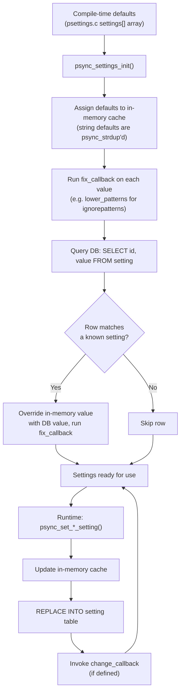

# Settings and Configuration

The pclsync library uses a two-tier configuration system built on top of its SQLite database. A fixed set of **settings** provides typed, cached, in-memory access to commonly used configuration values (SSL mode, speed limits, ignore patterns, etc.), while a more general **values** store offers open-ended key-value persistence for library-populated metadata and application data. Both tiers share the same `setting` table in the database, but they differ in API semantics, memory management, and intended use.

This document covers the settings subsystem in detail: how settings are defined, initialized, read, written, and persisted.

## Settings Lifecycle

The following diagram shows how a setting moves from its compile-time default to an in-memory cached value that the library uses at runtime.



Key points:

- **Defaults are baked into the `settings[]` array** at compile time. String defaults (like `ignorepatterns`) are assigned as literal pointers before initialization.
- **`psync_settings_init()`** is called once during `psync_init()`, after the database is opened by `psync_libs_init()` but before any sync activity starts.
- **Database values override defaults.** Each row in the `setting` table whose `id` column matches a known setting name replaces the in-memory default.
- **Setters persist immediately.** Every call to `psync_set_*_setting()` writes through to the database with `REPLACE INTO`, so settings survive restarts.
- **`psync_settings_reset()`** restores all settings to their compile-time defaults, re-running `fix_callback` on each. It is called during `psync_unlink()` (account unlink).

## Storage: The `setting` Table

All settings and values share a single SQLite table:

```sql
CREATE TABLE IF NOT EXISTS setting (
  id    TEXT PRIMARY KEY,
  value TEXT
);
```

The `id` column stores the setting name as a string (e.g., `"usessl"`, `"maxdownloadspeed"`). The `value` column stores the value as text; numeric and boolean values are stored as their decimal string representation.

Because SQLite stores everything as text, the typed interpretation happens entirely in the C layer. The `settings[]` array knows each setting's type and parses accordingly during initialization (via `atoll()` for numbers, truthiness check for booleans).

## The `settings[]` Array

The core data structure is a static array of `psync_setting_t` in `psettings.c`:

```c
typedef struct {
  const char *name;
  setting_callback change_callback;
  filter_callback fix_callback;
  union {
    int64_t snum;
    uint64_t num;
    char *str;
    int boolean;
  };
  psync_uint_t type;
} psync_setting_t;
```

Each entry defines:

| Field | Purpose |
|-------|---------|
| `name` | The string key used in the database `id` column and in the public API |
| `change_callback` | Function called after the value is changed at runtime (may be `NULL`) |
| `fix_callback` | Function called on the raw value during init and on set, used for normalization (may be `NULL`) |
| union | The cached in-memory value, interpreted according to `type` |
| `type` | One of `PSYNC_TBOOL` (5), `PSYNC_TNUMBER` (1), or `PSYNC_TSTRING` (2) |

Settings are addressed by compile-time integer indices defined in `psettings.h` using the `PSYNC_SETTING_*` constants and the `_PS()` macro:

```c
#define _PS(s) PSYNC_SETTING_##s

#define PSYNC_SETTING_usessl            0
#define PSYNC_SETTING_maxdownloadspeed  2
// ... etc.
```

Internal code accesses settings by index for efficiency (e.g., `psync_setting_get_bool(_PS(usessl))`), while the public API resolves names to indices via `psync_setting_getid()`, which performs a linear scan of the array.

## Complete Settings Reference

The table below lists every setting in the `settings[]` array, in index order.

| Index | Name | Type | Default | Change Callback | Fix Callback | Description |
|-------|------|------|---------|-----------------|--------------|-------------|
| 0 | `usessl` | bool | `1` (true) | `psync_timer_do_notify_exception` | -- | Use SSL/TLS for API connections. Toggling triggers a connection reset via the timer exception mechanism. |
| 1 | `saveauth` | bool | `1` (true) | -- | -- | Whether to persist the user's auth token in the database. When false, credentials are held only in memory. |
| 2 | `maxdownloadspeed` | number (signed) | `-1` | -- | -- | Maximum download speed in bytes/sec. `-1` = no limit, `0` = auto-shaper. |
| 3 | `maxuploadspeed` | number (signed) | `-1` | -- | -- | Maximum upload speed in bytes/sec. `-1` = no limit, `0` = auto-shaper. |
| 4 | `ignorepatterns` | string | *(see below)* | -- | `lower_patterns` | Semicolon-separated glob patterns for files/folders to exclude from sync. Normalized to lowercase on load and set. |
| 5 | `minlocalfreespace` | number (unsigned) | `2147483648` (2 GB) | -- | -- | Minimum free space in bytes that must remain on local disk. Downloads are paused when free space drops below this threshold. |
| 6 | `p2psync` | bool | `0` (false) | `psync_p2p_change` | -- | Enable peer-to-peer sync for LAN transfers. Toggling starts/stops the P2P subsystem. |
| 7 | `fsroot` | string | `$HOME/pCloudDrive` | `fsroot_change` (calls `psync_fs_remount`) | -- | FUSE filesystem mount point. Changing at runtime triggers a remount. On macOS the default is `$HOME/pCloud Drive` (with space). |
| 8 | `autostartfs` | bool | `1` (true) | -- | -- | Automatically mount the FUSE filesystem when the library starts. |
| 9 | `fscachesize` | number (unsigned) | `5368709120` (5 GB) | `psync_pagecache_resize_cache` | -- | Size of the on-disk page cache in bytes. Changing at runtime triggers a cache resize. |
| 10 | `fscachepath` | string | `$PCLOUD_DIR/Cache` | -- | -- | Directory path for the on-disk page cache. |
| 11 | `sleepstopcrypto` | bool | `0` (false) | -- | -- | If true, the crypto subsystem is stopped when the computer wakes from sleep, requiring the user to re-enter their passphrase. |
| 12 | `companyname` | string | `"Not set"` | -- | -- | Business account: company name. |
| 13 | `owneruserid` | number (unsigned) | `0` | -- | -- | Business account: owner user ID. |
| 14 | `ownerfirstname` | string | `"Not set"` | -- | -- | Business account: owner first name. |
| 15 | `ownerlastname` | string | `"Not set"` | -- | -- | Business account: owner last name. |
| 16 | `owneremail` | string | `"Not set"` | -- | -- | Business account: owner email address. |
| 17 | `owner_cryptosetup` | bool | `0` (false) | -- | -- | Business account: whether the owner has crypto set up. |
| 18 | `cryptov2isactive` | bool | `0` (false) | -- | -- | Whether crypto v2 is active for this account. |
| 19 | `hasactivesubscription` | bool | `0` (false) | -- | -- | Whether the user has an active paid subscription. |
| 20 | `api_server` | string | `"bineapi.pcloud.com"` | -- | -- | Binary API server hostname. Set via `psync_set_apiserver()`. |
| 21 | `location_id` | number (unsigned) | `2` | -- | -- | Data center location ID. Used together with `api_server` for region selection. |
| 22 | `ignorepaths` | string | *(platform-specific, see below)* | `psync_wake_localscan` | -- | Semicolon-separated list of absolute directory paths to exclude from sync. Changing triggers a local rescan. |

## Settings API

### Settings Functions (Typed, Cached)

The public API in `psynclib.h` provides name-based wrappers that resolve the setting name to an index and then delegate to the typed internal functions:

```c
// Boolean settings
int      psync_get_bool_setting(const char *settingname);
int      psync_set_bool_setting(const char *settingname, int value);

// Signed integer settings (interchangeable with uint for PSYNC_TNUMBER)
int64_t  psync_get_int_setting(const char *settingname);
int      psync_set_int_setting(const char *settingname, int64_t value);

// Unsigned integer settings
uint64_t psync_get_uint_setting(const char *settingname);
int      psync_set_uint_setting(const char *settingname, uint64_t value);

// String settings
const char *psync_get_string_setting(const char *settingname);
int         psync_set_string_setting(const char *settingname, const char *value);

// Reset to default (only ignorepatterns and ignorepaths supported)
int psync_reset_setting(const char *settingname);
```

**Return values:**

- Getters return the cached value directly from the `settings[]` array (no DB query).
- `psync_get_string_setting()` returns an empty string `""` on failure (invalid name or type mismatch). The returned pointer must **not** be freed; it points into the settings cache. If you need to store it, call `strdup()`.
- `psync_get_bool_setting()` and `psync_get_uint_setting()` / `psync_get_int_setting()` return `0` on failure.
- All setters return `0` on success, `-1` on failure (invalid name or type mismatch).
- `int` and `uint` are interchangeable types for `PSYNC_TNUMBER` settings.

**Setter behavior:**

1. Validate the setting index and type.
2. Run the `fix_callback` (if any) on the new value.
3. Update the in-memory cache.
4. Persist to the database with `REPLACE INTO setting (id, value) VALUES (?, ?)`.
5. Invoke the `change_callback` (if any).

For string settings, the old string pointer is freed after a 600-second delay via `psync_free_after_sec()`. This deferred free ensures that any code holding a pointer to the previous value (obtained from `psync_get_string_setting()`) has time to finish using it before the memory is reclaimed.

### Values Functions (Untyped, DB-Direct)

A separate "values" API operates directly on the `setting` table without the in-memory cache:

```c
int      psync_has_value(const char *valuename);
int      psync_get_bool_value(const char *valuename);
void     psync_set_bool_value(const char *valuename, int value);
int64_t  psync_get_int_value(const char *valuename);
void     psync_set_int_value(const char *valuename, int64_t value);
uint64_t psync_get_uint_value(const char *valuename);
void     psync_set_uint_value(const char *valuename, uint64_t value);
char    *psync_get_string_value(const char *valuename);
void     psync_set_string_value(const char *valuename, const char *value);
```

Key differences from the settings API:

| Aspect | Settings (`*_setting`) | Values (`*_value`) |
|--------|------------------------|--------------------|
| Reads | From in-memory cache (no DB hit) | Direct SQL query each time |
| Type safety | Enforced; type mismatch returns error | No enforcement; values are cast |
| Known keys | Fixed set defined in `settings[]` | Any arbitrary key string |
| String memory | Caller must **not** free the returned pointer | Caller **must** free the returned pointer (allocated with `psync_malloc`) |
| String on missing key | Returns `""` | Returns `NULL` |
| Setters return | `int` (0 or -1) | `void` |
| Change callbacks | Supported | None |

Library-populated values include `auth`, `userid`, `username`, `quota`, `usedquota`, `runstatus`, `diffid`, `premium`, and others. See the `psynclib.h` header for the full list.

## Ignore Patterns

The `ignorepatterns` setting holds semicolon-separated glob patterns that determine which files and folders are excluded from synchronization. The matching is case-insensitive: patterns are lowercased by the `lower_patterns` fix callback on load and set, and filenames are lowercased before comparison.

### Default Ignore Patterns

```
.DS_Store;.DS_Store?;.AppleDouble;._*;.Spotlight-V100;
.DocumentRevisions-V100;.TemporaryItems;.Trashes;.fseventsd;
.~lock.*;ehThumbs.db;Thumbs.db;hiberfil.sys;pagefile.sys;
$RECYCLE.BIN;*.part;.pcloud;
```

### Pattern Syntax

Patterns support two wildcards:

| Wildcard | Meaning |
|----------|---------|
| `*` | Matches any number of characters, including zero |
| `?` | Matches exactly one character |

Patterns are matched against file and folder **names only** (not full paths). Matching is performed by `psync_match_pattern()` which is called from `psync_is_lname_to_ignore()` in `psynclib.c`.

### How Patterns Are Applied

When the sync engine encounters a file or folder, it calls `psync_is_name_to_ignore()`, which:

1. Converts the name to lowercase (using a stack buffer for names under 120 bytes, heap-allocated otherwise).
2. Reads the current `ignorepatterns` string from the settings cache.
3. Splits by semicolons, trims whitespace from each segment.
4. Calls `psync_match_pattern()` for each pattern against the lowercased name.
5. Returns `1` (ignore) on the first match, `0` if no pattern matches.

### Resetting Patterns

Call `psync_reset_setting("ignorepatterns")` to restore the default pattern list. This is one of only two settings that support `psync_reset_setting()` (the other being `ignorepaths`).

## Ignore Paths

The `ignorepaths` setting holds semicolon-separated absolute directory paths that are excluded from local scanning. Unlike `ignorepatterns` (which matches names), `ignorepaths` matches by filesystem identity (device ID + inode number), so it works correctly even if the directory is accessed through a symlink.

### Default Ignore Paths (Platform-Specific)

**Linux:**
```
/Applications;/Library;/private;/System;/bin;/dev;/etc;/net;/sbin;/usr;/Developer;
```

**macOS:**
```
/Applications;/Library;/private;/System;/bin;/etc;/sbin;/usr;
```

**Windows:**
```
C:\$Recycle.Bin;C:\$WinREAgent;C:\Windows;C:\Program Files;C:\Program Files (x86);
```

### Path Evaluation

The `reload_ignored_folders()` function in `plocalscan.c` processes the paths:

1. Splits the `ignorepaths` string by semicolons and newlines.
2. Trims whitespace from each entry.
3. Expands entries starting with `$HOME` to the user's home directory.
4. Calls `stat()` on each path and records the device ID and inode number.
5. During scanning, directories are compared by device+inode rather than string path.

The path list is checksummed with SHA-256. Re-evaluation is skipped if the checksum has not changed and less than one hour has elapsed since the last check. Changing the `ignorepaths` setting invokes `psync_wake_localscan()` as its change callback, prompting an immediate rescan.

## Speed Limits

Download and upload speed limits are controlled by two settings:

| Setting | Type | Default | Meaning |
|---------|------|---------|---------|
| `maxdownloadspeed` | signed number | `-1` | Max download bytes/sec |
| `maxuploadspeed` | signed number | `-1` | Max upload bytes/sec |

Three modes are supported based on the value:

| Value | Mode | Behavior |
|-------|------|----------|
| `-1` | Unlimited | No throttling applied |
| `0` | Auto-shaper | Dynamically adjusts speed to avoid saturating the connection |
| `> 0` | Fixed limit | Hard cap at the specified bytes per second |

The auto-shaper for uploads starts at `PSYNC_UPL_AUTO_SHAPER_INITIAL` (100 KB) and adjusts incrementally: increasing by 5% when conditions are good, decreasing by 5% when latency is detected, with a floor of `PSYNC_UPL_AUTO_SHAPER_MIN` (10 KB). These constants are defined in `psettings.h`.

The shaped receive buffer size is `PSYNC_RECV_BUFFER_SHAPED` (128 KB) when shaping is active, versus `PSYNC_MAX_SPEED_RECV_BUFFER` (1 MB) when running at full speed.

Example usage:

```c
// Set upload limit to 500 KB/s
psync_set_int_setting("maxuploadspeed", 500 * 1024);

// Enable auto-shaper for downloads
psync_set_int_setting("maxdownloadspeed", 0);

// Remove all limits
psync_set_int_setting("maxdownloadspeed", -1);
psync_set_int_setting("maxuploadspeed", -1);
```

## API Server and Location Configuration

The library connects to a pCloud binary API server determined by two settings:

| Setting | Default | Purpose |
|---------|---------|---------|
| `api_server` | `"bineapi.pcloud.com"` | Hostname for the binary API endpoint |
| `location_id` | `2` | Numeric data center region identifier |

These are typically set together via the convenience function:

```c
void psync_set_apiserver(const char *binapi, uint32_t locationid);
```

This function updates both settings and calls `psync_apipool_set_server()` to reconfigure the connection pool immediately. On startup, `psync_apiserver_init()` reads the saved values (if `saveauth` is true) and restores the server configuration.

Additional compile-time API host constants in `psettings.h`:

| Constant | Value | Purpose |
|----------|-------|---------|
| `PSYNC_API_HOST` | `"bineapi.pcloud.com"` | Default binary API host (EU) |
| `PSYNC_API_HOST_US` | `"binapi.pcloud.com"` | US region binary API host |
| `PSYNC_API_AHOST_US` | `"api.pcloud.com"` | US region HTTP API host |
| `PSYNC_API_PORT` | `80` | Plaintext port |
| `PSYNC_API_PORT_SSL` | `443` | TLS port |

The port used at runtime depends on the `usessl` setting: port 443 when SSL is enabled (the default), port 80 otherwise.

## In-Memory Cache vs. Database Persistence

The settings system maintains two representations of each value, and understanding the relationship between them is important for correctness:

**In-memory cache** (the `settings[]` array):
- Populated once during `psync_settings_init()`.
- Updated in place by every setter call.
- All getter calls read from here with no database access.
- Provides the fastest possible read path -- just an array index lookup.
- Not protected by locks. The settings are assumed to be read/written from coordinated contexts. String values use deferred freeing (600-second delay) to prevent use-after-free.

**Database (`setting` table):**
- Written to on every setter call via `REPLACE INTO`.
- Read only once, during `psync_settings_init()`.
- Provides persistence across restarts.
- Shares the table with the values API, which reads/writes directly without caching.

The consequence is that **settings getters are essentially free** (a bounds check and array access), while **values getters issue a SQL query on each call**. For hot paths, prefer the settings API when possible.

## Relevant Source Files

| File | Role |
|------|------|
| `psettings.h` | Setting name constants (`PSYNC_SETTING_*`), compile-time defaults, the `_PS()` macro |
| `psettings.c` | The `settings[]` array, `psync_settings_init()`, `psync_settings_reset()`, typed getters/setters with DB persistence |
| `psynclib.h` | Public API declarations for both settings and values functions |
| `psynclib.c` | Public name-based wrappers (`psync_get_*_setting`, `psync_set_*_setting`), values API implementation, ignore-pattern matching (`psync_is_lname_to_ignore`) |
| `plocalscan.c` | Ignore-path evaluation (`reload_ignored_folders`, `add_ignored_dir`) |
