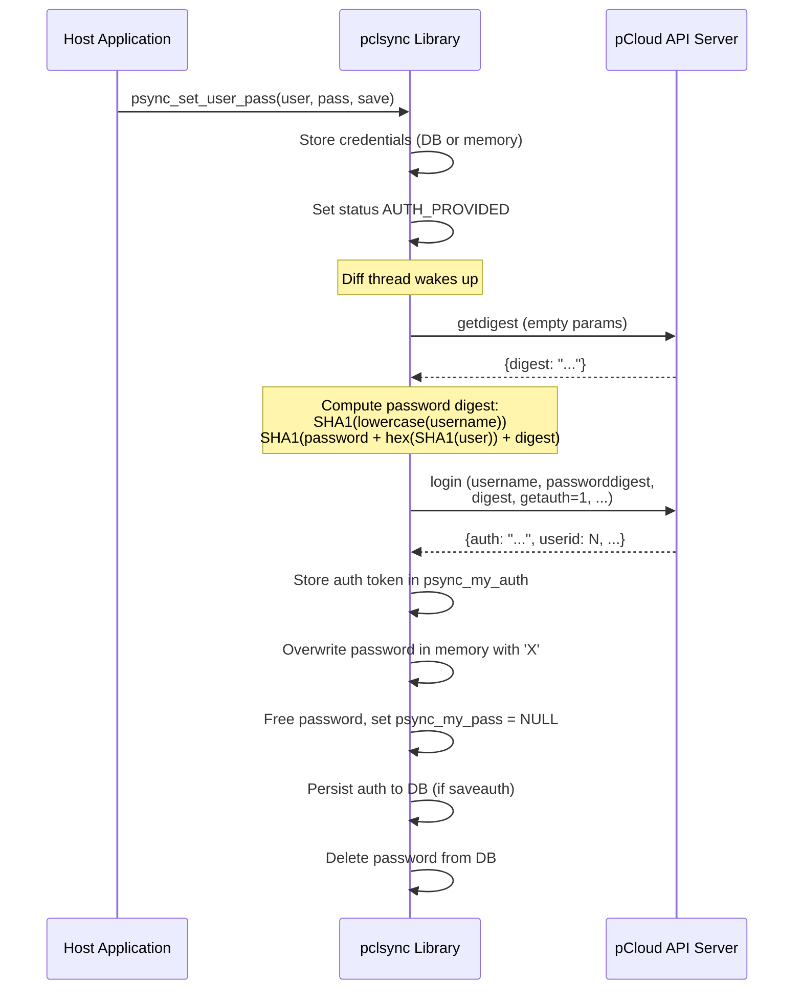
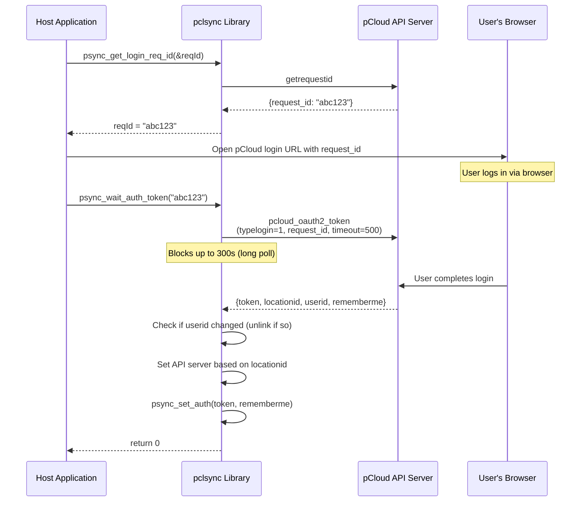
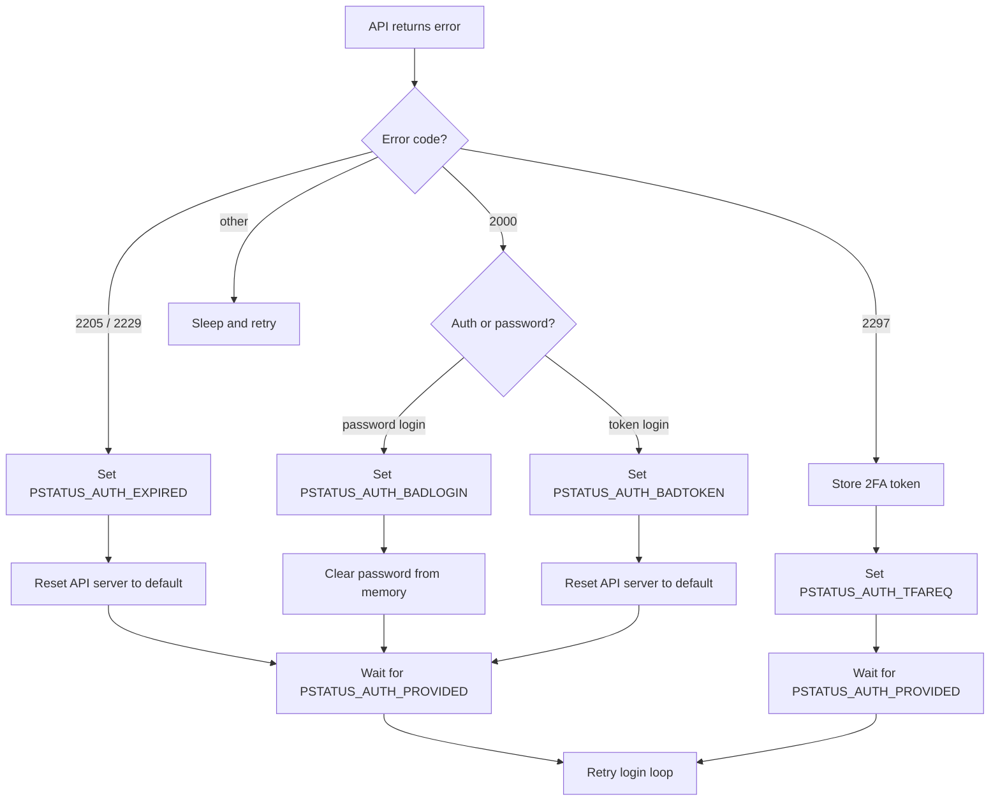

# Authentication

The pclsync library supports multiple authentication methods: credential-based login with username and password, token-based session resumption, and web-based OAuth2 login. All methods ultimately produce a 64-byte auth token that the library uses for every subsequent API call. Two-factor authentication (2FA) is integrated into the login flow and is handled transparently through status transitions that the host application observes and responds to.

Authentication is managed primarily by the diff thread (`pdiff.c`), which runs the login loop in `get_connected_socket()` and retries authentication until it succeeds. The public API in `psynclib.h` provides functions for the host application to supply credentials, set auth tokens, handle 2FA challenges, and terminate sessions.

## Credential-Based Login

### Overview

Credential-based login converts a username/password pair into an API auth token through a challenge-response protocol that avoids sending the raw password over the wire.

### Public API

```c
void psync_set_user_pass(const char *username, const char *password, int save);
void psync_set_pass(const char *password, int save);
```

The `save` parameter controls whether credentials are persisted to the database or held only in memory. See the [saveauth mechanism](#the-saveauth-mechanism) section for details.

### Login Flow



### Digest Authentication Details

The library uses a two-step challenge-response process implemented in `get_userinfo_user_pass()` in `pdiff.c`:

1. **Fetch digest:** The library sends a `getdigest` command to the API, which returns a one-time `digest` string.
2. **Compute password digest:** The password is combined with the SHA-1 of the lowercased username and the server-provided digest, then hashed:
   - `user_sha1 = SHA1(lowercase(username))`
   - `password_digest = SHA1(password || hex(user_sha1) || digest)`
3. **Send login:** The `login` command is sent with the `username`, `passworddigest`, and `digest` fields. The server can reproduce the same computation and verify the password without ever receiving it in plaintext.

If the server returns error code `2237` (digest not supported), the library falls back to sending credentials via the plain `login` command with the `password` field directly. This fallback uses a `digest` flag that is reset per-attempt in the login loop.

### Token-Based Login

When the library already has an auth token (either from a previous session via `saveauth`, or set directly via `psync_set_auth()`), it skips the password-based flow and sends the `userinfo` command with the token:

```c
void psync_set_auth(const char *auth, int save);
```

```c
// In get_connected_socket():
binparam params[] = {
    P_STR("auth", auth),
    P_STR("osversion", osversion),
    // ... device info, getauth=1, etc.
};
res = send_command(sock, "userinfo", params);
```

A successful `userinfo` response returns a fresh auth token, which the library stores as the new session token. This means auth tokens are effectively rotated on every login.

## Web-Based Login (OAuth2)

### Overview

Web-based login allows the host application to authenticate the user through a browser, avoiding the need to handle passwords directly. The flow uses a request ID that the browser presents to the pCloud web login page, then the library long-polls until the user completes authentication.

### Public API

```c
int psync_get_login_req_id(char **reqId);
int psync_wait_auth_token(char *request_id);
int psync_wait_auth_token_async(char *request_id, void *callb_ptr);
```

All three functions return `0` on success and a nonzero error code on failure.

### Flow



### Step-by-Step Details

1. **Get request ID:** `psync_get_login_req_id()` delegates to `get_login_req_id()` in `ptools.c`, which calls the `getrequestid` API endpoint. The returned `request_id` string is allocated with `psync_strdup()` and must be freed by the caller.

2. **Open browser:** The host application constructs a login URL containing the request ID and opens it in a browser. This step is entirely the application's responsibility.

3. **Wait for token:** `psync_wait_auth_token()` delegates to `wait_auth_token()` in `ptools.c`, which calls the `pcloud_oauth2_token` endpoint with:
   - `typelogin = 1` (fixed identifier)
   - `request_id` (from step 1)
   - `timeout = 500` (server-side timeout hint)

   The library sets a socket read timeout of 300 seconds (`PSYNC_SOCK_READ_TIMEOUT_300`) to accommodate the long poll.

4. **Process response:** On success, the library extracts:
   - `token` -- the auth token string
   - `locationid` -- the user's data center (1 = US, 2 or 0 = EU)
   - `userid` -- the numeric user ID
   - `rememberme` -- boolean indicating whether to persist the token

5. **User change detection:** If a different user was previously logged in (detected by comparing `userid` against the stored value), the library calls `psync_unlink()` to fully reset the local state before proceeding.

6. **Finalize:** The library calls `psync_set_auth(token, rememberme)`, which stores the token and sets `PSTATUS_AUTH_PROVIDED`, waking the diff thread for a normal login cycle.

### Async Variant

`psync_wait_auth_token_async()` spawns a background thread that calls `wait_auth_token()` and then invokes the provided callback:

```c
typedef void (*wait_login_async_cb)(int result);
```

The callback receives the integer result code from `wait_auth_token()`. The `callb_ptr` parameter is cast to `wait_login_async_cb` internally. The background thread frees the `wait_token_cb_struct` before invoking the callback.

## Auth Token Storage

### In-Memory Storage

The auth token is stored in a global, fixed-size character array:

```c
char psync_my_auth[64];
```

This array is declared in `pcore.h` and is the primary source of the token for all API calls throughout the library. Every command that requires authentication references `psync_my_auth` directly in its `binparam` array.

### Database Storage

When `saveauth` is enabled, the token is persisted to the `setting` table:

```sql
REPLACE INTO setting (id, value) VALUES ('auth', '<token>');
```

On startup, the diff thread's login loop reads credentials from the database before checking the in-memory globals:

```c
auth = psync_sql_cellstr("SELECT value FROM setting WHERE id='auth'");
user = psync_sql_cellstr("SELECT value FROM setting WHERE id='user'");
pass = psync_sql_cellstr("SELECT value FROM setting WHERE id='pass'");

// Then fall back to in-memory values:
if (!auth && psync_my_auth[0])
    auth = psync_strdup(psync_my_auth);
```

This ordering means database values take precedence over in-memory values.

## The saveauth Mechanism

The `save` parameter on `psync_set_user_pass()`, `psync_set_pass()`, and `psync_set_auth()` controls whether credentials survive a library restart:

| `save` value | Behavior |
|:---:|---|
| **Nonzero (true)** | Username, password, and/or auth token are written to the `setting` table in the database. The `saveauth` setting is set to `true`. After a successful login, the auth token is persisted and the password row is deleted. The token will be available on next startup. |
| **Zero (false)** | Credentials are stored only in the in-memory globals (`psync_my_auth`, `psync_my_user`, `psync_my_pass`) under the protection of `psync_my_auth_mutex`. The `saveauth` setting is set to `false`. After login, both `pass` and `auth` rows are deleted from the database. The user must re-authenticate on restart. |

Internally, both paths call `clear_db()` first, which deletes any existing `pass` and `auth` rows from the `setting` table and writes the `saveauth` boolean:

```c
static void clear_db(int save) {
    psync_sql_statement("DELETE FROM setting WHERE id IN ('pass', 'auth')");
    psync_setting_set_bool(_PS(saveauth), save);
}
```

### Post-Login Cleanup

After a successful login in `get_connected_socket()`, the library performs different cleanup depending on `saveauth`:

- **If `saveauth` is true:** The auth token is saved to the database. The password row is deleted. Only the auth token persists.
- **If `saveauth` is false:** Both the `pass` and `auth` rows are deleted from the database. Nothing persists across restarts.

In both cases, the in-memory password is overwritten with `'X'` characters and then freed:

```c
pthread_mutex_lock(&psync_my_auth_mutex);
if (psync_my_pass) {
    memset(psync_my_pass, 'X', strlen(psync_my_pass));
    // ... update DB row to overwritten value ...
    psync_free(psync_my_pass);
    psync_my_pass = NULL;
}
pthread_mutex_unlock(&psync_my_auth_mutex);
```

## Two-Factor Authentication (2FA)

### Overview

When a user has 2FA enabled, the API login returns error code `2297` instead of a successful response. The library transitions to `PSTATUS_AUTH_TFAREQ` and waits for the host application to provide a verification code.

### Public API

```c
int  psync_tfa_has_devices();  // Returns nonzero if user has other logged-in devices
int  psync_tfa_type();         // Returns TFA type: 1 = SMS, 2 = Google Authenticator
int  psync_tfa_send_sms(char **country_code, char **phone_number);
int  psync_tfa_send_nofification(plogged_device_list_t **devices_list);
plogged_device_list_t *psync_tfa_send_nofification_res();
void psync_tfa_set_code(const char *code, int trusted, int is_recovery);
```

### 2FA Flow

1. **Login attempt returns 2297:** The API returns a temporary `token`, a `hasdevices` boolean, and a `tfatype` number. The library stores these in the globals `psync_my_2fa_token`, `psync_my_2fa_has_devices`, and `psync_my_2fa_type`.

2. **Status transition:** The library sets `PSTATUS_AUTH_TFAREQ` and blocks on `psync_wait_status(PSTATUS_TYPE_AUTH, PSTATUS_AUTH_PROVIDED)`.

3. **Application responds:** The host application has three options:
   - **SMS code:** Call `psync_tfa_send_sms()`, which sends `tfa_sendcodeviasms` to the API using the stored 2FA token. Optionally returns the user's masked phone number.
   - **Device notification:** Call `psync_tfa_send_nofification()`, which sends `tfa_sendcodeviasysnotification` to the API. Optionally returns a list of logged-in devices.
   - **Recovery code:** Proceed directly to step 4 with `is_recovery = 1`.

4. **Submit code:** The application calls `psync_tfa_set_code(code, trusted, is_recovery)`, which:
   - Copies the code into `psync_my_2fa_code[32]`
   - Sets `psync_my_2fa_trust` (marks device as trusted if nonzero)
   - Sets `psync_my_2fa_code_type` to `1` (normal) or `2` (recovery)
   - Sets `PSTATUS_AUTH_PROVIDED`, waking the diff thread

5. **Login retry:** The diff thread detects that `psync_my_2fa_token` and `psync_my_2fa_code` are populated and sends the appropriate command:
   - Code type 1: `tfa_login` with `token`, `code`, and `trustdevice`
   - Code type 2: `tfa_loginwithrecoverycode` with the same parameters

6. **Result:** On success, the normal login response processing continues. On failure (error codes `2012`, `2064`, `2074`, `2092`), the library sets `PSTATUS_AUTH_BADCODE` and waits for a new code.

### 2FA-Related Globals

| Variable | Type | Purpose |
|----------|------|---------|
| `psync_my_2fa_token` | `char *` | Temporary token from the 2297 response, used for SMS/notification/login API calls |
| `psync_my_2fa_code` | `char[32]` | The verification code provided by the user |
| `psync_my_2fa_code_type` | `int` | `0` = not set, `1` = normal code, `2` = recovery code |
| `psync_my_2fa_trust` | `int` | Whether to mark this device as trusted |
| `psync_my_2fa_has_devices` | `int` | Whether the user has other logged-in devices |
| `psync_my_2fa_type` | `int` | TFA type: `1` = SMS (msisdn), `2` = Google Authenticator |

## Token Expiration and Error Handling

### Error Code Mapping

The diff thread's login loop in `get_connected_socket()` maps API error codes to auth status transitions:

| API Error Code | Meaning | Status Set | Notes |
|:-:|---|---|---|
| `2000` | Invalid login credentials | `PSTATUS_AUTH_BADLOGIN` | Password cleared from memory |
| `2297` | 2FA required | `PSTATUS_AUTH_TFAREQ` | 2FA token stored, see 2FA section |
| `2306` | Email verification required | `PSTATUS_AUTH_VERIFYREQ` | Verify token stored |
| `2012`, `2064`, `2074`, `2092` | Bad 2FA code | `PSTATUS_AUTH_BADCODE` | 2FA code fields cleared |
| `2205`, `2229` | Account expired | `PSTATUS_AUTH_EXPIRED` | API server reset to default |
| `2237` | Digest not supported | (none) | Falls back to plain password login |
| `2321` | Server relocation | (none) | API server updated from response, retry |
| `2330` | Relocating | `PSTATUS_AUTH_RELOCATING` | API server reset, waits for PROVIDED |
| `4000` | Rate limited | (none) | Sleeps 5 minutes, retries |

### Expiration Flow



When any error sets a non-`PROVIDED` auth status, the diff thread blocks on `psync_wait_status(PSTATUS_TYPE_AUTH, PSTATUS_AUTH_PROVIDED)`. It resumes only when the host application supplies new credentials, a new token, or a 2FA code.

## Auth-Related Status Codes

All auth status codes are defined in `pstatus.h` under `PSTATUS_TYPE_AUTH`:

| Constant | Value | Meaning |
|----------|:-----:|---------|
| `PSTATUS_AUTH_PROVIDED` | 1 | Credentials or token have been supplied; login may proceed |
| `PSTATUS_AUTH_REQUIRED` | 2 | No credentials available; waiting for user input |
| `PSTATUS_AUTH_MISMATCH` | 4 | Supplied username differs from the previously logged-in user |
| `PSTATUS_AUTH_BADLOGIN` | 8 | Username/password rejected by the API |
| `PSTATUS_AUTH_BADTOKEN` | 16 | Auth token rejected by the API (invalid or revoked) |
| `PSTATUS_AUTH_EXPIRED` | 32 | Account subscription has expired |
| `PSTATUS_AUTH_TFAREQ` | 64 | Two-factor authentication code is required |
| `PSTATUS_AUTH_BADCODE` | 128 | Supplied 2FA code was rejected |
| `PSTATUS_AUTH_VERIFYREQ` | 256 | Email verification is required |
| `PSTATUS_AUTH_RELOCATING` | 512 | Account is being relocated to another data center |
| `PSTATUS_AUTH_RELOCATED` | 1024 | Account relocation complete |

## Logout vs. Unlink

Logout and unlink are fundamentally different operations. Logout ends the current session while preserving all local data and sync state. Unlink fully deregisters the device and destroys all local state.

### Comparison

| Aspect | `psync_logout()` | `psync_unlink()` |
|--------|:-:|:-:|
| **API call** | Sends `logout` to invalidate the server-side session | Sends `logout` to invalidate session |
| **Auth token** | Cleared (`memset` to zero) | Cleared (`memset` to zero) |
| **In-memory password** | Freed, set to NULL | Freed, set to NULL |
| **Database auth/pass/saveauth rows** | Deleted | Deleted (entire DB destroyed) |
| **Database (all other data)** | Preserved | **Deleted and recreated** |
| **SQLite file** | Kept | **Deleted from disk, new DB opened** |
| **Page cache** | Cleaned | **Cleaned and file cache purged** |
| **Crypto engine** | Stopped | Stopped |
| **Downloads/uploads** | Stopped | Stopped |
| **Device backup** | Preserved | **Stopped** (`psync_stop_device`) |
| **Diff thread** | Continues running, retries login | **Paused**, then resumed after DB reset |
| **FUSE mount** | Paused until login | Paused until login, tasks cleaned |
| **API server** | Reset to default | Reset to default |
| **Local scan** | Restarted | Stopped, then resumed |
| **Status after** | `AUTH_REQUIRED` | `AUTH_REQUIRED`, `RUN_RUN` |
| **Can re-login same user** | Yes, immediately | Yes, but all data re-syncs from scratch |
| **Device ID** | Preserved | **Preserved** (read before DB delete, re-inserted) |
| **Settings** | Preserved | **Reset to defaults** |
| **Notifications** | Preserved | **Cleaned** |

### psync_logout() Implementation

`psync_logout()` calls `psync_logout2(PSTATUS_AUTH_REQUIRED, 1)`:

1. Deletes `pass`, `auth`, and `saveauth` from the `setting` table
2. Sends the `logout` API command to invalidate the session server-side
3. Zeroes `psync_my_auth` with `memset`
4. Stops the crypto engine
5. Frees `psync_my_pass` under `psync_my_auth_mutex`
6. Sets status to `PSTATUS_ONLINE_CONNECTING` and `PSTATUS_AUTH_REQUIRED`
7. Pauses FUSE, stops downloads/uploads, cleans cache
8. Resets API server to default, restarts local scan

### psync_unlink() Implementation

`psync_unlink()` performs a much more aggressive reset:

1. Reads the device ID from the database (to preserve it)
2. Sets `psync_diff_run = 0` and waits for the diff thread to pause
3. Stops all downloads and uploads
4. Stops device backup
5. Invalidates the auth token via the `logout` API command
6. Stops the crypto engine, resets API server
7. Stops local scan
8. Acquires the SQL checkpoint lock and SQL lock
9. Cleans all caches
10. **Closes the SQLite database**
11. **Deletes the database file from disk** (retries up to 5 times)
12. Cleans the page cache file
13. **Opens a fresh database connection** (recreates the schema)
14. Re-inserts the device ID into the new database
15. Zeroes `psync_my_auth`, sets `psync_my_user`, `psync_my_pass`, and `psync_my_userid` to zero/NULL
16. Cleans FUSE tasks, resets path status, clears download list
17. Releases locks, resets settings, cleans notifications
18. Resumes the diff thread (`psync_diff_run = 1`)
19. Sets status to `AUTH_REQUIRED` and `RUN_RUN`
20. Resumes local scan

## Mutex Protection

The global `psync_my_auth_mutex` (a `pthread_mutex_t` declared in `pcore.h`) protects concurrent access to the in-memory credential globals:

- `psync_my_user` -- the username string (heap-allocated)
- `psync_my_pass` -- the password string (heap-allocated)

The mutex is locked in:
- `psync_set_user_pass()` and `psync_set_pass()` when storing credentials in memory (non-save mode)
- `get_connected_socket()` in `pdiff.c` when overwriting and freeing the password after login
- `psync_unlink()` when clearing all credential globals

Note that `psync_my_auth` (the fixed-size array) and `psync_my_2fa_code` are typically written only from the diff thread or from the application thread before signaling `AUTH_PROVIDED`, so they rely on the status-wait synchronization rather than the mutex for thread safety. However, this is a subtle design point -- integrators should ensure that `psync_set_user_pass()`, `psync_set_auth()`, and `psync_tfa_set_code()` are not called concurrently from multiple threads.

## Password Security

The library takes several steps to minimize the window during which the plaintext password exists in memory:

1. **Digest authentication:** The actual password is never sent to the server. Instead, a SHA-1 challenge-response digest is computed and sent. See [Digest Authentication Details](#digest-authentication-details).

2. **Post-login overwrite:** Immediately after a successful login, the password string is overwritten with `'X'` characters before being freed. This reduces the risk of the password being recoverable from a memory dump:
   ```c
   memset(psync_my_pass, 'X', strlen(psync_my_pass));
   ```

3. **Database cleanup:** If the password was saved to the database (during the brief window between `psync_set_user_pass()` and successful login), the overwritten value replaces it, and then the row is deleted entirely.

4. **No persistent password storage:** Regardless of the `saveauth` setting, the plaintext password is never stored long-term. When `saveauth` is true, only the auth token is persisted. When `saveauth` is false, nothing is persisted.

## Key Source Files

| File | Role in Authentication |
|------|----------------------|
| `pdiff.c` | `get_connected_socket()` -- the main login loop; digest computation; 2FA handling; token storage; password cleanup |
| `psynclib.c` | Public API implementations: `psync_set_user_pass()`, `psync_set_auth()`, `psync_logout()`, `psync_unlink()`, `psync_tfa_*()`, `psync_get_login_req_id()`, `psync_wait_auth_token()` |
| `ptools.c` | `get_login_req_id()`, `wait_auth_token()` -- web login backend calls |
| `pcallbacks.c` | `wait_auth_token_async()` -- async web login thread implementation |
| `pcallbacks.h` | `wait_token_cb_struct`, `wait_login_async_cb` type definitions |
| `pcore.h` | Global declarations: `psync_my_auth[64]`, `psync_my_user`, `psync_my_pass`, `psync_my_auth_mutex`, 2FA globals |
| `psynclib.h` | Public API declarations, status constants, `WEB_LOGIN_GET_REQ_ID` / `WEB_LOGIN_WAIT_AUTH` endpoint names |
| `pstatus.h` | Auth status codes (`PSTATUS_AUTH_*`), status type constants |
| `psettings.h` | Socket timeout constants (`PSYNC_SOCK_READ_TIMEOUT_300`) |
