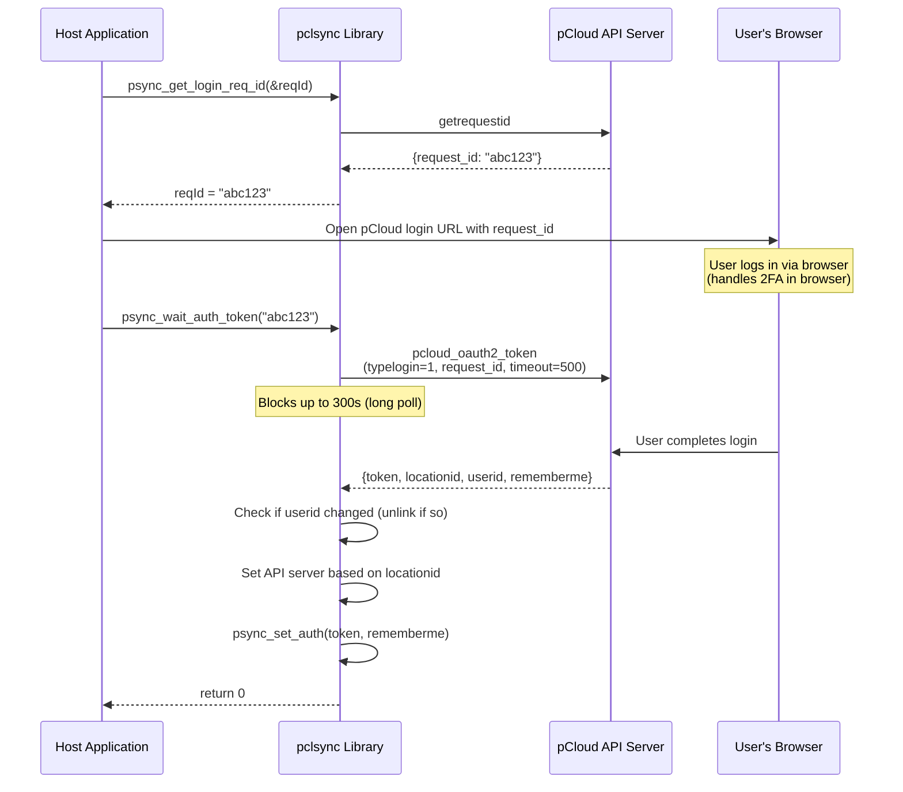
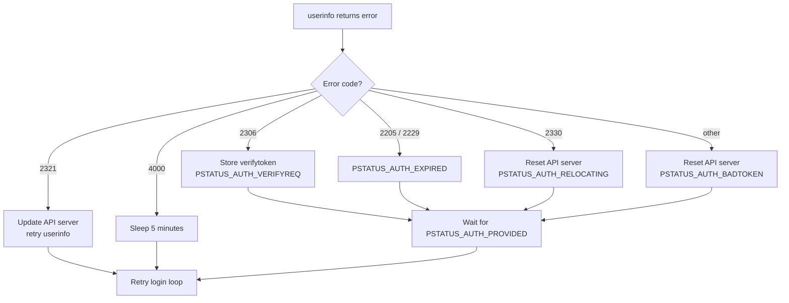

# Authentication

The pclsync library is a token-only client: every authenticated API call carries a 64-byte session token, and the library obtains that token in one of two ways. The host application can supply a previously stored token via `psync_set_auth()`, or the library can fetch one via the long-poll web-login flow after the user authenticates in a browser. There is no in-library username/password or 2FA handling -- those steps happen entirely in the browser, and the library only sees the resulting token.

Authentication is managed primarily by the diff thread (`pdiff.c`), which runs the login loop in `get_connected_socket()` and retries authentication until it succeeds. The public API in `psynclib.h` provides functions for the host application to supply tokens, drive the web-login flow, observe auth status, and terminate sessions.

## Token-Based Login

### Overview

When the library has a session token -- either restored from a previous session via `saveauth`, or set directly via `psync_set_auth()` -- it presents the token to the API by calling `userinfo`:

```c
void psync_set_auth(const char *auth, int save);
```

```c
// In get_connected_socket():
binparam params[] = {
    P_STR("timeformat", "timestamp"),
    P_STR("auth", auth),
    P_STR("osversion", osversion),
    P_STR("appversion", appversion),
    P_STR("deviceid", deviceid),
    P_STR("device", devicestring),
    P_BOOL("getauth", 1),
    P_BOOL("cryptokeyssign", 1),
    P_BOOL("getapiserver", 1),
    P_BOOL("getlastsubscription", 1),
    P_NUM("os", P_OS_ID)
};
res = send_command(sock, "userinfo", params);
```

A successful `userinfo` response returns a fresh `auth` field, which the library stores as the new session token. Auth tokens are effectively rotated on every successful login.

## Web-Based Login (OAuth2)

### Overview

Web-based login lets the host application authenticate the user through a browser, avoiding the need to handle passwords or 2FA codes directly. The flow uses a request ID that the browser presents to the pCloud web login page, then the library long-polls until the user completes authentication (including any 2FA prompts shown in the browser).

### Public API

```c
int psync_get_login_req_id(char **reqId);
int psync_wait_auth_token(char *request_id);
int psync_wait_auth_token_async(char *request_id, void *callb_ptr);
```

All three functions return `0` on success and a nonzero error code on failure.

### Flow



### Step-by-Step Details

1. **Get request ID:** `psync_get_login_req_id()` delegates to `get_login_req_id()` in `ptools.c`, which calls the `getrequestid` API endpoint. The returned `request_id` string is allocated with `psync_strdup()` and must be freed by the caller.

2. **Open browser:** The host application constructs a login URL containing the request ID and opens it in a browser. This step is entirely the application's responsibility.

3. **Wait for token:** `psync_wait_auth_token()` delegates to `wait_auth_token()` in `ptools.c`, which calls the `pcloud_oauth2_token` endpoint with:
   - `typelogin = 1` (fixed identifier)
   - `request_id` (from step 1)
   - `timeout = 500` (server-side timeout hint)

   The library sets a socket read timeout of 300 seconds (`PSYNC_SOCK_READ_TIMEOUT_300`) to accommodate the long poll.

4. **Process response:** On success, the library extracts:
   - `token` -- the auth token string
   - `locationid` -- the user's data center (1 = US, 2 or 0 = EU)
   - `userid` -- the numeric user ID
   - `rememberme` -- boolean indicating whether to persist the token

5. **User change detection:** If a different user was previously logged in (detected by comparing `userid` against the stored value), the library calls `psync_unlink()` to fully reset the local state before proceeding.

6. **Finalize:** The library calls `psync_set_auth(token, rememberme)`, which stores the token and sets `PSTATUS_AUTH_PROVIDED`, waking the diff thread for a normal login cycle.

### Async Variant

`psync_wait_auth_token_async()` spawns a background thread that calls `wait_auth_token()` and then invokes the provided callback:

```c
typedef void (*wait_login_async_cb)(int result);
```

The callback receives the integer result code from `wait_auth_token()`. The `callb_ptr` parameter is cast to `wait_login_async_cb` internally. The background thread frees the `wait_token_cb_struct` before invoking the callback.

## Auth Token Storage

### In-Memory Storage

The auth token is stored in a global, fixed-size character array:

```c
char psync_my_auth[64];
```

This array is declared in `pcore.h` and is the primary source of the token for all API calls throughout the library. Every command that requires authentication references `psync_my_auth` directly in its `binparam` array.

### Database Storage

When `saveauth` is enabled, the token is persisted to the `setting` table:

```sql
REPLACE INTO setting (id, value) VALUES ('auth', '<token>');
```

On startup, the diff thread's login loop reads the token from the database before falling back to the in-memory global:

```c
auth = psync_sql_cellstr("SELECT value FROM setting WHERE id='auth'");

// Then fall back to the in-memory value:
if (!auth && psync_my_auth[0])
    auth = psync_strdup(psync_my_auth);
```

This ordering means the database value takes precedence over the in-memory value.

## The saveauth Mechanism

The `save` parameter on `psync_set_auth()` controls whether the auth token survives a library restart:

| `save` value | Behavior |
|:---:|---|
| **Nonzero (true)** | The auth token is written to the `setting` table in the database. The `saveauth` setting is set to `true`. The token will be available on next startup. |
| **Zero (false)** | The token is stored only in the in-memory global `psync_my_auth`, written under `psync_my_auth_mutex`. The `saveauth` setting is set to `false`. The user must re-authenticate (e.g. via the web-login flow) on restart. |

Internally, both paths call `clear_db()` first, which deletes any existing `auth` row from the `setting` table and writes the `saveauth` boolean:

```c
static void clear_db(int save) {
    psync_sql_statement("DELETE FROM setting WHERE id='auth'");
    psync_setting_set_bool(_PS(saveauth), save);
}
```

### Post-Login Cleanup

After a successful login in `get_connected_socket()`, the library performs minimal cleanup:

- **If `saveauth` is true:** The fresh auth token returned by `userinfo` is saved to the database.
- **If `saveauth` is false:** The `auth` row is deleted from the database. The token persists only in memory.

## Token Expiration and Error Handling

### Error Code Mapping

The diff thread's login loop in `get_connected_socket()` maps API error codes to auth status transitions:

| API Error Code | Meaning | Status Set | Notes |
|:-:|---|---|---|
| `2306` | Email verification required | `PSTATUS_AUTH_VERIFYREQ` | Stores `verifytoken`; resumed once the application provides verification or supplies a new token |
| `2205`, `2229` | Account expired | `PSTATUS_AUTH_EXPIRED` | API server reset to default |
| `2321` | Server relocation | (none) | API server updated from response, retries `userinfo` |
| `2330` | Relocating | `PSTATUS_AUTH_RELOCATING` | API server reset, waits for `PSTATUS_AUTH_PROVIDED` |
| `4000` | Rate limited | (none) | Sleeps 5 minutes, retries |
| default | Any other non-zero result | `PSTATUS_AUTH_BADTOKEN` | API server reset to default; waits for a new token via `psync_set_auth()` or web-login |

### Expiration Flow



When any error sets a non-`PROVIDED` auth status, the diff thread blocks on `psync_wait_status(PSTATUS_TYPE_AUTH, PSTATUS_AUTH_PROVIDED)`. It resumes only when the host application supplies a new token or otherwise drives the auth status forward.

## Auth-Related Status Codes

All auth status codes are defined in `pstatus.h` under `PSTATUS_TYPE_AUTH`:

| Constant | Value | Meaning |
|----------|:-----:|---------|
| `PSTATUS_AUTH_PROVIDED` | 1 | Credentials or token have been supplied; login may proceed |
| `PSTATUS_AUTH_REQUIRED` | 2 | No credentials available; waiting for user input |
| `PSTATUS_AUTH_MISMATCH` | 4 | Supplied username differs from the previously logged-in user |
| `PSTATUS_AUTH_BADLOGIN` | 8 | *(constant retained for ABI; no longer reachable)* |
| `PSTATUS_AUTH_BADTOKEN` | 16 | Auth token rejected by the API (invalid or revoked) |
| `PSTATUS_AUTH_EXPIRED` | 32 | Account subscription has expired |
| `PSTATUS_AUTH_TFAREQ` | 64 | *(constant retained for ABI; 2FA is now handled in the browser)* |
| `PSTATUS_AUTH_BADCODE` | 128 | *(constant retained for ABI; no longer reachable)* |
| `PSTATUS_AUTH_VERIFYREQ` | 256 | Email verification is required |
| `PSTATUS_AUTH_RELOCATING` | 512 | Account is being relocated to another data center |
| `PSTATUS_AUTH_RELOCATED` | 1024 | Account relocation complete |

## Logout vs. Unlink

Logout and unlink are fundamentally different operations. Logout ends the current session while preserving all local data and sync state. Unlink fully deregisters the device and destroys all local state.

### Comparison

| Aspect | `psync_logout()` | `psync_unlink()` |
|--------|:-:|:-:|
| **API call** | Sends `logout` to invalidate the server-side session | Sends `logout` to invalidate session |
| **Auth token** | Cleared (`memset` to zero under `psync_my_auth_mutex`) | Cleared (`memset` to zero under `psync_my_auth_mutex`) |
| **Database auth/saveauth rows** | Deleted | Deleted (entire DB destroyed) |
| **Database (all other data)** | Preserved | **Deleted and recreated** |
| **SQLite file** | Kept | **Deleted from disk, new DB opened** |
| **Page cache** | Cleaned | **Cleaned and file cache purged** |
| **Crypto engine** | Stopped | Stopped |
| **Downloads/uploads** | Stopped | Stopped |
| **Device backup** | Preserved | **Stopped** (`psync_stop_device`) |
| **Diff thread** | Continues running, retries login | **Paused**, then resumed after DB reset |
| **FUSE mount** | Paused until login | Paused until login, tasks cleaned |
| **API server** | Reset to default | Reset to default |
| **Local scan** | Restarted | Stopped, then resumed |
| **Status after** | `AUTH_REQUIRED` | `AUTH_REQUIRED`, `RUN_RUN` |
| **Can re-login same user** | Yes, immediately | Yes, but all data re-syncs from scratch |
| **Device ID** | Preserved | **Preserved** (read before DB delete, re-inserted) |
| **Settings** | Preserved | **Reset to defaults** |
| **Notifications** | Preserved | **Cleaned** |

### psync_logout() Implementation

`psync_logout()` calls `psync_logout2(PSTATUS_AUTH_REQUIRED, 1)`:

1. Deletes `auth` and `saveauth` from the `setting` table
2. Sends the `logout` API command to invalidate the session server-side
3. Zeroes `psync_my_auth` with `memset` under `psync_my_auth_mutex`
4. Stops the crypto engine
5. Sets status to `PSTATUS_ONLINE_CONNECTING` and `PSTATUS_AUTH_REQUIRED`
6. Pauses FUSE, stops downloads/uploads, cleans cache
7. Resets API server to default, restarts local scan

### psync_unlink() Implementation

`psync_unlink()` performs a much more aggressive reset:

1. Reads the device ID from the database (to preserve it)
2. Sets `psync_diff_run = 0` and waits for the diff thread to pause
3. Stops all downloads and uploads
4. Stops device backup
5. Invalidates the auth token via the `logout` API command
6. Stops the crypto engine, resets API server
7. Stops local scan
8. Acquires the SQL checkpoint lock and SQL lock
9. Cleans all caches
10. **Closes the SQLite database**
11. **Deletes the database file from disk** (retries up to 5 times)
12. Cleans the page cache file
13. **Opens a fresh database connection** (recreates the schema)
14. Re-inserts the device ID into the new database
15. Zeroes `psync_my_auth` and sets `psync_my_userid` to zero under `psync_my_auth_mutex`
16. Cleans FUSE tasks, resets path status, clears download list
17. Releases locks, resets settings, cleans notifications
18. Resumes the diff thread (`psync_diff_run = 1`)
19. Sets status to `AUTH_REQUIRED` and `RUN_RUN`
20. Resumes local scan

## Mutex Protection

`psync_my_auth_mutex` (a `pthread_mutex_t` declared in `pcore.h`) historically guarded the now-removed `psync_my_user` and `psync_my_pass` heap pointers, where a `psync_free(p); p = psync_strdup(...)` sequence is a use-after-free hazard for concurrent readers.

Current discipline, after the removal of those pointers:

- **Writers of `psync_my_auth` take the lock.** Five sites: `pdiff.c:435` (`get_connected_socket` after a successful `userinfo`), `ptools.c:1426` (`wait_auth_token` storing a fresh web-login token), `psynclib.c:416` (`psync_set_auth` in the in-memory branch), `psynclib.c:450` (`psync_logout2` wiping the token), and `psynclib.c:1323` (`psync_change_password` storing the rotated token).
- **Readers do not take the lock.** The ~150 `P_STR("auth", psync_my_auth)` sites across the codebase capture the buffer pointer and read its contents at request-serialization time without synchronization. Writes of the 64-byte buffer are not atomic, so a reader can observe a torn intermediate value.
- **This is a deliberate trade-off.** A torn read produces an invalid auth token; the server rejects it (`PSTATUS_AUTH_BADTOKEN`), and the connection is re-established with the now-consistent buffer. The error is recoverable on the wire, and the cost of holding the mutex on every API call would be substantial relative to the rarity of writes (login, logout, unlink, password change).

## Key Source Files

| File | Role in Authentication |
|------|----------------------|
| `pdiff.c` | `get_connected_socket()` -- the login loop; `userinfo` request; error-code dispatch; token storage |
| `psynclib.c` | Public API implementations: `psync_set_auth()`, `psync_logout()`, `psync_unlink()`, `psync_get_login_req_id()`, `psync_wait_auth_token()`, `psync_change_password()` |
| `ptools.c` | `get_login_req_id()`, `wait_auth_token()` -- web-login backend calls |
| `pcallbacks.c` | `wait_auth_token_async()` -- async web-login thread implementation |
| `pcallbacks.h` | `wait_token_cb_struct`, `wait_login_async_cb` type definitions |
| `pcore.h` | Global declarations: `psync_my_auth[64]`, `psync_my_verify_token`, `psync_my_userid`, `psync_my_auth_mutex` |
| `psynclib.h` | Public API declarations, status constants, `WEB_LOGIN_GET_REQ_ID` / `WEB_LOGIN_WAIT_AUTH` endpoint names |
| `pstatus.h` | Auth status codes (`PSTATUS_AUTH_*`), status type constants |
| `psettings.h` | Socket timeout constants (`PSYNC_SOCK_READ_TIMEOUT_300`) |
