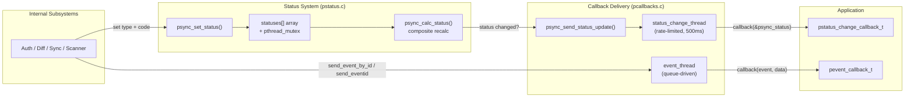

# Status and Callbacks

The pclsync library tracks the sync engine's state through a multi-dimensional status system and delivers changes to integrators via dedicated callback threads. Each dimension of state (authentication, connectivity, disk usage, etc.) is tracked independently and combined into a single composite status code that represents the engine's overall condition. Callbacks are dispatched asynchronously from dedicated threads, ensuring that internal subsystems are never blocked by application-level processing.

## How Status Flows Through the System



## Status Types and Codes

The engine maintains six independent status dimensions, stored in a static array indexed by type. Each dimension has its own set of valid codes. Together they determine the composite status.

### Status Type Index

| Type Constant | Index | Purpose |
|---|---|---|
| `PSTATUS_TYPE_RUN` | 0 | Engine run state (running, paused, stopped) |
| `PSTATUS_TYPE_ONLINE` | 1 | Network connectivity |
| `PSTATUS_TYPE_AUTH` | 2 | Authentication state |
| `PSTATUS_TYPE_ACCFULL` | 3 | Remote account quota |
| `PSTATUS_TYPE_DISKFULL` | 4 | Local disk space |
| `PSTATUS_TYPE_LOCALSCAN` | 5 | Local filesystem scan progress |

### Status Codes by Type

#### PSTATUS_TYPE_RUN

| Code | Value | Meaning |
|---|---|---|
| `PSTATUS_RUN_RUN` | 1 | Engine is running normally |
| `PSTATUS_RUN_PAUSE` | 2 | Engine is paused by user |
| `PSTATUS_RUN_STOP` | 4 | Engine is stopped |

The run status is persisted in the SQLite `setting` table under the key `runstatus` and restored on initialization.

#### PSTATUS_TYPE_ONLINE

| Code | Value | Meaning |
|---|---|---|
| `PSTATUS_ONLINE_CONNECTING` | 1 | Attempting to connect to server |
| `PSTATUS_ONLINE_SCANNING` | 2 | Connected, scanning remote state |
| `PSTATUS_ONLINE_ONLINE` | 4 | Fully connected and synchronized |
| `PSTATUS_ONLINE_OFFLINE` | 8 | No network connectivity |

#### PSTATUS_TYPE_AUTH

| Code | Value | Meaning |
|---|---|---|
| `PSTATUS_AUTH_PROVIDED` | 1 | Credentials accepted, authenticated |
| `PSTATUS_AUTH_REQUIRED` | 2 | No credentials provided yet |
| `PSTATUS_AUTH_MISMATCH` | 4 | Credentials do not match previously logged-in user |
| `PSTATUS_AUTH_BADLOGIN` | 8 | Invalid username or password |
| `PSTATUS_AUTH_BADTOKEN` | 16 | Invalid authentication token |
| `PSTATUS_AUTH_EXPIRED` | 32 | Account has expired |
| `PSTATUS_AUTH_TFAREQ` | 64 | Two-factor authentication code required |
| `PSTATUS_AUTH_BADCODE` | 128 | Invalid two-factor authentication code |
| `PSTATUS_AUTH_VERIFYREQ` | 256 | Email verification required |
| `PSTATUS_AUTH_RELOCATING` | 512 | Account is being relocated to another server |
| `PSTATUS_AUTH_RELOCATED` | 1024 | Account has been relocated |

#### PSTATUS_TYPE_ACCFULL

| Code | Value | Meaning |
|---|---|---|
| `PSTATUS_ACCFULL_QUOTAOK` | 1 | Quota is within limits |
| `PSTATUS_ACCFULL_OVERQUOTA` | 2 | Account storage is full |

#### PSTATUS_TYPE_DISKFULL

| Code | Value | Meaning |
|---|---|---|
| `PSTATUS_DISKFULL_OK` | 1 | Sufficient local disk space |
| `PSTATUS_DISKFULL_FULL` | 2 | Local disk is full |

#### PSTATUS_TYPE_LOCALSCAN

| Code | Value | Meaning |
|---|---|---|
| `PSTATUS_LOCALSCAN_SCANNING` | 1 | Initial local filesystem scan in progress |
| `PSTATUS_LOCALSCAN_READY` | 2 | Local scan complete |

### Composite Status Codes

The composite status is a single integer derived from all six dimensions. It is stored in `psync_status.status` and represents the overall engine state visible to applications.

| Constant | Value | Meaning |
|---|---|---|
| `PSTATUS_READY` | 0 | Idle, everything in sync |
| `PSTATUS_DOWNLOADING` | 1 | Downloading files |
| `PSTATUS_UPLOADING` | 2 | Uploading files |
| `PSTATUS_DOWNLOADINGANDUPLOADING` | 3 | Downloading and uploading simultaneously |
| `PSTATUS_LOGIN_REQUIRED` | 4 | Waiting for credentials |
| `PSTATUS_BAD_LOGIN_DATA` | 5 | Invalid username/password |
| `PSTATUS_BAD_LOGIN_TOKEN` | 6 | Invalid auth token |
| `PSTATUS_ACCOUNT_FULL` | 7 | Remote account over quota |
| `PSTATUS_DISK_FULL` | 8 | Local disk full |
| `PSTATUS_PAUSED` | 9 | Engine paused |
| `PSTATUS_STOPPED` | 10 | Engine stopped |
| `PSTATUS_OFFLINE` | 11 | No network connection |
| `PSTATUS_CONNECTING` | 12 | Connecting to server |
| `PSTATUS_SCANNING` | 13 | Scanning (remote or local) |
| `PSTATUS_USER_MISMATCH` | 14 | Credentials do not match stored user |
| `PSTATUS_ACCOUNT_EXPIRED` | 15 | Account expired |
| `PSTATUS_TFA_REQUIRED` | 16 | Two-factor code needed |
| `PSTATUS_BAD_TFA_CODE` | 17 | Invalid two-factor code |
| `PSTATUS_VERIFY_REQUIRED` | 18 | Email verification needed |
| `PSTATUS_RELOCATION` | 19 | Account relocating |
| `PSTATUS_RELOCATED` | 20 | Account relocated |

### Composite Status Priority

The `psync_calc_status()` function in `pstatus.c` evaluates dimensions in strict priority order. The first problem found wins:

1. **AUTH** -- Any auth problem other than `PSTATUS_AUTH_PROVIDED` (or `PSTATUS_INVALID` during init) immediately determines the composite status.
2. **RUN** -- If not `PSTATUS_RUN_RUN`, maps to `PSTATUS_PAUSED` or `PSTATUS_STOPPED`.
3. **ONLINE** -- If not `PSTATUS_ONLINE_ONLINE`, maps to `PSTATUS_CONNECTING`, `PSTATUS_SCANNING`, or `PSTATUS_OFFLINE`.
4. **LOCALSCAN** -- If not `PSTATUS_LOCALSCAN_READY`, maps to `PSTATUS_SCANNING`.
5. **ACCFULL** -- If over quota, maps to `PSTATUS_ACCOUNT_FULL`.
6. **DISKFULL** -- If disk full, maps to `PSTATUS_DISK_FULL`.
7. **Transfer activity** -- If all dimensions are healthy, the composite reflects file transfer state: downloading, uploading, both, or ready.

## The `pstatus_t` Struct

The `pstatus_t` struct (defined in `psynclib.h`) carries a snapshot of the engine's status. It is the type passed to status change callbacks and filled by `psync_get_status()`.

```c
typedef struct pstatus_struct_ {
  const char *downloadstr;         /* human-readable download status string */
  const char *uploadstr;           /* human-readable upload status string */
  uint64_t bytestoupload;          /* total bytes remaining to upload */
  uint64_t bytestouploadcurrent;   /* total size of files currently uploading */
  uint64_t bytesuploaded;          /* bytes uploaded in current batch */
  uint64_t bytestodownload;        /* total bytes remaining to download */
  uint64_t bytestodownloadcurrent; /* total size of files currently downloading */
  uint64_t bytesdownloaded;        /* bytes downloaded in current batch */
  uint32_t status;                 /* composite status (PSTATUS_READY..PSTATUS_RELOCATED) */
  uint32_t filestoupload;          /* files remaining to upload (includes currently uploading) */
  uint32_t filesuploading;         /* files actively uploading right now */
  uint32_t uploadspeed;            /* current upload speed in bytes/sec */
  uint32_t filestodownload;        /* files remaining to download (includes currently downloading) */
  uint32_t filesdownloading;       /* files actively downloading right now */
  uint32_t downloadspeed;          /* current download speed in bytes/sec */
  uint8_t  remoteisfull;           /* 1 if account is over quota */
  uint8_t  localisfull;            /* 1 if local disk is full */
} pstatus_t;
```

The `downloadstr` and `uploadstr` fields are filled in only when the struct is retrieved through `psync_get_status()` or when delivered via the status callback. They contain human-readable strings such as `"3.5MB/sec, Remaining: 42 files, 1.2GB 5m 30s"` or `"Everything Downloaded"`.

## Setting and Reading Status

### `psync_set_status(statusid, status)`

This is the primary function used by internal subsystems to update a status dimension. Defined in `pstatus.c`, it:

1. Acquires the status mutex.
2. Stores the new code into `statuses[statusid]`.
3. Broadcasts on the condition variable if any threads are waiting (see below).
4. Updates `psync_status.remoteisfull` and `psync_status.localisfull` flags from the current `ACCFULL` and `DISKFULL` dimensions.
5. Calls `psync_calc_status()` to recompute the composite status.
6. If the composite status changed, releases the mutex and calls `psync_send_status_update()` to notify the callback thread.
7. If unchanged, simply releases the mutex.

Thread safety is guaranteed by the mutex. The function is safe to call from any thread.

### `psync_status_get(statusid)`

Returns the current code for a single status dimension. Acquires and releases the status mutex for the read.

### `psync_get_status(status)`

The public API function (declared in `psynclib.h`, implemented in `psynclib.c`) that fills a caller-supplied `pstatus_t` struct. Internally it delegates to `psync_callbacks_get_status()` in `pcallbacks.c`, which copies the global `psync_status` struct and then fills in the human-readable `downloadstr` and `uploadstr` fields.

## Waiting on Status Conditions

Internal subsystem threads frequently need to block until a particular status combination is reached. The status system provides two mechanisms for this.

### `psync_wait_status(statusid, status)`

Blocks the calling thread until the specified status dimension matches one of the bits set in `status`. The `status` parameter is a bitmask, so you can wait for any of several codes:

```c
// Block until auth is provided
psync_wait_status(PSTATUS_TYPE_AUTH, PSTATUS_AUTH_PROVIDED);

// Block until online or connecting
psync_wait_status(PSTATUS_TYPE_ONLINE, PSTATUS_ONLINE_ONLINE | PSTATUS_ONLINE_CONNECTING);
```

Internally, the function acquires the status mutex, then loops on `pthread_cond_wait()` until `(statuses[statusid] & status) != 0`. A counter (`status_waiters`) tracks how many threads are waiting so that `psync_set_status()` only broadcasts when there are actual waiters.

If `psync_do_run` becomes false (engine shutdown), the function calls `pthread_exit(NULL)` to terminate the waiting thread.

### `psync_wait_statuses(first, ...)`

Waits for multiple status conditions to be satisfied simultaneously. It accepts a variadic list of combined status values (type and bitmask packed together using `PSTATUS_COMBINE(type, statuses)`) terminated by zero:

```c
psync_wait_statuses(
  PSTATUS_COMBINE(PSTATUS_TYPE_RUN, PSTATUS_RUN_RUN),
  PSTATUS_COMBINE(PSTATUS_TYPE_ONLINE, PSTATUS_ONLINE_ONLINE),
  PSTATUS_COMBINE(PSTATUS_TYPE_AUTH, PSTATUS_AUTH_PROVIDED),
  0  /* terminator */
);
```

The `PSTATUS_COMBINE` macro packs the type into the upper 8 bits and the status bitmask into the lower 24 bits. Internally the function builds an array and delegates to `psync_wait_statuses_array()`, which loops over all conditions, blocking on the condition variable whenever any condition is not met, and restarts the full check after each wakeup to ensure all conditions are met simultaneously.

### `psync_statuses_ok_array(combinedstatuses, cnt)`

A non-blocking variant that returns 1 if all specified conditions are currently met, 0 otherwise. Useful for polling without blocking.

### `psync_terminate_status_waiters()`

Broadcasts on the condition variable to wake all waiting threads. Used during engine shutdown to unblock threads so they can observe `psync_do_run == 0` and exit cleanly.

## Status Change Callbacks

### Registration

The application registers a status change callback by passing it to `psync_start_sync()`:

```c
int psync_start_sync(pstatus_change_callback_t status_callback, pevent_callback_t event_callback);
```

The callback type is:

```c
typedef void (*pstatus_change_callback_t)(pstatus_t *status);
```

Internally, `psync_set_status_callback()` in `pcallbacks.c` spawns a dedicated thread named `"status change"` that runs `status_change_thread()`.

### Delivery Mechanism

The status change thread implements rate-limited delivery:

1. The thread sleeps for 500ms at the top of each iteration, limiting delivery to a maximum of two updates per second.
2. It then acquires the callback mutex and waits on a condition variable until `statuschanges > 0`.
3. When signaled, it resets the counter, checks whether icon rebuilds are needed (transitions involving pause/stop/offline or file count changes), copies the current status, and releases the mutex.
4. It fills in the human-readable `downloadstr` and `uploadstr` fields.
5. It calls the application's callback with a pointer to the `psync_status` struct.

The `psync_send_status_update()` function signals this thread. It uses a counter-based scheme: a value of `-1` means the thread is idle and waiting, `0` means a signal was already sent but not yet processed, and positive values indicate pending updates. This ensures at most one wakeup per sleep cycle.

### Threading Constraints

- The callback is always invoked from the same dedicated thread (named `"status change"`).
- Callbacks are guaranteed never to overlap.
- The `pstatus_t*` pointer passed to the callback points to the global `psync_status` struct. The `downloadstr` and `uploadstr` pointers are valid only for the duration of the callback invocation.
- Blocking inside the callback delays subsequent status updates.

## Event Callbacks

### Registration

The event callback is also registered via `psync_start_sync()`:

```c
typedef void (*pevent_callback_t)(psync_eventtype_t event, psync_eventdata_t data);
```

Internally, `psync_set_event_callback()` initializes a linked list queue and spawns a dedicated thread named `"event"`.

### Delivery Mechanism

The event thread blocks on a condition variable until events are available in the queue. When woken:

1. It dequeues the head element from the linked list.
2. It calls the application's callback with the event type and associated data.
3. If the event data was dynamically allocated (`freedata` flag), it frees the data after the callback returns.

Events are enqueued by internal subsystems through several functions:

| Function | Purpose |
|---|---|
| `psync_send_event_by_id()` | Sends an event with a remote file/folder ID; resolves the remote path automatically |
| `psync_send_event_by_path()` | Sends an event with explicit local and remote paths |
| `psync_send_eventid()` | Sends an event with no associated data (data.ptr is NULL) |
| `psync_send_eventdata()` | Sends an event with arbitrary data (freed after callback) |

### Threading Constraints

- All event callbacks are delivered from the same dedicated thread (named `"event"`).
- Event callbacks are guaranteed never to overlap.
- String pointers within event data structs (`name`, `localpath`, `remotepath`) are only valid for the duration of the callback. Use `strdup()` if you need to retain them.
- If the event thread is not running (no callback registered), events sent via `psync_send_eventdata()` are freed immediately and silently discarded.

## Event Types

Event types are bitmask-composed constants defined in `psynclib.h`. The low bits encode the nature of the event.

### Bitmask Components

| Flag | Value | Meaning |
|---|---|---|
| `PEVENT_TYPE_LOCAL` | `0<<0` | Action replicated to local filesystem |
| `PEVENT_TYPE_REMOTE` | `1<<0` | Action replicated to remote server |
| `PEVENT_TYPE_FILE` | `0<<1` | Event concerns a file |
| `PEVENT_TYPE_FOLDER` | `1<<1` | Event concerns a folder |
| `PEVENT_TYPE_CREATE` | `0<<2` | Creation event |
| `PEVENT_TYPE_DELETE` | `1<<2` | Deletion event |
| `PEVENT_TYPE_RENAME` | `2<<2` | Rename event |
| `PEVENT_TYPE_START` | `0<<5` | Transfer started |
| `PEVENT_TYPE_FINISH` | `1<<5` | Transfer finished |
| `PEVENT_TYPE_SUCCESS` | `0<<6` | Transfer succeeded |
| `PEVENT_TYPE_FAIL` | `1<<6` | Transfer failed |

### Sync Events

These events carry `psync_file_event_t` or `psync_folder_event_t` data depending on whether the `PEVENT_TYPE_FOLDER` bit is set.

| Constant | Data Type | Description |
|---|---|---|
| `PEVENT_LOCAL_FOLDER_CREATED` | `psync_folder_event_t` | Remote folder replicated locally |
| `PEVENT_REMOTE_FOLDER_CREATED` | `psync_folder_event_t` | Local folder replicated to server |
| `PEVENT_LOCAL_FOLDER_DELETED` | `psync_folder_event_t` | Folder deleted locally (from remote change) |
| `PEVENT_REMOTE_FOLDER_DELETED` | `psync_folder_event_t` | Folder deleted remotely (from local change) |
| `PEVENT_LOCAL_FOLDER_RENAMED` | `psync_folder_event_t` | Folder renamed locally (from remote change) |
| `PEVENT_LOCAL_FILE_DELETED` | `psync_file_event_t` | File deleted locally (from remote change) |
| `PEVENT_REMOTE_FILE_DELETED` | `psync_file_event_t` | File deleted remotely (from local change) |
| `PEVENT_FILE_DOWNLOAD_STARTED` | `psync_file_event_t` | File download began |
| `PEVENT_FILE_DOWNLOAD_FINISHED` | `psync_file_event_t` | File download completed successfully |
| `PEVENT_FILE_DOWNLOAD_FAILED` | `psync_file_event_t` | File download failed |
| `PEVENT_FILE_UPLOAD_STARTED` | `psync_file_event_t` | File upload began |
| `PEVENT_FILE_UPLOAD_FINISHED` | `psync_file_event_t` | File upload completed successfully |
| `PEVENT_FILE_UPLOAD_FAILED` | `psync_file_event_t` | File upload failed |

Note the naming convention: `PEVENT_LOCAL_*` means a remote change was replicated locally, and `PEVENT_REMOTE_*` means a local change was replicated to the server.

### User and Quota Events

| Constant | Data | Description |
|---|---|---|
| `PEVENT_USERINFO_CHANGED` | NULL | User profile information changed |
| `PEVENT_USEDQUOTA_CHANGED` | NULL | Used storage quota changed |

### Share Events

These events carry `psync_share_event_t` data.

| Constant | Description |
|---|---|
| `PEVENT_SHARE_REQUESTIN` | Incoming share request received |
| `PEVENT_SHARE_REQUESTOUT` | Outgoing share request sent |
| `PEVENT_SHARE_ACCEPTIN` | Incoming share accepted |
| `PEVENT_SHARE_ACCEPTOUT` | Outgoing share accepted |
| `PEVENT_SHARE_DECLINEIN` | Incoming share declined |
| `PEVENT_SHARE_DECLINEOUT` | Outgoing share declined |
| `PEVENT_SHARE_CANCELIN` | Incoming share cancelled |
| `PEVENT_SHARE_CANCELOUT` | Outgoing share cancelled |
| `PEVENT_SHARE_REMOVEIN` | Incoming share removed |
| `PEVENT_SHARE_REMOVEOUT` | Outgoing share removed |
| `PEVENT_SHARE_MODIFYIN` | Incoming share permissions modified |
| `PEVENT_SHARE_MODIFYOUT` | Outgoing share permissions modified |
| `PEVENT_SHARE_RENAME_F` | Shared folder renamed |
| `PEVENT_SHARE_RELOAD_ALL` | All shares should be reloaded |

### Data Events (Numeric IDs)

These events are delivered through the data event subsystem (see below) and use simple integer IDs rather than bitmask composition.

| Constant | Value | Description |
|---|---|---|
| `PEVENT_SYNC_RENAME_F` | 1 | Sync folder renamed |
| `PEVENT_FS_ADD_OBJ` | 101 | Filesystem object added |
| `PEVENT_FS_DEL_OBJ` | 102 | Filesystem object deleted |
| `PEVENT_FS_MOD_OBJ` | 103 | Filesystem object modified |
| `PEVENT_STUCK_OBJ_CNT` | 201 | Count of stuck objects changed |
| `PEVENT_UPLOAD_LOGS_DONE` | 301 | Log upload completed |
| `PEVENT_BACKUP_STOP` | 401 | Backup stopped |
| `PEVENT_BKUP_OBJ_DEL` | 402 | Backup object deleted |
| `PEVENT_SYNC_OBJ_DEL` | 403 | Sync object deleted |
| `PEVENT_BKUP_F_DEL_DRIVE` | 404 | Backup folder deleted from drive |
| `PEVENT_MP_NOT_EMPTY_ERR` | 501 | Mount point not empty (error) |
| `PEVENT_MP_NOT_EMPTY_NO_ERR` | 502 | Mount point not empty (non-error) |
| `PEVENT_UPL_TASKS_STAT` | 601 | Upload task status update |
| `PEVENT_UPL_TASKS_FINISH` | 602 | All upload tasks finished |
| `PEVENT_UPL_TASKS_NO_TASKS_ADDED` | 603 | No upload tasks were created (e.g., all files hidden) |

## Event Data Structures

### `psync_file_event_t`

```c
typedef struct {
  psync_fileid_t fileid;     /* remote file ID */
  const char *name;          /* file name */
  const char *localpath;     /* local filesystem path */
  const char *remotepath;    /* remote path on server */
  psync_syncid_t syncid;    /* sync folder pair ID */
} psync_file_event_t;
```

### `psync_folder_event_t`

```c
typedef struct {
  psync_fileid_t folderid;   /* remote folder ID */
  const char *name;          /* folder name */
  const char *localpath;     /* local filesystem path */
  const char *remotepath;    /* remote path on server */
  psync_syncid_t syncid;    /* sync folder pair ID */
} psync_folder_event_t;
```

### `psync_share_event_t`

```c
typedef struct {
  psync_folderid_t folderid;
  const char *sharename;
  const char *toemail;
  const char *fromemail;
  const char *message;
  psync_userid_t userid;
  psync_shareid_t shareid;
  psync_sharerequestid_t sharerequestid;
  time_t created;
  unsigned char canread;
  unsigned char cancreate;
  unsigned char canmodify;
  unsigned char candelete;
  unsigned char canmanage;
} psync_share_event_t;
```

### `psync_eventdata_t`

A union that holds a pointer to one of the above event-specific structs:

```c
typedef union {
  psync_file_event_t   *file;
  psync_folder_event_t *folder;
  psync_share_event_t  *share;
  void                 *ptr;
} psync_eventdata_t;
```

Which member to read is determined by the event type flags. For `PEVENT_TYPE_FOLDER` events use `.folder`, for file events use `.file`, for `PEVENT_SHARE_*` events use `.share`. For events with no data, `.ptr` is NULL.

## Data Event Subsystem

In addition to the primary event callback, `pcallbacks.c` implements a secondary "data event" subsystem intended for platform-specific integrations (especially Windows/desktop overlays). It uses a separate callback signature:

```c
typedef void (*data_event_callback)(int eventId, const char *str1, const char *str2,
                                    uint64_t uint1, uint64_t uint2);
```

This subsystem:

- Is initialized via `psync_init_data_event(callback_ptr)`.
- Runs its own dedicated thread (`"Data Event"`) that polls a linked list queue every 1 second.
- Processes up to 100 events per poll cycle.
- Implements a timed delay mechanism (`PDIFF_DATA_EVENT_DELAY`, 5 seconds) for batching diff-related filesystem change notifications via `psync_timed_data_event()`.
- Events are enqueued with `psync_send_data_event()`.

## Key Source Files

| File | Role |
|---|---|
| `pstatus.h` | Status type/code constants, function declarations |
| `pstatus.c` | Status array, mutex/condvar, composite calculation, set/wait/get |
| `pcallbacks.h` | Callback type definitions, event dispatch function declarations |
| `pcallbacks.c` | Callback thread management, status/event delivery, data event subsystem |
| `psynclib.h` | Public API: `pstatus_t`, event type constants, callback typedefs, `psync_start_sync()` |
| `psynclib.c` | `psync_get_status()` implementation (delegates to `psync_callbacks_get_status()`) |
| `pcore.h` | Declaration of the global `psync_status` variable |
| `plibs.c` | Definition of the global `psync_status` variable |
