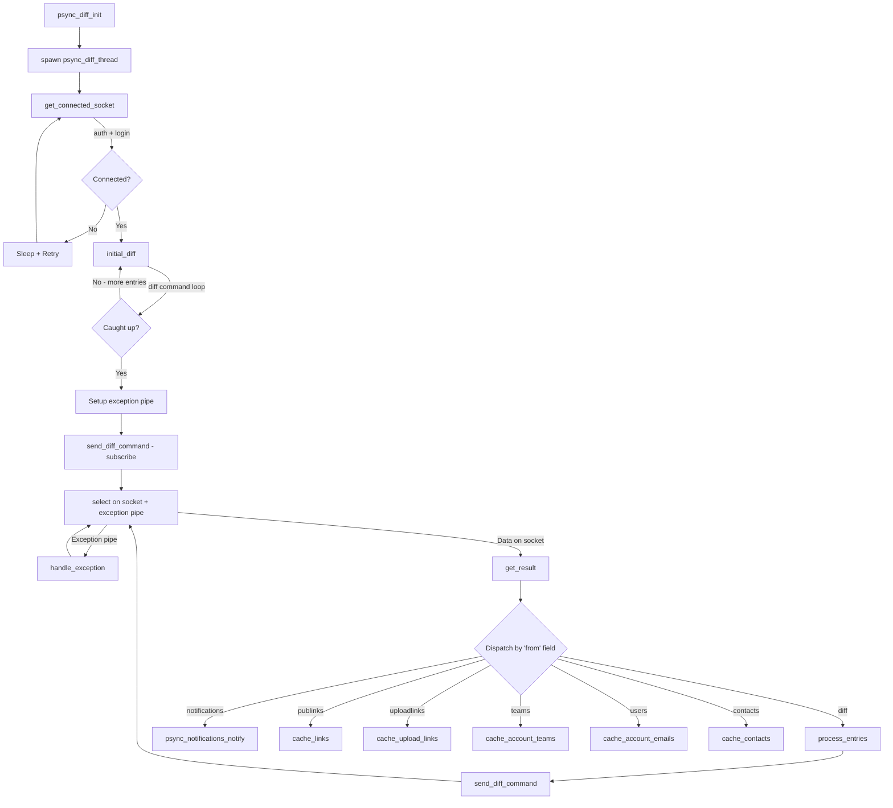
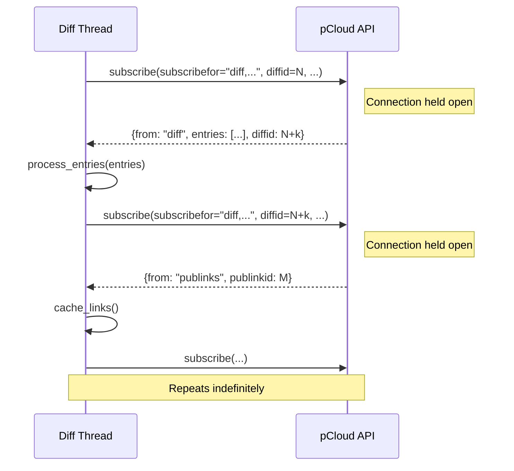

# Diff Engine

The diff engine is the mechanism by which the pclsync library learns about remote changes on the pCloud server. It runs as a dedicated background thread (`psync_diff_thread`) that connects to the API, performs an initial synchronization of all remote state, and then enters a long-poll loop to receive real-time change notifications. Every folder creation, file modification, share event, and account change flows through this single pipeline, which updates the local SQLite database and triggers downstream sync tasks (downloads, local folder creation, etc.).

The implementation lives primarily in `pdiff.c` (the diff thread, all event handlers, and connection management) with public declarations in `pdiff.h`.

## Architecture Overview



## The `diffid` Cursor

The diff engine uses an opaque, monotonically increasing integer called `diffid` as its synchronization cursor. The server tracks which changes the client has already seen based on this value. On first launch, `diffid` is 0, meaning the client has seen nothing and must receive the entire remote state. After processing each batch of entries, the new `diffid` from the server response is persisted to the `setting` table (`id='diffid'`).

This cursor-based design means:

- **Resumability** -- if the client disconnects, it resumes from the last committed `diffid` without replaying the full history.
- **Incremental updates** -- the server only sends changes newer than the client's `diffid`.
- **Atomicity** -- `diffid` is updated inside the same database transaction as the entries it covers, so the cursor and state never drift apart.

The `subscribed_ids` struct tracks cursors for all subscription channels:

```c
typedef struct {
  uint64_t diffid;
  uint32_t notificationid;
  uint64_t publinkid;
  uint64_t uploadlinkid;
} subscribed_ids;
```

## Initial Diff

When the diff thread starts (or after a reconnection where the initial state must be re-fetched), it calls `initial_diff()`. This function uses the `diff` API command -- a simple request/response pattern, not long-polling -- to batch-load all remote changes.

The algorithm:

1. Read the current `diffid` from the database (0 on first run).
2. Send a `diff` command with the current `diffid` and a limit of `PSYNC_DIFF_LIMIT` (500,000 entries).
3. If the response contains entries, pass them to `process_entries()`, which updates the database and returns the new `diffid`.
4. Repeat from step 2 until the server returns an empty entries array, meaning the client is fully caught up.
5. Call `psync_diff_check_quota()` to synchronize the used-quota value with the server.

If any request fails, `initial_diff()` returns 1, and the main loop reconnects and retries.

When `diffid` starts at 0, the flag `initialdownload` is set to 1. This flag suppresses share notification events during the bulk load to avoid flooding the user interface with historical share events.

## Subscribe and Long-Poll Mechanism

Once the initial diff is complete, the engine switches to real-time updates using the `subscribe` API command. This is a long-poll: the client sends a single `subscribe` request over the persistent socket, and the server holds the connection open until a change occurs. When the server responds, the client processes the response, then immediately sends another `subscribe` to resume listening.



The `send_diff_command()` function assembles the `subscribe` request. The set of channels included in the `subscribefor` parameter varies:

| Condition | Channels |
|-----------|----------|
| Non-business, notifications active | `diff`, `notifications`, `publinks`, `uploadlinks`, `contacts` |
| Business, notifications active | `diff`, `notifications`, `publinks`, `uploadlinks`, `teams`, `users`, `contacts` |
| Non-business, no notifications | `diff`, `publinks`, `uploadlinks`, `contacts` |
| Business, no notifications | `diff`, `publinks`, `uploadlinks`, `teams`, `users`, `contacts` |

Business accounts additionally subscribe to `teams` and `users` channels. When notifications are active, the request includes a `notificationid` cursor and optionally a `notificationthumbsize` parameter.

## The `process_entries()` Dispatch

`process_entries()` is the central dispatcher. It receives an array of diff entries from either `initial_diff()` or the subscribe loop, and routes each entry to the correct handler based on the `event` string field.

The dispatch uses a static table defined with the `FN()` macro:

```c
#define FN(n) {process_##n, #n, sizeof(#n)-1, 0}

static struct {
  void (*process)(const binresult *);
  const char *name;
  uint32_t len;
  uint8_t used;
} event_list[] = {
  FN(createfolder),
  FN(modifyfolder),
  FN(deletefolder),
  FN(createfile),
  FN(modifyfile),
  FN(deletefile),
  FN(modifyuserinfo),
  // ... share and business events ...
  FN(cryptopasschange),
  FN(modifyaccountinfo)
};
```

For each entry, the function matches `entry.event` against the table by comparing string length and content. When a match is found, it calls `event_list[j].process(entry)` and marks the handler as `used`.

After all entries are processed, every handler that was called at least once is called again with `NULL`. This gives handlers the opportunity to finalize prepared statements and free cached resources -- a pattern used throughout the codebase where handlers maintain `static` prepared statements across multiple invocations for performance.

The entire batch runs inside a single database transaction. If a stop signal is detected mid-batch (`!psync_diff_run`), the transaction is rolled back and the `diffid` is not advanced.

## Event Handlers

### File and Folder Events

| Handler | Event | Database Effect |
|---------|-------|-----------------|
| `process_createfolder` | `createfolder` | `INSERT OR IGNORE INTO folder`; falls back to `UPDATE` if the row already exists. Increments `subdircnt` on the parent. If the parent is in the download list, creates a `syncedfolder` entry and schedules a local folder creation task. |
| `process_modifyfolder` | `modifyfolder` | `UPDATE folder SET ...`. Handles reparenting (move): decrements old parent's `subdircnt`, increments new parent's. Reconciles synced folder state when a folder moves between sync roots. Falls back to `process_createfolder` if the folder does not exist locally. |
| `process_deletefolder` | `deletefolder` | `DELETE FROM folder WHERE id=?`. Decrements parent `subdircnt`. Removes from download list and schedules local folder deletion tasks. Notifies FUSE via `psync_fs_folder_deleted()`. |
| `process_createfile` | `createfile` | `INSERT OR IGNORE INTO file` with full metadata (size, hash, media fields). Falls back to `UPDATE` on conflict. Inserts a `filerevision` row. Schedules download tasks for files in synced folders. |
| `process_modifyfile` | `modifyfile` | `UPDATE file SET ...`. Handles reparenting and renaming. Compares hash/size to decide if a re-download is needed. Cleans up stale crypto keys for encrypted files. Falls back to `process_createfile` if the file does not exist locally. |
| `process_deletefile` | `deletefile` | `DELETE FROM file WHERE id=?`. Cancels pending download tasks. Schedules local file deletion. Adjusts `used_quota`. Notifies FUSE via `psync_fs_file_deleted()`. |

### Account and User Events

| Handler | Event | Database Effect |
|---------|-------|-----------------|
| `process_modifyuserinfo` | `modifyuserinfo` | Updates quota, premium status, email, plan, crypto settings, and many other account fields in the `setting` table. If `cryptosetup` becomes false, stops the crypto thread and deletes cached keys. Fires `PEVENT_USERINFO_CHANGED`. |
| `process_modifyaccountinfo` | `modifyaccountinfo` | Updates business account info (owner name/email, crypto setup status). |
| `process_cryptopasschange` | `cryptopasschange` | Stops the crypto module and deletes cached crypto keys, forcing re-authentication of the crypto layer. |

### Share Events

| Handler | Event | Database Effect |
|---------|-------|-----------------|
| `process_requestsharein` | `requestsharein` | Inserts into `sharerequest` table, sends share notification. |
| `process_requestshareout` | `requestshareout` | Inserts into `sharerequest` table, sends share notification. |
| `process_acceptedsharein` | `acceptedsharein` | Inserts into `sharedfolder`, deletes from `sharerequest`, adds folder to download list. |
| `process_acceptedshareout` | `acceptedshareout` | Inserts into `sharedfolder`, deletes from `sharerequest`. |
| `process_declinedsharein` | `declinedsharein` | Deletes from `sharerequest`, sends notification. |
| `process_declinedshareout` | `declinedshareout` | Deletes from `sharerequest`, sends notification. |
| `process_cancelledsharein` | `cancelledsharein` | Deletes from `sharerequest`, sends notification. |
| `process_cancelledshareout` | `cancelledshareout` | Deletes from `sharerequest`, sends notification. |
| `process_removedsharein` | `removedsharein` | Deletes from `sharedfolder`, sends notification. |
| `process_removedshareout` | `removedshareout` | Deletes from `sharedfolder`, sends notification. |
| `process_modifiedsharein` | `modifiedsharein` | Updates `sharedfolder` permissions, sends notification. |
| `process_modifiedshareout` | `modifiedshareout` | Updates `sharedfolder` permissions, sends notification. |
| `process_establishbsharein` | `establishbsharein` | Business share accepted (incoming): inserts into `bsharedfolder`, adds to download list. |
| `process_establishbshareout` | `establishbshareout` | Business share accepted (outgoing): inserts into `bsharedfolder`. |
| `process_modifybsharein` | `modifybsharein` | Updates `bsharedfolder` permissions. |
| `process_modifybshareout` | `modifybshareout` | Updates `bsharedfolder` permissions. |
| `process_removebsharein` | `removebsharein` | Deletes from `bsharedfolder`. |
| `process_removebshareout` | `removebshareout` | Deletes from `bsharedfolder`. |

## Exception Pipe Mechanism

The diff thread blocks on `psync_select_in()` waiting for data on two file descriptors simultaneously: the API socket and a local pipe called the "exception pipe." The exception pipe allows other threads to wake the diff thread and request specific actions without waiting for a server response.

### Setup

`setup_exeptions()` creates a pipe pair (`psync_pipe()`). The read end goes into the `select` set; the write end is stored in the global `exceptionsockwrite`. A timer callback (`psync_diff_adapter_timer`) is registered to check for network adapter changes every 5 seconds.

### Exception Characters

Different single-byte characters written to the pipe trigger different behaviors in `handle_exception()`:

| Character | Source | Meaning |
|-----------|--------|---------|
| `'c'` | `psync_diff_wake()` | **Check for changes.** If no diff event arrived in the last second, waits 1 second for data on the socket. If nothing arrives, reconnects. Used by the upload/sync subsystems to prompt a fresh diff poll after local changes are pushed. |
| `'e'` | `diff_exception_handler()` / adapter timer | **Network exception.** Sends a `nop` command to test if the socket is alive. If the `nop` fails or the response times out (6 seconds), closes the socket, clears the API cache, and reconnects. If the socket responds, marks it as having pending data. |
| `'r'` | Internal (passed directly) | **Reconnect.** Unconditionally closes the socket and calls `get_connected_socket()` to establish a new session. Also triggered when the run status changes to `PSTATUS_RUN_STOP`, auth is revoked, or the SSL mode changes. |

The adapter timer (`psync_diff_adapter_timer`) hashes the system's network interface list every 5 seconds. If the hash changes (e.g., WiFi reconnection, VPN toggle), it writes `'e'` to trigger a connectivity check.

### Wake Flow

```
Other thread                     Diff thread
    |                                |
    |-- psync_diff_wake() ---------> |
    |   writes 'c' to pipe          |
    |                                |-- select() returns on pipe
    |                                |-- handle_exception('c')
    |                                |   (checks socket, maybe reconnects)
    |                                |-- resumes select()
```

## Login and Connection Flow

The diff thread's first action is to call `get_connected_socket()`, which handles the entire authentication handshake:

1. **Wait for credentials** -- blocks until either an auth token or username/password is available (checking the database and in-memory globals).
2. **Connect** -- opens a socket to the API server via `psync_api_connect()`.
3. **Authenticate** -- sends one of several login commands depending on available credentials:
   - `login` with digest authentication (username + SHA1 password digest + server nonce)
   - `login` with plain password (fallback if digest is rejected with error 2237)
   - `userinfo` with an existing auth token
   - `tfa_login` or `tfa_loginwithrecoverycode` for two-factor authentication
4. **Handle errors** -- maps API error codes to status updates:
   - 2297: TFA required, sets `PSTATUS_AUTH_TFAREQ` and waits for a code.
   - 2306: Email verification required.
   - 2321: Server redirect (location change), updates API server and retries.
   - 2330: Account relocated, sets `PSTATUS_AUTH_RELOCATING`.
   - 2000: Bad credentials, sets `PSTATUS_AUTH_BADLOGIN` (password login) or `PSTATUS_AUTH_BADTOKEN` (token login).
   - 2012/2064/2074/2092: Bad 2FA code, sets `PSTATUS_AUTH_BADCODE` and clears the stored 2FA code.
   - 2205/2229: Expired session.
   - 4000: Rate limited, sleeps 5 minutes.
5. **Store user info** -- saves userid, quota, premium status, crypto keys, and other account data to the `setting` table in a single transaction.
6. **Return the socket** -- the authenticated socket is reused for `initial_diff()` and then `subscribe`.

## Reconnection Behavior

Reconnection can be triggered by:

- A failed API response (socket error, unexpected result code)
- The `'r'` or `'e'` exception
- A network adapter change
- An SSL mode toggle
- An auth status change (e.g., logout)

On every reconnection:

1. The current socket is closed.
2. `get_connected_socket()` is called, which blocks until authentication succeeds.
3. The status is set to `PSTATUS_ONLINE_ONLINE`.
4. Delayed syncs are checked (`psync_syncer_check_delayed_syncs()`).
5. The `diffid` is re-read from the database (in case it advanced before the disconnect).
6. A new `subscribe` command is sent to resume the long-poll loop.

The `socks[1]` array element is updated to the new socket's file descriptor so that `select()` monitors the correct connection.

## Key Constants

| Constant | Value | Purpose |
|----------|-------|---------|
| `PSYNC_DIFF_LIMIT` | 500,000 | Maximum entries per `diff` or `subscribe` response |
| `PSYNC_SLEEP_BEFORE_RECONNECT` | 5,000 ms | Delay before retrying after a connection failure |
| `PSYNC_SOCK_TIMEOUT_ON_EXCEPTION` | 6 s | Timeout for the `nop` liveness check on exception |
| `PSYNC_DIFF_CHECK_ADAPTER_CHANGE_SEC` | 5 s | Interval for network adapter change polling |

## Thread Safety

The diff thread uses two mutexes:

- **`diff_mutex`** -- acquired by `psync_diff_lock()` / `psync_diff_unlock()`, held during `process_entries()` to serialize database writes against other subsystems that might read folder/file state.
- **`diff_pause_mutex`** -- acquired by `psync_diff_wait_lock()` / `psync_diff_wait_unlock()`, used to pause the diff loop during operations like unlink/relink that require the diff thread to stop processing temporarily.

The `psync_diff_run` volatile flag controls whether the diff loop should process entries or pause. When cleared, the thread enters a wait state until signaled to resume.
