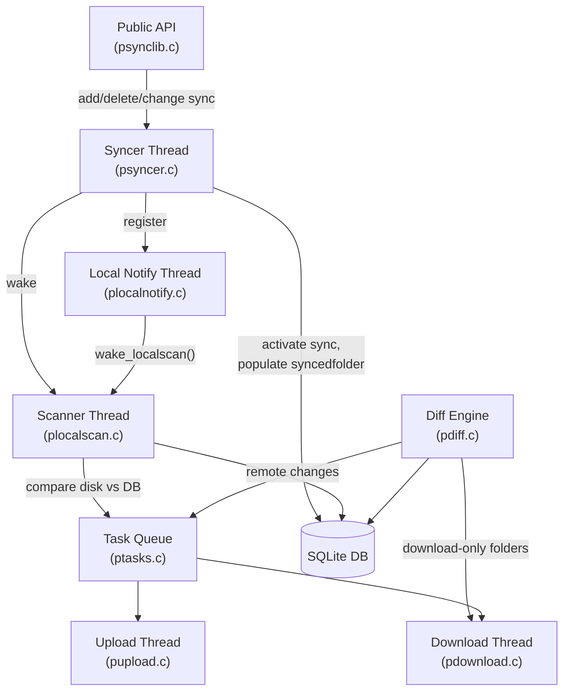

# Sync Engine

The sync engine is the central orchestration layer that keeps local folders and remote cloud folders in agreement. It combines three cooperating subsystems -- a filesystem scanner (`plocalscan.c`), a filesystem notification listener (`plocalnotify.c`), and a syncer thread (`psyncer.c`) -- to detect local changes, while a separate diff engine (`pdiff.c`) handles remote changes. Detected changes are converted into tasks (uploads, downloads, folder creations, deletions) that the transfer subsystems execute asynchronously.

This document explains the sync types, the APIs for managing sync folder pairs, the internal threads that drive synchronization, and the platform-specific notification mechanisms that make it all efficient.

## Architecture Overview



## Sync Types

Sync types are bitmask values that control the direction of synchronization. They are defined in `psynclib.h`:

| Constant | Value | Bit Pattern | Behavior |
|----------|-------|-------------|----------|
| `PSYNC_DOWNLOAD_ONLY` | 1 | `01` | Cloud-to-local only. Remote changes are downloaded; local changes are ignored. |
| `PSYNC_UPLOAD_ONLY` | 2 | `10` | Local-to-cloud only. Local changes are uploaded; remote changes are ignored. |
| `PSYNC_FULL` | 3 | `11` | Bidirectional. Both local and remote changes are synchronized. |
| `PSYNC_BACKUPS` | 7 | `111` | Backup mode. Upload-only with additional backup-specific handling (see below). |

The valid range is `PSYNC_SYNCTYPE_MIN` (1) through `PSYNC_SYNCTYPE_MAX` (7). Any value outside this range causes `PERROR_INVALID_SYNCTYPE`.

Because the types are bitmasks, the engine tests direction with bitwise AND:

- `synctype & PSYNC_DOWNLOAD_ONLY` -- true for download-only and full sync
- `synctype & PSYNC_UPLOAD_ONLY` -- true for upload-only, full sync, and backups

## Adding Sync Folder Pairs

Three functions create sync relationships between a local directory and a remote cloud folder.

### `psync_add_sync_by_path()`

```c
psync_syncid_t psync_add_sync_by_path(const char *localpath, const char *remotepath, psync_synctype_t synctype);
```

Resolves `remotepath` to a folder ID via `psync_get_folderid_by_path()`, then delegates to `psync_add_sync_by_folderid()`. Returns `PSYNC_INVALID_SYNCID` if the remote path does not exist.

### `psync_add_sync_by_folderid()`

```c
psync_syncid_t psync_add_sync_by_folderid(const char *localpath, psync_folderid_t folderid, psync_synctype_t synctype);
```

This is the core sync-addition function. It performs the following validation steps in order:

1. **Sync type validation** -- rejects values outside `[PSYNC_SYNCTYPE_MIN, PSYNC_SYNCTYPE_MAX]`.
2. **Local path existence** -- calls `psync_stat()` and verifies the path is a directory.
3. **Permission check** -- for download-only types, requires read+write+execute (mode 7); for upload-only types, requires read+execute (mode 5).
4. **FUSE mount guard** -- rejects local paths that reside inside the pCloudDrive FUSE mount point to prevent recursive sync loops.
5. **Parent/child conflict detection** -- iterates all existing `syncfolder` rows and checks whether the new local path is a parent or child of any existing sync path (using `psync_str_is_prefix()`), or an exact match. Rejects with `PERROR_PARENT_OR_SUBFOLDER_ALREADY_SYNCING` or `PERROR_FOLDER_ALREADY_SYNCING`.
6. **Remote folder existence** -- queries the local `folder` table for the given `folderid`.
7. **Remote permission check** -- verifies the remote folder grants `PSYNC_PERM_READ` for download types and `PSYNC_PERM_WRITE` for upload types. Shared folders with insufficient permissions are rejected with `PERROR_REMOTE_FOLDER_ACC_DENIED`.
8. **Database insert** -- inserts a row into `syncfolder` with `flags=0` (pending activation), along with the inode and device ID of the local directory.
9. **Syncer activation** -- calls `psync_syncer_new(syncid)` which spawns a thread to activate the new sync.

On success, returns the new `psync_syncid_t`. On failure, returns `PSYNC_INVALID_SYNCID` and sets `psync_error`.

### `psync_add_sync_by_path_delayed()`

```c
int psync_add_sync_by_path_delayed(const char *localpath, const char *remotepath, psync_synctype_t synctype);
```

A deferred variant designed for early initialization. Key differences from the immediate functions:

- Can be called right after `psync_init()`, before `psync_start_sync()`, and even before the user has logged in.
- Inserts into the `syncfolderdelayed` table instead of `syncfolder`.
- Does not return a sync ID (returns 0 on success, -1 on error).
- Only validates the local path (existence, directory type, permissions). Remote path validation and folder creation are deferred.
- If the engine is already online, immediately spawns a thread to process delayed syncs.

This function is the primary mechanism used by the CLI's `sync add` command.

## Delayed Sync Resolution

The delayed sync mechanism is implemented in `psync_syncer_check_delayed_syncs()` in `psyncer.c`. This function is called both during syncer initialization and whenever a delayed sync is added while online.

For each row in `syncfolderdelayed`, the function:

1. **Re-validates the local path** -- checks existence, directory type, and permissions. If validation fails, the delayed sync is silently deleted.
2. **Checks for parent/child conflicts** -- compares against all existing `syncfolder` entries using `psync_str_is_prefix()`. Conflicting entries are deleted.
3. **Resolves or creates the remote folder** -- calls `psync_get_folderid_by_path_or_create()`, which will create any missing path components if the user has sufficient permissions.
4. **Promotes to a real sync** -- deletes the delayed row, inserts into `syncfolder` with `flags=0`, and calls `psync_syncer_new()` to activate it.

If the remote folder cannot be resolved because the engine is offline (`PERROR_OFFLINE`), processing stops and the delayed sync remains for later retry. If the folder cannot be created for any other reason (e.g., permission denied), the delayed sync is silently discarded.

## Deleting Sync Folder Pairs

```c
int psync_delete_sync(psync_syncid_t syncid);
```

Deleting a sync removes the relationship between the local and remote folders. No files or folders are deleted on either side. The function:

1. Recursively deletes all `localfolder` and `localfile` records for the sync via `psync_delete_local_recursive()`.
2. Deletes the `syncfolder` row.
3. Commits the transaction.
4. Stops any in-progress downloads and uploads for the sync.
5. Removes the filesystem notification watch via `psync_localnotify_del_sync()`.
6. Restarts the local scanner to pick up the changed sync list.
7. Reloads path status caches.

## Changing Sync Type

```c
int psync_change_synctype(psync_syncid_t syncid, psync_synctype_t synctype);
```

Changes the direction of an existing sync. This is a destructive-and-rebuild operation:

1. Validates the new sync type, local path, and remote permissions (same checks as `psync_add_sync_by_folderid()`).
2. If the type is unchanged, returns 0 immediately.
3. Resets `flags` to 0 in `syncfolder` (marking the sync as pending re-activation).
4. Removes all entries from the download folder list for this sync.
5. Deletes all `syncedfolder`, `localfile`, and `localfolder` records for this sync.
6. Stops in-progress downloads and uploads.
7. Removes and re-adds the filesystem notification watch.
8. Calls `psync_syncer_new()` to re-activate the sync with the new type.

This effectively treats the sync as a brand-new folder pair with the new direction.

## Syncer Thread

The syncer subsystem (`psyncer.c`) is responsible for activating new syncs and populating the internal tracking structures.

### Initialization

`psync_syncer_init()` runs at startup and:

1. Loads all folder IDs from `syncedfolder` where the sync type includes `PSYNC_DOWNLOAD_ONLY` into the download folder list (a binary search tree).
2. Spawns the syncer thread.

### Syncer Thread Loop

The syncer thread (`psync_syncer_thread()`) runs under the SQL lock and:

1. Cleans up orphaned `syncfolder` rows (those with `folderid IS NULL`) if there are no pending tasks.
2. Processes all `syncfolder` rows where `flags=0` (pending activation) by calling `psync_sync_newsyncedfolder()`.

### Sync Activation

`psync_sync_newsyncedfolder()` activates a single sync within a database transaction:

**For download-containing syncs** (`synctype & PSYNC_DOWNLOAD_ONLY`):
- Calls `psync_add_folder_for_downloadsync()` which recursively walks the remote folder tree.
- For each subfolder: creates a `localfolder` record, creates a folder-creation task, adds the folder to the download list, and recurses.
- For each file: creates a download task via `psync_task_download_file_silent()`.
- Adds the folder to the `syncedfolder` tracking table.

**For upload-only syncs** (`synctype` without `PSYNC_DOWNLOAD_ONLY`):
- Simply inserts a `syncedfolder` record. The local scanner will detect and upload files.

After activation, the function:
- Updates the `syncfolder` flags from 0 to 1 (activated).
- Wakes the local scanner (for upload syncs) or the download thread (for download syncs).
- Registers the sync with the local notification system.

## Download Folder List

The download folder list is a binary search tree (`synced_down_folders` in `psyncer.c`) that tracks which remote folder IDs are part of a download-type sync. This data structure is consulted by the diff engine (`pdiff.c`) to determine whether a remote change should trigger a local download.

Key operations:
- `psync_add_folder_to_downloadlist()` -- adds a folder ID (called during sync activation).
- `psync_del_folder_from_downloadlist()` -- removes a folder ID (called during sync deletion or type change).
- `psync_is_folder_in_downloadlist()` -- tests membership (called by the diff engine when processing remote changes).
- `psync_clear_downloadlist()` -- removes all entries.

All operations are protected by `sync_down_mutex`. The tree uses the `psync_tree` intrusive balanced binary tree from `ptree.h`, keyed by `psync_folderid_t`.

## Local Scanning

The local scanner (`plocalscan.c`) detects changes on the local filesystem for upload-type syncs.

### Scanner Thread

The scanner thread (`scanner_thread()`) follows this lifecycle:

1. Sleeps 1.5 seconds after start.
2. Waits for `PSTATUS_AUTH_PROVIDED` and `PSTATUS_RUN_RUN` or `PSTATUS_RUN_PAUSE`.
3. Performs the initial full scan (`scanner_scan(1)`).
4. Sets `PSTATUS_LOCALSCAN_READY`.
5. Enters the main loop: wait for a wake signal or timeout, then scan again.

### Scan Intervals

The scanner uses adaptive timing controlled by constants in `psettings.h`:

| Constant | Value | Meaning |
|----------|-------|---------|
| `PSYNC_LOCALSCAN_RESCAN_INTERVAL` | 10 seconds | Rescan interval when local notifications are not available. |
| `PSYNC_LOCALSCAN_RESCAN_NOTIFY_SUPPORTED` | 3600 seconds | Rescan interval when local notifications are working (1 hour fallback). |
| `PSYNC_LOCALSCAN_SLEEPSEC_PER_SCAN` | 10 seconds | Total sleep budget distributed across folders to throttle scanning. |
| `PSYNC_LOCALSCAN_MIN_INTERVAL` | 60 seconds | Minimum interval between `psync_wake_localscan()` calls (rate-limited). |

When filesystem notifications are available (`psync_localnotify_init()` returns 0), the scanner sleeps for up to one hour between scans, relying on notification-triggered wakes. Without notifications, it rescans every 10 seconds.

### How Scanning Works

`scanner_scan()` iterates all `syncfolder` rows where `synctype & PSYNC_UPLOAD_ONLY`. For each sync folder:

1. Stats the local path and verifies it still exists with matching device ID.
2. Skips folders on the FUSE mount or in the ignore list.
3. Calls `scanner_scan_folder()` recursively for each directory.

`scanner_scan_folder()` performs a sorted merge between the disk listing and the database state:

1. Reads the local directory contents into a sorted list.
2. Reads the corresponding `localfile` and `localfolder` records from the database into a sorted list.
3. Walks both lists in parallel:
   - **Match (same name, same type):** for files, checks mtime/size/inode; if different, adds to the modified-files list.
   - **Match (same name, different type):** treats as delete + create.
   - **On disk but not in DB:** new file or folder (triggers upload task creation).
   - **In DB but not on disk:** deleted file or folder (triggers delete task creation).
4. Recurses into subdirectories.

The scan produces nine categorized change lists (new files, deleted files, new folders, deleted folders, modified files, renamed files from/to, renamed folders from/to) that are processed into tasks after the recursive walk completes.

### Per-Folder Throttling

To avoid overwhelming the system on large directory trees, the scanner distributes a sleep budget across folders. The per-folder sleep is `PSYNC_LOCALSCAN_SLEEPSEC_PER_SCAN * 1000 / folder_count` milliseconds, capped at 250ms. On the first scan, throttling is disabled for faster initial sync.

### Ignored Paths

The scanner maintains a list of ignored paths loaded from the `ignorepaths` setting. Paths are matched by device ID and inode number (not string comparison), which makes the check robust against symlinks and mount points. The ignore list supports `$HOME` expansion and is refreshed hourly or when the setting changes (detected via SHA-256 checksum).

## Local Filesystem Notifications

The local notification system (`plocalnotify.c`) provides platform-specific filesystem change detection that triggers immediate rescans instead of relying on polling intervals.

### Platform Implementations

| Platform | Mechanism | Scope | Notes |
|----------|-----------|-------|-------|
| Linux | `inotify` + `epoll` | Per-directory recursive watches | Watches all events: `IN_CLOSE_WRITE`, `IN_CREATE`, `IN_DELETE`, `IN_MOVED_FROM`, `IN_MOVED_TO`, `IN_DELETE_SELF`. New subdirectories are automatically watched. |
| macOS | FSEvents | Per-sync-folder with 200ms latency | Re-creates the event stream when syncs are added or removed by stopping the `CFRunLoop`. Only monitors upload-type syncs. |
| BSD | `kqueue` | Per-directory with `EVFILT_VNODE` | Monitors `NOTE_WRITE`, `NOTE_EXTEND`, `NOTE_ATTRIB`. Only catches folder-level changes (not individual file modifications); the implementation returns -1 from init to force frequent rescans. |
| Windows | `FindFirstChangeNotification` | Per-sync-folder, recursive | Monitors file name, directory name, size, last write, and attribute changes. Uses `WaitForMultipleObjects` to multiplex across all watched folders. |
| Other | No-op | None | `psync_localnotify_init()` returns -1, causing the scanner to use its short polling interval. |

### Interaction with the Scanner

The notification thread does not process changes itself. When it detects a filesystem event, it calls `psync_wake_localscan()`, which:

1. Cancels any per-folder sleep in the current scan (via `cancel_localsleep()`).
2. Signals the scan condition variable to wake the scanner thread.
3. Is rate-limited to at most once per `PSYNC_LOCALSCAN_MIN_INTERVAL` (60 seconds) to prevent notification storms from causing excessive CPU usage.

On Linux, the notification thread batches events: it accumulates a notification count during `epoll_wait()` and only wakes the scanner after a 1-second idle period (no events received in the last epoll timeout). This debouncing prevents rapid-fire wakes during bulk file operations.

### Adding and Removing Watches

When a sync is activated, `psync_localnotify_add_sync(syncid)` is called. On Linux and BSD, this sends a message through an internal pipe to the notification thread, which then sets up watches for the sync folder and all its subdirectories. On macOS, it stops the run loop, causing the notification thread to rebuild its FSEvents stream with the updated folder list.

When a sync is deleted, `psync_localnotify_del_sync(syncid)` removes all watches for that sync. The pipe-based message passing ensures thread safety -- the notification thread is the only one that manipulates watch state.

## Sync Folder Flags and States

The `syncfolder` table uses a `flags` column to track activation state:

| Flag Value | Meaning |
|------------|---------|
| 0 | Pending activation. The syncer thread has not yet processed this sync. |
| 1 | Activated. The syncer has populated `syncedfolder` records and started tracking. |

When `psync_change_synctype()` is called, it resets flags to 0 and re-activates the sync, effectively treating it as new.

The `syncedfolder` table tracks the actual folder-level mapping between remote folder IDs, local folder IDs, and sync types. It is populated during sync activation and consulted by the diff engine.

## Backup Mode

`PSYNC_BACKUPS` (value 7, bits `111`) is a special sync type that includes both download and upload bits, plus an additional flag bit. In practice, backup mode behaves as upload-only with additional server-side handling:

- Backup syncs are created via `psync_create_backup()` in `psynclib.c`, which internally calls `psync_add_sync_by_folderid()` with `PSYNC_BACKUPS`.
- Because `PSYNC_BACKUPS & PSYNC_UPLOAD_ONLY` is true, the local scanner processes backup folders.
- Because `PSYNC_BACKUPS & PSYNC_DOWNLOAD_ONLY` is true, the syncer also populates the download folder list during activation.
- Backup deletion uses `psync_delete_sync()` and optionally `psync_delete_backup_device()` to clean up the server-side device registration.
- The `psync_delete_sync_by_folderid()` function provides an alternative deletion path that looks up the sync ID from a remote folder ID, used when the server requests a device stop.

## Task Creation

The sync engine does not transfer files directly. Instead, it creates task records that the upload and download subsystems process asynchronously:

- **Local scanner** creates upload tasks for new/modified local files and folder creation/deletion tasks.
- **Syncer activation** creates download tasks (`psync_task_download_file_silent()`) and local folder creation tasks (`psync_task_create_local_folder()`) for download-type syncs.
- **Diff engine** creates download tasks when remote files change in folders that are in the download list.

The `localfolder` table includes a `taskcnt` field that tracks pending tasks per folder. This is incremented when tasks are created (`psync_increase_local_folder_taskcnt()`) and decremented when they complete (`psync_decrease_local_folder_taskcnt()`).

## Limitations and Gotchas

- **Parent/child nesting is forbidden.** You cannot sync `/home/user/Documents` and `/home/user/Documents/Work` simultaneously. The validation uses `psync_str_is_prefix()` which checks both directions, so neither a parent nor a child of an existing sync path is allowed.

- **FUSE mount exclusion.** Local paths inside the pCloudDrive FUSE mount are rejected. Syncing from the virtual filesystem back to the cloud would create infinite loops.

- **Delayed syncs can be silently dropped.** If `psync_add_sync_by_path_delayed()` creates a delayed sync and the remote path cannot be created (e.g., shared folder with no create permission), the delayed sync is deleted without any error callback to the caller.

- **BSD kqueue limitations.** The BSD implementation only monitors directory-level changes (creation, deletion, rename) but does not detect in-place file modifications. The implementation compensates by returning -1 from `psync_localnotify_init()`, which forces the scanner to use the 10-second polling interval instead of the 1-hour notification-backed interval.

- **Device ID validation.** The scanner checks that the device ID of each sync folder has not changed since it was registered. If a folder is on a removable drive that gets remounted with a different device ID, the scanner will skip it. This prevents accidental sync of the wrong volume.

- **Invalid filename character replacement.** When creating local folders for download syncs, `psync_create_local_folder_in_db()` replaces characters that are invalid in local filenames with underscores. The set of invalid characters is defined in `psync_invalid_filename_chars`.

- **Rate-limited wake calls.** `psync_wake_localscan()` is rate-limited to once per 60 seconds via `psync_run_ratelimited()`. During bulk operations, this means the scanner may not react to notifications for up to a minute. The first scan after start bypasses this limit.

- **macOS startup race.** On macOS, the FSEvents run loop may not be initialized when `psync_localnotify_add_sync()` is first called. The implementation busy-waits up to 2 seconds for the run loop to become available, with a `psync_milisleep_nosqlcheck()` call to avoid deadlocking on the SQL lock.

- **Scan restart on device change.** If the device ID of a sync folder changes mid-scan (e.g., the volume is remounted), the entire scan is aborted and restarted with exponential backoff (starting at 1 second, doubling up to 16 seconds).

- **Name ignore filtering.** Both the syncer (during download activation) and the diff engine filter files through `psync_is_name_to_ignore()`. Files matching OS-specific patterns (e.g., `.DS_Store`, `Thumbs.db`, `desktop.ini`) are never synced in either direction.
