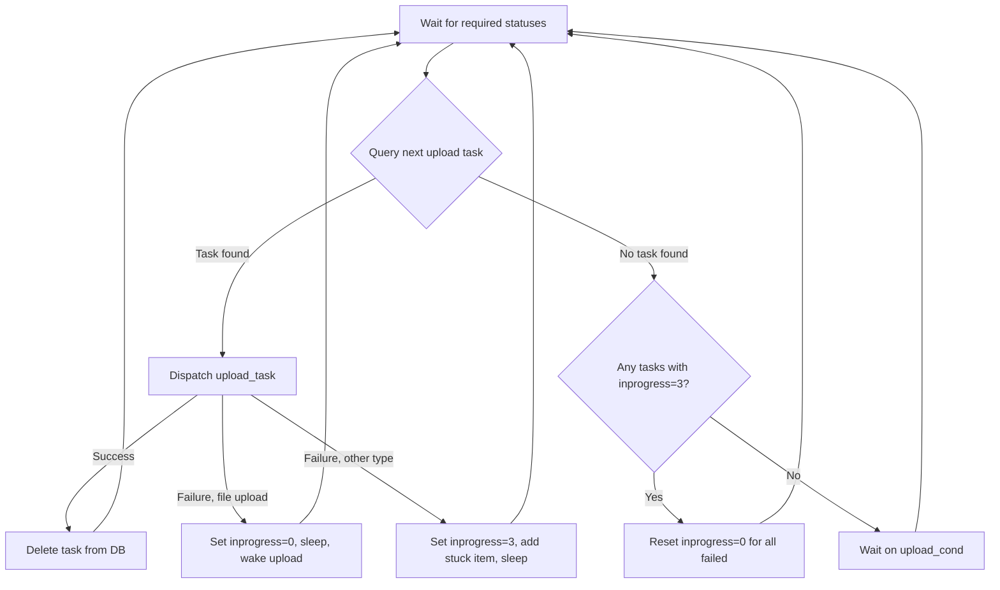
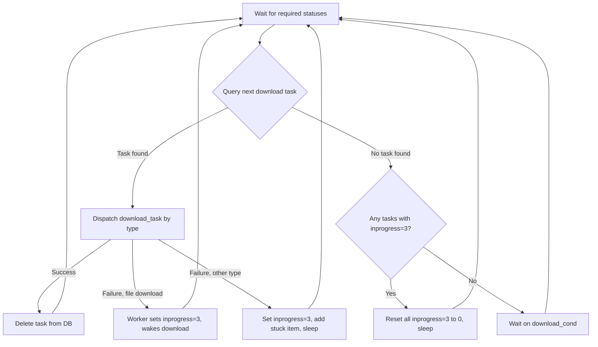
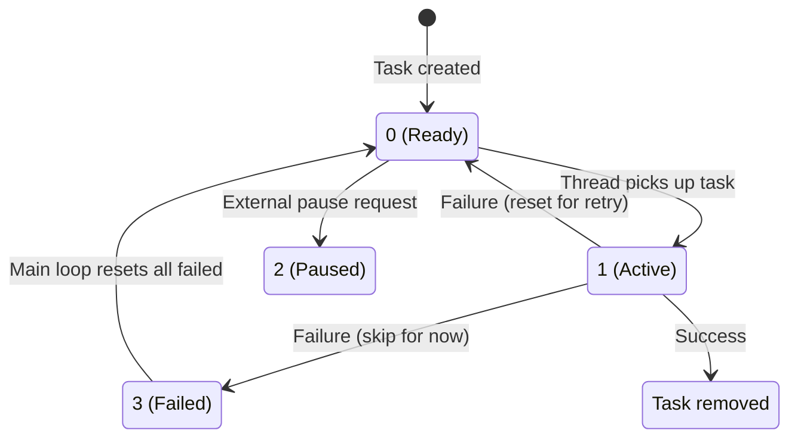

# File Transfers (Uploads and Downloads)

The pclsync library performs file transfers through two dedicated long-running threads: the **upload thread** and the **download thread**. Each thread runs a continuous loop that polls the SQLite database for pending tasks, enforces concurrency limits, and spawns per-file worker threads to perform the actual data transfer. The system supports chunked uploads with block-level deduplication, delta downloads using range requests, peer-to-peer (P2P) transfers on the local network, and automatic or manual speed shaping. Failed transfers are retried indefinitely as long as the engine remains online.

Key source files:

| File | Role |
|------|------|
| `pupload.c` | Upload thread, per-file upload logic, retry and concurrency control |
| `pdownload.c` | Download thread, per-file download logic, retry and concurrency control |
| `pp2p.c` | Peer-to-peer file transfer over LAN |
| `pnetlibs.c` | Network utilities, speed shaping, HTTP helpers, checksum-based block scanning |
| `psettings.h` | Transfer-related constants (parallelism limits, thresholds, sleep durations) |
| `ptasks.h` | Task type definitions and state constants |

## Upload Thread

The upload thread (`upload_thread()` in `pupload.c`) runs in a loop that selects the next pending upload task from the database, dispatches it, and sleeps when no work is available.

### Task Selection

Upload tasks are selected with a SQL `UNION ALL` query that merges two sources:

1. **Sync tasks** from the `task` table -- rows where `type & PSYNC_TASK_DWLUPL_MASK == PSYNC_TASK_UPLOAD` and `inprogress = 0`.
2. **Direct upload tasks** from the `upload_tasks` table -- rows where `status = PUPTASK_STATUS_WAITING`.

The combined result set is ordered by `id` and `level`, and `LIMIT 1` returns the oldest pending task.

### Main Loop



### Per-File Upload Worker

When the task type is `PSYNC_UPLOAD_FILE`, the main thread calls `task_run_uploadfile()`, which:

1. Queries the file size from `localfile` (sync tasks) or `upload_tasks` (direct tasks).
2. Sets `inprogress = 1` in the database.
3. Allocates an `upload_task_t` struct and adds it to the in-memory `uploads` list.
4. Waits on `current_uploads_cond` if the parallelism or byte threshold limits are exceeded.
5. Increments `psync_status.filesuploading` and `bytestouploadcurrent`.
6. Spawns a new thread (`task_run_upload_file_thread`) to perform the actual upload.
7. Returns `-1` (meaning "do not delete the task yet") -- the worker thread handles cleanup.

The worker thread calls `task_uploadfile()`, which runs through this sequence:

1. **Freshness check** -- if the file's mtime is less than `PSYNC_UPLOAD_OLDER_THAN_SEC` (5 seconds) old, sleep and re-stat up to 10 times until it stabilizes.
2. **File lock** -- acquire a lock via `psync_lock_file()`.
3. **Checksum computation** -- compute SHA-1 of the local file.
4. **Exists check** -- if a file with the same name, size, and checksum already exists at the remote destination, skip the upload entirely.
5. **Copy-if-exists** -- for files >= `PSYNC_MIN_SIZE_FOR_EXISTS_CHECK` (8 KB), ask the server if any file with the same checksum exists and server-side copy it.
6. **Small file path** -- for files <= `PSYNC_MIN_SIZE_FOR_CHECKSUMS` (64 KB), call `upload_file()` which sends the entire file in a single `uploadfile` API call.
7. **Large file path** -- for larger files, call `upload_big_file()` which uses the chunked upload protocol (`upload_create`, `upload_write`, `upload_writefromfile`, `upload_writefromupload`, `upload_info`, `upload_save`). This path includes block-level deduplication by scanning existing remote files and previous uploads for reusable blocks.

### Chunked Upload Protocol (Large Files)

For files larger than 64 KB, the upload uses a multi-step protocol:

1. **`upload_create`** -- creates a server-side upload session and returns an `uploadid`.
2. **Block scanning** -- the library scans the previous version of the file (by fileid/hash) and prior upload sessions for blocks that match, building a range list. Matching blocks use `upload_writefromfile` or `upload_writefromupload` instead of re-uploading data.
3. **`upload_write`** -- streams new data ranges from the local file to the server.
4. **`upload_info`** -- requests the server to verify the checksum of the assembled upload.
5. **`upload_save`** -- finalizes the upload, creating the file in the target folder.

Responses are pipelined: up to `PSYNC_MAX_PENDING_UPLOAD_REQS` (16) requests can be in flight before the client must drain results. If a copy-from range fails, it is transparently restarted as an upload range.

### File Growth During Upload

After all bytes have been sent, `upload_file()` attempts one more read. If any bytes are returned, the file has grown during upload and the entire transfer is restarted. For large files, `upload_big_file()` checks `psync_file_size(fd) != fsize` after completing all ranges and also restarts if the size has changed.

## Download Thread

The download thread (`download_thread()` in `pdownload.c`) follows a similar pattern to the upload thread but handles a wider variety of local filesystem operations.

### Task Selection

Download tasks are selected from the `task` table with:

```sql
SELECT ... FROM task
WHERE inprogress=0
  AND type & PSYNC_TASK_DWLUPL_MASK = PSYNC_TASK_DOWNLOAD
ORDER BY id LIMIT 1
```

This selects the oldest pending download-side task, which may be a folder create/delete/rename, a file download, a file delete, or a file rename.

### Main Loop



### Per-File Download Worker

When the task type is `PSYNC_DOWNLOAD_FILE`, `task_run_download_file()`:

1. Queries the file metadata (`size`, `hash`, `ctime`, `mtime`) from the `file` table.
2. Builds the local path, temp file path (with `.part` suffix), and lock file name.
3. Adds the task to the in-memory `downloads` list.
4. Waits on `current_downloads_cond` if parallelism or byte thresholds are exceeded.
5. Checks if the temp file or local file already has the correct checksum (skips the download).
6. Checks free disk space against `minlocalfreespace`.
7. Acquires a file lock via `psync_lock_file()`.
8. Sets `inprogress = 1` in the database.
9. For small files (<= `PSYNC_MAX_SIZE_FOR_ASYNC_DOWNLOAD`, 256 KB), dispatches an async download.
10. For larger files, spawns a thread (`task_run_download_file_thread`) that calls `task_download_file()`.

The actual download function `task_download_file()` proceeds as follows:

1. **Remote checksum** -- fetch the server-side checksum via `psync_get_remote_file_checksum()`.
2. **Local match** -- if a local file with the same checksum/size already exists in `localfile`, skip the download.
3. **Local copy** -- search `localfile` for any file with a matching checksum and copy it locally.
4. **P2P attempt** -- for files >= `PSYNC_MIN_SIZE_FOR_P2P` (32 KB), try `psync_p2p_check_download()`.
5. **Server download** -- call `getfilelink` API to obtain download hosts and path.
6. **Range-based download** -- use `psync_net_download_ranges()` to compute which byte ranges can be copied from existing local files (old version, temp files) and which must be transferred from the server.
7. **HTTP transfer** -- download server ranges via HTTP GET with byte-range headers, using `psync_http_connect()` and `psync_http_readall()`.
8. **Checksum verification** -- compute SHA-1 of the downloaded file and compare with the server checksum. On mismatch, the download fails.
9. **Atomic rename** -- rename the `.part` temp file to the final name, creating or updating the `localfile` DB entry.

## Task State Machine

Each task in the `task` table has an `inprogress` column that tracks its processing state.



| Value | Name | Meaning |
|-------|------|---------|
| 0 | `PSYNC_TASK_WAITING` | Ready for processing. The main thread's SELECT query only picks tasks with `inprogress = 0`. |
| 1 | `PSYNC_TASK_INPROGR` | Currently being processed by a worker thread. |
| 2 | `PSYNC_TASK_PAUSED` | Externally paused. Excluded from both the ready query and the "count pending uploads" query. |
| 3 | `PSYNC_TASK_FAILED` | Failed on the most recent attempt. The main loop skips these, processes all ready tasks first, then bulk-resets all `inprogress = 3` rows back to `0` before sleeping. |

The `inprogress = 3` state is the key mechanism that prevents a single failing task from blocking the entire queue. When a non-file task fails, the main thread sets it to 3 and moves on to the next task. Only after all ready tasks are exhausted does the loop reset failed tasks and retry them (after a sleep).

For file downloads specifically, the worker thread itself sets `inprogress = 3` and calls `psync_wake_download()`, allowing other tasks to proceed immediately.

## Concurrency Controls

### Parallelism Limits

| Constant | Value | Description |
|----------|-------|-------------|
| `PSYNC_MAX_PARALLEL_UPLOADS` | 32 | Maximum concurrent upload worker threads |
| `PSYNC_MAX_PARALLEL_DOWNLOADS` | 1024 | Maximum concurrent download worker threads |
| `PSYNC_START_NEW_UPLOADS_TRESHOLD` | 512 KB | New uploads blocked until remaining bytes to upload drops below this |
| `PSYNC_START_NEW_DOWNLOADS_TRESHOLD` | 4 MB | New downloads blocked until remaining bytes to download drops below this |

Both upload and download threads use the same pattern for concurrency control:

1. The task struct is added to an in-memory linked list (`uploads` or `downloads`).
2. While the count of active workers exceeds the max or the remaining-bytes-to-transfer exceeds the threshold, the thread blocks on a condition variable (`current_uploads_cond` / `current_downloads_cond`).
3. Worker threads signal the condition variable as they make progress (bytes transferred) or complete.

### Byte Threshold Gating

The byte thresholds prevent the system from spawning many workers for a queue of small files while a large file is still transferring. A new worker is only started when:

```
bytes_remaining = bytestouploadcurrent - bytesuploaded
bytes_remaining <= PSYNC_START_NEW_UPLOADS_TRESHOLD
```

Workers call `wake_upload_when_ready()` after writing data, which checks both conditions and signals the waiting main thread if appropriate.

## Retry Logic

Both upload and download threads retry failed tasks indefinitely while the engine is online.

### Upload Retry

1. The worker thread calls `task_uploadfile()`.
2. On failure, it sets `inprogress = 0` (sync tasks) or updates `upload_tasks.status` to `PUPTASK_STATUS_FAILED`/`PUPTASK_STATUS_WAITING` depending on online status.
3. It calls `psync_wake_upload()` and sleeps for `PSYNC_SLEEP_ON_FAILED_UPLOAD` (2 seconds).
4. The main loop will re-select the task on its next iteration.

### Download Retry

1. The worker thread calls `task_download_file()`.
2. On failure, it sleeps for `PSYNC_SLEEP_ON_FAILED_DOWNLOAD` (2 seconds).
3. It sets `inprogress = 3` and calls `psync_wake_download()`.
4. When the main loop exhausts all `inprogress = 0` tasks, it resets all `inprogress = 3` tasks back to `0`, sleeps for `PSYNC_SLEEP_ON_FAILED_DOWNLOAD`, and retries.

### Sleep Durations

| Constant | Value | When Used |
|----------|-------|-----------|
| `PSYNC_SLEEP_ON_FAILED_UPLOAD` | 2 seconds | After a failed upload, before retry |
| `PSYNC_SLEEP_ON_FAILED_DOWNLOAD` | 2 seconds | After a failed download, before retry |
| `PSYNC_SLEEP_ON_DISK_FULL` | 10 seconds | When local disk is full |
| `PSYNC_SLEEP_ON_LOCKED_FILE` | 2 seconds | When a file lock cannot be acquired |
| `PSYNC_SLEEP_ON_OS_LOCK` | 5 seconds | When the OS reports a lock conflict |
| `PSYNC_SLEEP_FILE_CHANGE` | 2 seconds | When a file changes during transfer |

### Required Status Checks

Both threads call `psync_wait_statuses_array()` at the top of each loop iteration and periodically within data transfer loops. The required statuses differ slightly:

- **Upload**: `RUN_RUN`, `ONLINE_ONLINE`, `ACCFULL_QUOTAOK` (will not upload if account quota is exceeded).
- **Download**: `AUTH_PROVIDED`, `RUN_RUN`, `ONLINE_ONLINE`.

If any required status is not met, the thread blocks until it is restored.

## Speed Limiting / Shaping

Speed shaping is implemented in `pnetlibs.c` at the socket read/write level, controlled by the `maxdownloadspeed` and `maxuploadspeed` settings.

### Upload Shaping

The function `psync_socket_writeall_upload()` handles three modes based on the `maxuploadspeed` setting:

| Setting Value | Behavior |
|---------------|----------|
| `-1` (default) | No shaping. Writes as fast as possible. |
| `0` | **Auto shaping.** Uses a dynamic rate (`dyn_upload_speed`) that starts at `PSYNC_UPL_AUTO_SHAPER_INITIAL` (100 KB/s). The rate increases by 5% when writes succeed and decreases by 5% when the socket is not writable (congestion detected). Minimum rate is `PSYNC_UPL_AUTO_SHAPER_MIN` (10 KB/s). |
| `> 0` | **Manual shaping.** Limits writes to the specified bytes per second using a per-second byte counter. When the limit is reached, the thread sleeps until the next second. |

### Download Shaping

The function `psync_socket_readall_download_th()` handles three modes based on the `maxdownloadspeed` setting:

| Setting Value | Behavior |
|---------------|----------|
| `-1` (default) | No shaping. Reads as fast as possible. |
| `0` | **Auto shaping.** Monitors the socket's pending data buffer. Sleeps for `PSYNC_SLEEP_AUTO_SHAPER` (100 ms) scaled by the estimated download speed, and stops when the buffer stops growing. |
| `> 0` | **Manual shaping.** Limits reads to the specified bytes per second using a per-second byte counter. |

When shaping is active, the socket receive buffer is reduced to `PSYNC_RECV_BUFFER_SHAPED` (128 KB) to prevent the kernel from buffering too far ahead.

## Peer-to-Peer (P2P) Transfer

P2P transfer (`pp2p.c`) allows files to be transferred directly between pCloud clients on the same local network, bypassing the server. It is disabled by default (`PSYNC_P2P_SYNC_DEFAULT = 0`) and must be enabled via the `p2psync` setting.

### Architecture

The P2P subsystem runs a dedicated thread that listens on:
- **UDP port 42420** (`PSYNC_P2P_PORT`) for discovery broadcasts.
- **A random TCP port** for file transfer connections.

### Protocol Flow

1. **Discovery**: The downloading client broadcasts a `P2P_CHECK` packet on all network interfaces via UDP. The packet contains the first 3 bytes of the file's SHA-1 hash, the file size, and a random challenge.
2. **Response**: A peer that has the file (checked against `localfile` table) responds with `P2P_RESP_HAVEIT` and its TCP port. A peer that is currently downloading the file responds with `P2P_RESP_WAIT`.
3. **Transfer**: The downloader connects via TCP, sends a `P2P_GET` packet with its RSA public key and an ownership token (obtained from the pCloud API via `getfileownershiptoken`).
4. **Encryption**: The server peer generates an AES-256-CTR key, encrypts it with the downloader's RSA public key, and streams the encrypted file data.
5. **Verification**: The downloader decrypts and verifies the SHA-1 checksum.

### When P2P Is Used

P2P is attempted during file download only when:
- The `p2psync` setting is enabled.
- The file size is >= `PSYNC_MIN_SIZE_FOR_P2P` (32 KB).
- The download falls through to the server download stage (after local copy checks fail).

If P2P returns `PSYNC_NET_OK`, the file is used directly. If it returns `PSYNC_NET_PERMFAIL`, the download falls back to the server. If it returns `PSYNC_NET_TEMPFAIL`, the entire download task is retried.

### Security

- Each P2P transfer requires an **ownership token** from the pCloud API, proving the downloader is authorized to access the file.
- File data is encrypted in transit using **AES-256-CTR** with an RSA-exchanged key (2048-bit RSA for P2P).
- Peers are identified by a random computer name hash to avoid self-communication.

## Wake Mechanisms

Both threads use condition variables to sleep efficiently when no work is available.

### Upload Wake

- **Condition variable**: `upload_cond` / `upload_mutex`, with `upload_wakes` counter.
- **`psync_wake_upload()`** signals the condition. Called from: local scan completion, diff processing, task creation, timer exceptions.
- **Timer exception handler**: `psync_timer_exception_handler(psync_wake_upload)` ensures the upload thread wakes on network state changes.

### Download Wake

- **Condition variable**: `download_cond` / `download_mutex`, with `download_wakes` counter.
- **`psync_wake_download()`** signals the condition. Called from: diff processing, task creation, worker thread completion, timer exceptions.
- **Timer exception handler**: `psync_timer_exception_handler(psync_wake_download)` ensures the download thread wakes on network state changes.

### Worker Concurrency Wake

- **`current_uploads_cond`**: signaled when bytes are uploaded or a worker finishes, allowing queued uploads to start.
- **`current_downloads_cond`**: signaled when bytes are downloaded or a worker finishes, allowing queued downloads to start.

## Stuck Items Tracking

The download system maintains a "stuck items" list for files and folders that repeatedly fail to transfer. When a download task fails, a `stuck_item` is created via `create_stuck_elem()` and added to a tracking list via `add_stuck_elem()`. This provides:

- A user-visible list of problematic files (exposed through status callbacks).
- Diagnostic information including the file hash, local path, file name, and error message (typically `STUCK_MSG_NO_PERMISSION`).
- Items are removed from the stuck list via `delete_element()` when the corresponding task eventually succeeds.

Upload failures also create stuck items when the local file cannot be read (e.g., permission denied).

## Key Constants Reference

| Constant | Value | Description |
|----------|-------|-------------|
| `PSYNC_MAX_PARALLEL_UPLOADS` | 32 | Max concurrent upload threads |
| `PSYNC_MAX_PARALLEL_DOWNLOADS` | 1024 | Max concurrent download threads |
| `PSYNC_START_NEW_UPLOADS_TRESHOLD` | 512 KB | Byte backlog threshold for new uploads |
| `PSYNC_START_NEW_DOWNLOADS_TRESHOLD` | 4 MB | Byte backlog threshold for new downloads |
| `PSYNC_MIN_SIZE_FOR_CHECKSUMS` | 64 KB | Min file size for chunked/delta upload |
| `PSYNC_MIN_SIZE_FOR_EXISTS_CHECK` | 8 KB | Min file size for server-side copy check |
| `PSYNC_MIN_SIZE_FOR_P2P` | 32 KB | Min file size for P2P transfer attempt |
| `PSYNC_MAX_SIZE_FOR_ASYNC_DOWNLOAD` | 256 KB | Max file size for async (non-threaded) download |
| `PSYNC_MAX_CHECKSUMS_SIZE` | 64 MB | Max file size for full checksum-based block scanning |
| `PSYNC_MAX_COPY_FROM_REQ` | 32 MB | Max size of a single copy-from-file/upload range request |
| `PSYNC_MAX_PENDING_UPLOAD_REQS` | 16 | Max pipelined upload requests before draining |
| `PSYNC_COPY_BUFFER_SIZE` | 256 KB | Buffer size for file read/write during transfer |
| `PSYNC_UPLOAD_OLDER_THAN_SEC` | 5 s | File must be unmodified for this long before upload starts |
| `PSYNC_FSUPLOAD_NUM_TASKS_PER_RUN` | 128 | Max FS upload tasks processed per batch |
| `PSYNC_APPEND_PARTIAL_FILES` | `.part` | Suffix for partial/temp download files |
| `PSYNC_P2P_PORT` | 42420 | UDP port for P2P discovery |
| `PSYNC_P2P_INITIAL_TIMEOUT` | 600 ms | Timeout waiting for P2P response |

## Limitations and Gotchas

- **No partial upload resume across restarts.** The `uploadid` and `uploadoffset` are persisted in the `localfileupload` / `uptask_fileupload` tables, so large uploads can resume within the same engine session. However, if the partial upload's checksum does not match (e.g., the file was modified), the upload restarts from scratch.

- **File growth during upload causes a full restart.** If a file grows while being uploaded (detected by a trailing read after the expected EOF), the entire upload is abandoned and retried. There is no incremental recovery.

- **inprogress=3 blocking.** The `inprogress = 3` mechanism prevents a single failing task from starving the queue, but all failed tasks are retried together after the queue drains. A persistently failing task will still be retried on every cycle.

- **Download parallelism limit is very high.** The `PSYNC_MAX_PARALLEL_DOWNLOADS` of 1024 is effectively unlimited for most workloads. In practice, the byte threshold (`PSYNC_START_NEW_DOWNLOADS_TRESHOLD` = 4 MB) is the real governor.

- **P2P is disabled by default** and requires explicit opt-in via the `p2psync` setting. When enabled, it adds a 600 ms timeout to each qualifying download attempt, which can slow down initial downloads if no peers are available.

- **Small file downloads use the async system.** Files <= 256 KB are dispatched through `psync_async_download_file()` rather than spawning a dedicated thread. The async system groups requests and uses shared connections. Errors in the async path (e.g., `PSYNC_SERVER_ERROR_TOO_BIG`) cause the task to be retried through the normal thread-based path.

- **Upload freshness delay.** Files modified within the last 5 seconds are delayed (up to 10 retries, each waiting for the mtime to stabilize). A file that is continuously written to will be skipped after 10 attempts and retried on the next upload cycle.

- **File locking.** Both upload and download acquire a file lock before proceeding. If the lock cannot be acquired, the task sleeps for 2 seconds and retries. This prevents conflicts with other processes but can delay transfers for files held open by editors or other applications.

- **Stuck items are keyed by hash.** The same file may appear in the stuck list under both its file hash and its local folder ID. The `delete_element()` call on success removes both entries.

- **The 25 ms download thread sleep.** When spawning a large-file download thread, the download main thread sleeps for 25 ms (`psync_milisleep(25)`) to stagger thread creation and improve API connection reuse. This is a deliberate optimization, not a bug.
