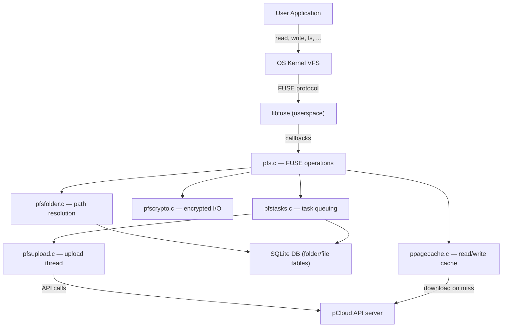

# FUSE Filesystem

The pclsync library exposes the entire pCloud account as a local directory through a FUSE (Filesystem in Userspace) virtual mount. Rather than downloading every file to disk, the FUSE layer serves directory listings from the local SQLite database, streams file content on demand through the page cache, and buffers writes locally before uploading them to the server. Encrypted folders are handled transparently -- filenames are decoded during directory listing and file content is decrypted/encrypted through a dedicated crypto layer. All mutating operations (create, mkdir, rename, unlink, rmdir) are recorded as tasks in the `fstask` database table and executed asynchronously by a background upload thread.

The primary source files involved are `pfs.c` (FUSE operation callbacks), `pfsfolder.c` (path resolution), `pfsstatic.c` (injected static files), `pfstasks.c` (task management), and `pfsupload.c` (background task execution).

## Architecture Overview



## FUSE Operations Table

The following operations are registered in `psync_fs_do_start()` within `pfs.c`:

| FUSE operation | Handler function | Description |
|---|---|---|
| `init` | `psync_fs_init` | Post-mount initialization callback |
| `getattr` | `psync_fs_getattr` | Stat a file or directory (size, mode, timestamps) |
| `readdir` | `psync_fs_readdir` | List directory contents |
| `open` | `psync_fs_open` | Open an existing file |
| `create` | `psync_fs_creat` | Create and open a new file |
| `release` | `psync_fs_release` | Close a file handle (flush + decrement refcount) |
| `flush` | `psync_fs_flush` | Flush pending writes for a file |
| `fsync` | `psync_fs_fsync` | Sync file data to disk |
| `fsyncdir` | `psync_fs_fsyncdir` | Sync directory metadata |
| `read` | `psync_fs_read` | Read file data |
| `write` | `psync_fs_write` | Write file data |
| `mkdir` | `psync_fs_mkdir` | Create a directory |
| `rmdir` | `psync_fs_rmdir` | Remove a directory |
| `unlink` | `psync_fs_unlink` | Delete a file |
| `rename` | `psync_fs_rename` | Move or rename a file or directory |
| `statfs` | `psync_fs_statfs` | Report filesystem statistics (quota) |
| `chmod` | `psync_fs_chmod` | Change permissions (largely a no-op) |
| `chown` | `psync_fs_chown` | Change ownership (largely a no-op) |
| `utimens` | `psync_fs_utimens` | Set file timestamps |
| `truncate` | `psync_fs_truncate` | Truncate a file by path |
| `ftruncate` | `psync_fs_ftruncate` | Truncate an open file |
| `setxattr` | `psync_fs_setxattr` | Set extended attribute |
| `getxattr` | `psync_fs_getxattr` | Get extended attribute |
| `listxattr` | `psync_fs_listxattr` | List extended attributes |
| `removexattr` | `psync_fs_removexattr` | Remove an extended attribute |

On macOS, the `setcrtime` operation is also registered. On platforms supporting `can_unlink`/`can_rmdir` (macFUSE), pre-check callbacks are registered to test permissions before the actual operation.

## Mount Lifecycle

### Starting the Mount (`psync_fs_start`)

`psync_fs_start()` in `pfs.c` is the public entry point. It checks whether authentication is available:

- If the user is already authenticated (`PSTATUS_AUTH_PROVIDED`), it calls `psync_fs_do_start()` directly.
- Otherwise, it spawns a background thread (`psync_fs_wait_start`) that blocks until the engine reaches `PSTATUS_ONLINE_ONLINE`, then calls `psync_fs_do_start()`.

`psync_fs_do_start()` performs the actual FUSE setup:

1. **Mount point resolution**: Calls `psync_fuse_get_mountpoint()`, which reads the `fsroot` setting. On POSIX, it creates the directory if it does not exist. On Windows, it selects a drive letter (defaulting to `P:`).
2. **FUSE arguments**: Configures platform-specific FUSE options. On Linux: `auto_unmount`, `hard_remove`, and `nonempty` (FUSE 2 only). On macOS: `volname`, `nolocalcaches`, `hard_remove`, and optionally `allow_root` for admin users.
3. **Operations struct**: Populates a `struct fuse_operations` with all handler function pointers.
4. **Channel and mount**: Calls `fuse_mount()` to create the FUSE channel, then `fuse_new()` to create the FUSE instance.
5. **Event loop**: Spawns a dedicated `psync_fuse_thread` that runs `fuse_loop_mt()` (multi-threaded FUSE event loop).

On the first start, `psync_fs_init_once()` runs one-time initialization:
- Generates a random fake-file prefix used for OS cache invalidation (POSIX only).
- Calls `psync_fstask_init()` to reload pending tasks from the `fstask` table and start the fsupload thread.
- Calls `psync_pagecache_init()` to initialize the page cache.
- Calls `psync_fsstatic_add_files()` to inject platform-specific static files.
- Registers an `atexit` handler and POSIX signal handlers for clean shutdown.

### Stopping the Mount (`psync_fs_stop`)

`psync_fs_stop()` delegates to `psync_fs_do_stop()`, which:

1. On macOS, calls `unmount()` with `MNT_FORCE`. On Linux, calls `fuse_unmount()`.
2. Calls `fuse_exit()` to signal the FUSE event loop to terminate.
3. Flushes the page cache via `psync_pagecache_flush()`.
4. Waits up to 2 seconds for the FUSE thread to finish via a condition variable.

### Remounting (`psync_fs_remount`)

`psync_fs_remount()` simply calls `psync_fs_stop()` followed by `psync_fs_start()`. This is triggered when the user changes the `fsroot` setting (mount point path).

### Login Pausing

When the user logs out while the mount is active, `psync_fs_pause_until_login()` sets a `waitingforlogin` flag. While this flag is set, all FUSE operation handlers (via the `CHECK_LOGIN_LOCKED` / `CHECK_LOGIN_RDLOCKED` macros) return `-EACCES` immediately. A background thread waits for the engine to come back online and clears the flag.

## Path Resolution

Path resolution is handled by `pfsfolder.c`. Every FUSE operation that receives a path must translate it into a folder ID and leaf name before it can query the database.

### `psync_fsfolder_resolve_path`

This is the primary path resolution function. Given an absolute path like `/Documents/report.pdf`, it:

1. Starts at the root folder (folder ID 0) with full permissions.
2. Iterates through each path component separated by `/`.
3. For each intermediate directory component, queries the `folder` table: `SELECT id, permissions, flags, userid FROM folder WHERE parentfolderid=? AND name=?`.
4. **Encryption handling**: If the current folder has the `PSYNC_FOLDER_FLAG_ENCRYPTED` flag, the path component is encrypted before the database lookup using `get_encname_for_folder()`.
5. **Pending task overlay**: After the database lookup, checks the in-memory fstask tree for the current folder. If a pending `mkdir` task exists for this name, it uses the task's folder ID. If a pending `rmdir` exists for a database-found folder, the folder is treated as deleted.
6. For the final (leaf) component, returns a `psync_fspath_t` struct containing the parent folder ID, the leaf name (in its server-side encoded form for encrypted folders), the accumulated permissions, folder flags, and share ID.

Returns `NULL` if any component is not found. Callers can then check `psync_fsfolder_crypto_error()` to distinguish between a missing path and a crypto error.

### `psync_fsfolderid_by_path`

A variant that resolves an entire path to a folder ID (all components must be directories). Used by `readdir` to look up the folder being listed.

### The `psync_fspath_t` Structure

Defined in `pfsfolder.h`:

```c
typedef struct {
  psync_fsfolderid_t folderid;  /* parent folder ID */
  const char *name;             /* leaf name (encoded if encrypted) */
  uint32_t shareid;             /* share ID, 0 if not shared */
  uint16_t permissions;         /* accumulated PSYNC_PERM_* bits */
  uint16_t flags;               /* folder flags (encrypted, backup, etc.) */
} psync_fspath_t;
```

## Open File Tracking (`psync_openfile_t`)

Every open file descriptor is represented by a `psync_openfile_t` structure, defined in `pfs.h`. These structures are stored in a global binary search tree (`openfiles`) keyed by `fileid` and protected by the SQL lock.

Key fields:

| Field | Purpose |
|---|---|
| `tree` | BST node for the global `openfiles` tree |
| `streams[]` | Read-ahead stream descriptors (`PSYNC_FS_FILESTREAMS_CNT` entries) |
| `mutex` | Per-file mutex for thread-safe access |
| `writeintervals` | Interval tree tracking which byte ranges have been written (modified files) |
| `currentfolder` | Pointer to the fstask folder for the file's parent directory |
| `currentname` | Current filename (may change on rename) |
| `fileid` | Positive for server-side files, negative for locally-created files (negated task ID) |
| `remotefileid` | The server-assigned file ID (0 for new files) |
| `hash` | File content hash (server-side) |
| `initialsize` / `currentsize` | Original and current file sizes |
| `writeid` | Monotonically increasing write generation counter |
| `datafile` | File descriptor for the local data file in the cache |
| `indexfile` | File descriptor for the index file (modified files only) |
| `refcnt` | Reference count (number of open handles + pending operations) |
| `modified` | Set when the file has been written to |
| `newfile` | Set for files created via `creat` that have no server-side original |
| `encrypted` | Set if the file is in an encrypted folder |
| `staticfile` | Set for injected static files (icons, desktop entries) |
| `encoder` | AES-256 sector encoder/decoder (allocated only for encrypted files) |

The `fh_to_openfile` and `openfile_to_fh` macros cast between FUSE file handles (`uint64_t`) and `psync_openfile_t` pointers.

## Major Operations

### `readdir` -- Directory Listing

`psync_fs_readdir()` in `pfs.c` lists the contents of a directory by combining database state with pending fstask operations:

1. Resolves the path to a folder ID via `psync_fsfolderid_by_path()`.
2. If the folder is encrypted, obtains a folder decoder (`psync_cloud_crypto_get_folder_decoder`).
3. Emits `.` and `..` entries.
4. Retrieves the `psync_fstask_folder_t` for pending tasks on this folder.
5. **Subfolders from DB**: Queries `SELECT id, permissions, ctime, mtime, subdircnt, name FROM folder WHERE parentfolderid=?`. Skips entries that have a pending `rmdir` or `mkdir` with the same name (the mkdir replaces the DB entry).
6. **Files from DB**: Queries `SELECT name, size, ctime, mtime, id FROM file WHERE parentfolderid=?`. Skips entries that have a pending `unlink`.
7. **Pending mkdirs**: Iterates the folder's `mkdirs` tree and emits entries (skips those with `PSYNC_FOLDER_FLAG_INVISIBLE`).
8. **Pending creats**: Iterates the folder's `creats` tree and emits entries, calling `psync_creat_to_file_stat()` to produce stat data from the local data file.
9. For encrypted folders, each filename from the database is decoded through the folder decoder before being passed to the FUSE filler callback.

### `read` -- Reading File Data

`psync_fs_read()` retrieves the `psync_openfile_t` from the file handle, updates speed statistics, then dispatches based on file state:

| File state | Encrypted? | Handler |
|---|---|---|
| New file | No | `psync_read_newfile()` -- direct `pread` from local data file |
| New file | Yes | `psync_fs_crypto_read_newfile_locked()` |
| Modified file | No | `psync_pagecache_read_modified_locked()` |
| Modified file (static) | No | `psync_read_staticfile()` -- `memcpy` from in-memory buffer |
| Modified file | Yes | `psync_fs_crypto_read_modified_locked()` |
| Unmodified file | No | `psync_pagecache_read_unmodified_locked()` -- fetches pages on demand |
| Unmodified file | Yes | `psync_pagecache_read_unmodified_encrypted_locked()` |

For unmodified server-side files, reads go through the page cache which downloads pages on demand from the pCloud API and caches them locally. The `streams[]` array in the open file structure tracks sequential access patterns to enable read-ahead.

### `write` -- Writing File Data

`psync_fs_write()` acquires the file mutex, checks available disk space via `psync_fs_check_write_space()`, increments the `writeid` (and cancels any in-progress upload if the file was released for upload), then dispatches:

- **New file**: Writes directly to the local data file (`psync_fs_write_newfile`) or through the crypto layer (`psync_fs_crypto_write_newfile_locked`).
- **Modified existing file**: Writes to the local data file and records the written range in both the index file and the interval tree (`psync_fs_write_modified`). If the file was not previously modified, `psync_fs_reopen_file_for_writing()` creates a `MODIFY` fstask entry and opens local data/index files.
- **Static file being written to**: Calls `psync_fs_reopen_static_file_for_writing()` to convert it from a read-only in-memory buffer to a writable on-disk file.

Each write increments the `writeid` counter and resets a timer (`PSYNC_UPLOAD_NOWRITE_TIMER`). When the timer fires without further writes, the file is considered quiescent and eligible for upload.

### `create` -- Creating a New File

`psync_fs_creat()` creates a brand-new file:

1. Resolves the path. Checks `PSYNC_PERM_CREATE` permission and rejects backup-flagged folders.
2. If the file already exists (found via `psync_fs_file_exists_in_folder`), falls through to `psync_fs_open()` instead.
3. For encrypted folders: generates a new AES-256 symmetric key, encodes it with the folder's public key, and creates a sector encoder/decoder.
4. Calls `psync_fstask_add_creat()` to insert a `CREAT` task into both the in-memory tree and the `fstask` database table. The task is assigned a negative file ID (negated task ID).
5. Calls `psync_fs_create_file()` to allocate and insert a `psync_openfile_t` into the global `openfiles` tree with `newfile=1` and `modified=1`.
6. Opens local data files for writing via `open_write_files()`.
7. Returns the `psync_openfile_t` as the FUSE file handle.

### `mkdir` -- Creating a Directory

`psync_fs_mkdir()` is straightforward:

1. Resolves the path under the SQL lock.
2. Checks `PSYNC_PERM_CREATE` permission, rejects backup-flagged folders, and checks crypto expiry for encrypted folders.
3. Delegates to `psync_fstask_mkdir()`, which inserts a `MKDIR` task into the `fstask` table and adds a `psync_fstask_mkdir_t` node to the in-memory folder task tree.

The new directory is immediately visible in subsequent `readdir` and `getattr` calls because the fstask overlay is consulted alongside the database.

### `rmdir` -- Removing a Directory

`psync_fs_rmdir()`:

1. Resolves the path, checks `PSYNC_PERM_DELETE`.
2. Delegates to `psync_fstask_rmdir()`, which checks that the directory is empty (considering both DB contents and pending tasks), then inserts an `RMDIR` task.

### `unlink` -- Deleting a File

`psync_fs_unlink()`:

1. Resolves the path, checks `PSYNC_PERM_DELETE`.
2. Delegates to `psync_fstask_unlink()`, which inserts an `UNLINK` task and adds a `psync_fstask_unlink_t` entry to the in-memory tree.
3. If the file is in a backup-flagged folder, sends a `PEVENT_BKUP_F_DEL_DRIVE` event to notify the UI.

If the file is still open when the unlink task is executed by the upload thread, `psync_fs_mark_openfile_deleted()` sets the `deleted` flag on the open file and defers task deletion (status 12).

### `rename` -- Moving and Renaming

`psync_fs_rename()` is the most complex operation. It handles several cases:

1. **Cross-encryption boundary**: If source and destination have different encryption flags, returns `EXDEV` (Linux) or `EACCES` (Windows), preventing moves between encrypted and non-encrypted folders.
2. **Backup folder restrictions**: Prevents cross-folder moves within backup device folders.
3. **Source identification**: Checks the fstask tree and database to determine whether the source is a folder, a file, or a static file.
4. **Static file rename**: Handled by `psync_fs_rename_static_file()`, which manipulates the in-memory creat/unlink task trees directly without creating database tasks.
5. **Folder rename**: Delegated to `psync_fs_rename_folder()`, which checks move permissions and calls `psync_fstask_rename_folder()`. This creates paired `RENFOLDER_FROM` and `RENFOLDER_TO` tasks.
6. **File rename**: Delegated to `psync_fs_rename_file()`, which calls `psync_fstask_rename_file()`. This creates paired `RENFILE_FROM` and `RENFILE_TO` tasks.
7. **Overwrite handling**: If the destination already exists, the rename must handle replacing it (checking whether it is a file, an empty folder, or a non-empty folder, and returning appropriate errors like `ENOTDIR`, `EISDIR`, or `ENOTEMPTY`).

For open files being renamed, `psync_fs_rename_openfile_locked()` updates the `currentfolder` and `currentname` fields of the `psync_openfile_t`.

## FUSE Task System

All mutating filesystem operations are asynchronous. Instead of contacting the pCloud API server directly during a FUSE callback, the operation is recorded as a task and executed later by a background thread.

### Task Types

Defined as constants in `pfstasks.h`:

| Constant | Value | Description |
|---|---|---|
| `PSYNC_FS_TASK_MKDIR` | 1 | Create a folder on the server |
| `PSYNC_FS_TASK_RMDIR` | 2 | Delete a folder on the server |
| `PSYNC_FS_TASK_CREAT` | 3 | Upload a newly created file |
| `PSYNC_FS_TASK_UNLINK` | 4 | Delete a file on the server |
| `PSYNC_FS_TASK_RENFILE_FROM` | 5 | Rename file (source record) |
| `PSYNC_FS_TASK_RENFILE_TO` | 6 | Rename file (destination record) |
| `PSYNC_FS_TASK_RENFOLDER_FROM` | 7 | Rename folder (source record) |
| `PSYNC_FS_TASK_RENFOLDER_TO` | 8 | Rename folder (destination record) |
| `PSYNC_FS_TASK_MODIFY` | 9 | Upload a modified file |
| `PSYNC_FS_TASK_UN_SET_REV` | 10 | File revision management |
| `PSYNC_FS_TASK_SET_FILE_MOD` | 11 | Set file modification time |
| `PSYNC_FS_TASK_SET_FILE_CR` | 12 | Set file creation time |

### The `fstask` Database Table

Tasks are persisted in the `fstask` table with columns including `id`, `type`, `status`, `folderid`, `fileid`, `sfolderid`, `text1`, `text2`, `int1`, `int2`. The `fstaskdepend` table tracks dependencies between tasks (e.g., a file create inside a pending mkdir depends on the mkdir completing first).

Task status values:
- **0**: Ready for execution
- **1/2**: In progress (reset to 0 on restart)
- **3**: Stuck (skipped during processing)
- **11**: Pending cancellation
- **12**: Deferred deletion (file still open)

### In-Memory Task Tree

Each folder with pending operations has a `psync_fstask_folder_t` structure in memory, organized as a BST keyed by folder ID. Each folder structure contains four sub-trees:

- `mkdirs` -- pending directory creation tasks (`psync_fstask_mkdir_t`)
- `rmdirs` -- pending directory deletion tasks (`psync_fstask_rmdir_t`)
- `creats` -- pending file creation/modification tasks (`psync_fstask_creat_t`)
- `unlinks` -- pending file deletion tasks (`psync_fstask_unlink_t`)

These trees are reference-counted and consulted by every FUSE operation to overlay pending changes on top of the committed database state.

### Task Initialization

`psync_fstask_init()` runs at mount time. It:

1. Resets in-progress tasks (status 1/2) back to status 0 for retry.
2. Converts deferred-deletion tasks (status 12) to cancellation (status 11).
3. Loads all non-stuck tasks from the database and rebuilds the in-memory trees via type-specific init functions.
4. Starts the fsupload thread by calling `psync_fsupload_init()`.

## The FSUpload Thread

The fsupload thread (`pfsupload.c`) is responsible for executing pending fstask operations against the pCloud API server.

### Thread Loop

`psync_fsupload_thread()` runs a continuous loop:

1. Waits for the engine to be online and the account not over quota.
2. Calls `psync_fsupload_check_tasks()` to query for executable tasks.
3. Sleeps on a condition variable (`upload_cond`) until woken by `psync_fsupload_wake()`.

### Task Execution

`psync_fsupload_check_tasks()` queries the `fstask` table joined with `fstaskdepend` to find tasks with no unresolved dependencies and status 0 or 11. It skips `CREAT` and `MODIFY` tasks when the account is over quota. Tasks are batched and sent to the API asynchronously:

1. `psync_fsupload_run_tasks()` opens an API connection and sends each task via type-specific send functions.
2. Results are collected asynchronously.
3. `psync_fsupload_process_tasks()` processes the results within a transaction: successful tasks update folder/file IDs and are deleted from the `fstask` table; failed tasks remain for retry.

For mkdir tasks, the server-assigned folder ID replaces the negative temporary folder ID in both the task dependency table and the in-memory tree. For creat tasks, `psync_fs_update_openfile()` updates the open file's `fileid`, `hash`, and `size` to reflect the server-committed state.

### Upload Coordination with Open Files

When a file is written and then closed (or quiescent), it becomes eligible for upload. The `writeid` counter and `releasedforupload` flag coordinate this:

- When a write arrives on a file that was already released for upload, the upload is cancelled via `psync_fsupload_stop_upload_locked()` and the write proceeds.
- The `writetimer` ensures that rapid successive writes do not trigger premature uploads.

## Static Files

`pfsstatic.c` injects platform-specific virtual files into the root of the FUSE mount. These files exist only in memory and are never uploaded to the server.

| Platform | Files injected |
|---|---|
| Linux | `.directory` (desktop entry pointing to icon), `.pcloudicon.png` (PNG icon) |
| Windows | `desktop.ini` (shell class info), `pCloud.ico` (Windows icon) |
| macOS | Previously `.VolumeIcon.icns`, currently disabled |

Static files are created via `psync_fstask_add_local_creat_static()`, which inserts a creat task with `fileid=0` and an inline `psync_fstask_local_creat_t` containing a pointer to the static data buffer and its length. The data is compiled directly into the binary as a `static const unsigned char[]` array.

When reading a static file, `psync_read_staticfile()` performs a simple `memcpy` from the in-memory buffer. If a user writes to a static file, `psync_fs_reopen_static_file_for_writing()` converts it to a regular writable file.

## Page Cache Integration

The page cache (`ppagecache.c`) is the bridge between FUSE reads and remote file content. For unmodified server-side files:

- `psync_pagecache_read_unmodified_locked()` checks if the requested byte range is cached locally. If not, it downloads the required pages from the pCloud API and stores them on disk.
- The `streams[]` array in `psync_openfile_t` tracks sequential read patterns. When sequential access is detected, the page cache pre-fetches upcoming pages to reduce latency.
- For encrypted unmodified files, `psync_pagecache_read_unmodified_encrypted_locked()` downloads the encrypted content and decrypts it sector-by-sector using the file's AES-256 encoder/decoder.

For modified files, `psync_pagecache_read_modified_locked()` merges locally written ranges (tracked by the interval tree in `writeintervals`) with the original remote content, presenting a coherent view of the file.

## Key Source Files

| File | Role |
|---|---|
| `pfs.c` | All FUSE operation handler implementations, mount/unmount lifecycle |
| `pfs.h` | `psync_openfile_t` struct, helper macros, public API declarations |
| `pfsfolder.c` | Path resolution (`psync_fsfolder_resolve_path`), folder ID lookup |
| `pfsfolder.h` | `psync_fspath_t` struct, path resolution API |
| `pfsstatic.c` | Platform-specific static file injection (icons, desktop entries) |
| `pfsstatic.h` | `psync_fsstatic_add_files()` declaration |
| `pfstasks.c` | FUSE task management: create, find, delete tasks in memory and DB |
| `pfstasks.h` | Task type constants, task structs, folder task tree API |
| `pfsupload.c` | Background fsupload thread: execute tasks against the pCloud API |
| `pfsupload.h` | Upload thread API (`psync_fsupload_init`, `psync_fsupload_wake`) |
| `pfscrypto.c` | Encrypted file read/write through the FUSE layer |
| `ppagecache.c` | Page cache for demand-paged file reads |
| `pfsxattr.c` | Extended attribute handlers |
