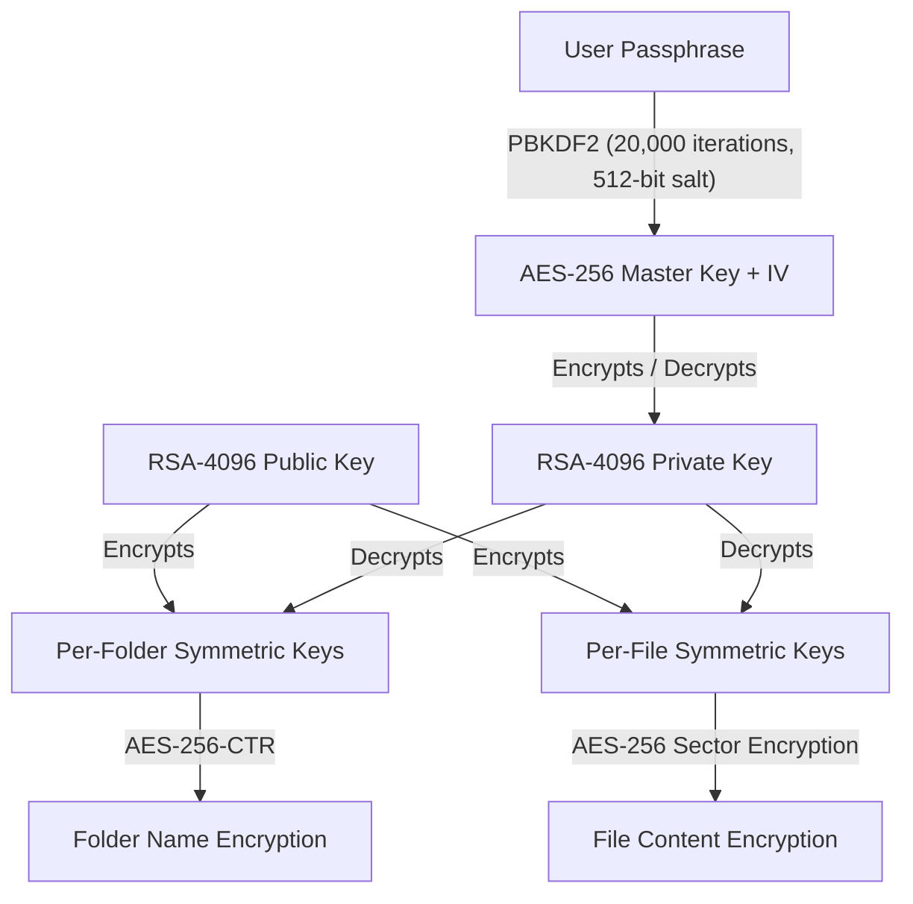
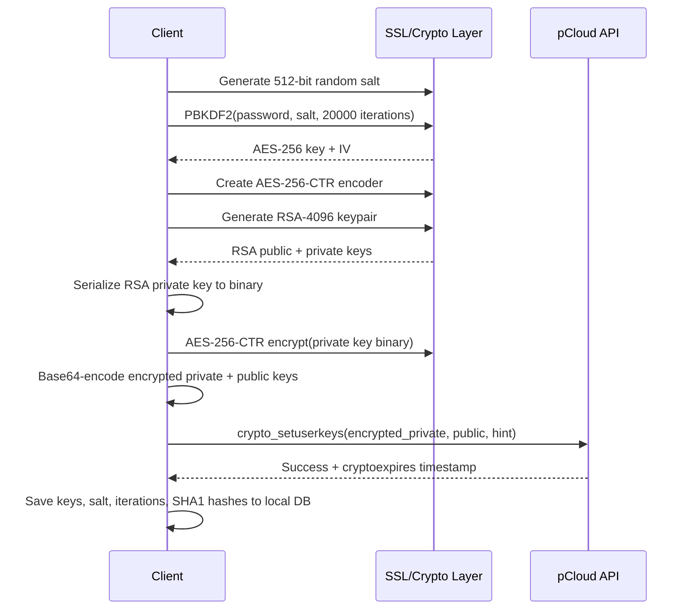
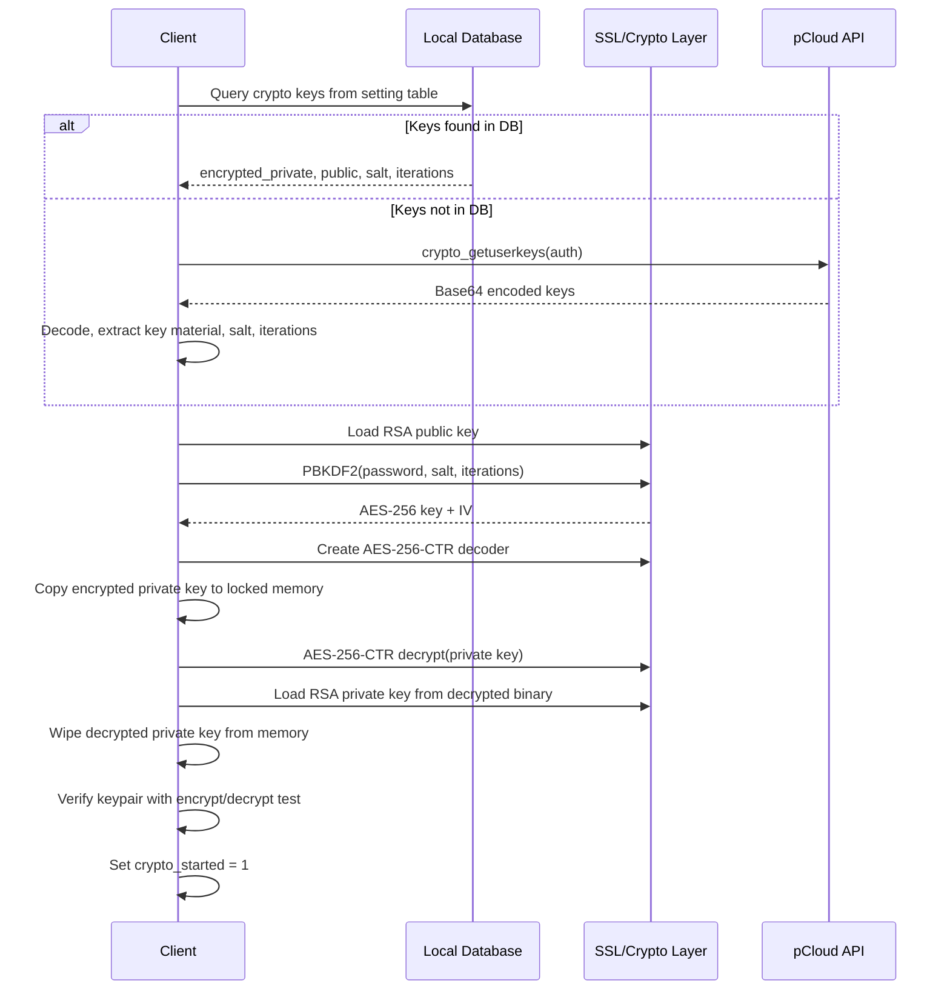

# Crypto Folder

The pclsync encryption subsystem implements client-side, zero-knowledge encryption. The server never sees plaintext data or private keys. The design is built on a key hierarchy: the user's passphrase derives an AES-256 key that protects an RSA-4096 keypair, whose private half in turn decrypts per-folder and per-file symmetric keys. All cryptographic material that leaves the client is either public or encrypted with a key the server does not possess.

The subsystem spans three main source files: `pcloudcrypto.c` handles key management, setup, start/stop lifecycle, and folder/file key operations; `pfscrypto.c` handles sector-level file content encryption at the FUSE layer; and `pcrypto.h` defines the low-level encoder/decoder types.

## Key Hierarchy

The following diagram shows how keys are derived and related:



Each per-folder and per-file symmetric key is a `sym_key_ver1` structure containing a 256-bit AES key and a 1024-bit HMAC-SHA512 key (type `PSYNC_CRYPTO_SYM_AES256_1024BIT_HMAC`). Folder keys carry the `PSYNC_CRYPTO_SYM_FLAG_ISDIR` flag to distinguish them from file keys.

## Crypto Setup

Setup is a one-time operation that creates the user's master keypair. It is performed by `psync_cloud_crypto_setup()` in `pcloudcrypto.c`.



### What happens step by step

1. A 64-byte (512-bit) random salt is generated via `psync_ssl_rand_strong()`.
2. PBKDF2 derives `PSYNC_AES256_KEY_SIZE + PSYNC_AES256_BLOCK_SIZE` bytes (key + IV) from the passphrase and salt, using 20,000 iterations (`PSYNC_CRYPTO_PASS_TO_KEY_ITERATIONS`).
3. An AES-256-CTR encoder is created from the derived key material.
4. An RSA-4096 keypair is generated (`PSYNC_CRYPTO_RSA_SIZE = 4096`).
5. The RSA private key is serialized to a binary blob and encrypted in-place with AES-256-CTR.
6. Both keys are wrapped in versioned structures (`priv_key_ver1` and `pub_key_ver1`) that carry a type tag (`PSYNC_CRYPTO_TYPE_RSA4096_64BYTESALT_20000IT`), flags, and (for the private key) the salt.
7. The wrapped keys are base64-encoded and uploaded to the server via the `crypto_setuserkeys` API call, along with a user-provided password hint.
8. On success, the keys, salt, iteration count, and SHA1 fingerprints are saved to the local SQLite database in the `setting` table.

### Database records saved during setup

| Setting key | Value |
|------------|-------|
| `cryptosetup` | `1` |
| `cryptoexpires` | Expiry timestamp from server (if provided) |
| `crypto_private_key` | Encrypted RSA private key (binary blob) |
| `crypto_public_key` | RSA public key (binary blob) |
| `crypto_private_salt` | PBKDF2 salt (binary blob) |
| `crypto_private_iter` | Iteration count (20,000) |
| `crypto_public_sha1` | SHA1 hex of the public key structure |
| `crypto_private_sha1` | SHA1 hex of the encrypted private key structure |
| `crypto_private_flags` | Key flags |

## Crypto Start (Unlock)

Starting crypto loads the keypair into memory and unlocks it using the user's passphrase. This is performed by `psync_cloud_crypto_start()` in `pcloudcrypto.c`.



### Key details

- The function acquires a write lock on `crypto_lock` to prevent concurrent access during startup.
- If keys are not cached in the local database, they are downloaded from the server via `crypto_getuserkeys` and then saved locally for future sessions.
- The encrypted private key is copied into memory-locked pages via `psync_locked_malloc()` before decryption, preventing it from being swapped to disk.
- After decryption and loading, the raw decrypted bytes are wiped with `psync_ssl_memclean()` and the locked memory is freed.
- A verification step (`crypto_keys_match()`) encrypts and decrypts a random blob to confirm the public and private keys are a matching pair. If this fails, crypto start returns `PSYNC_CRYPTO_START_KEYS_DONT_MATCH`.
- If the RSA private key fails to load (typically meaning the passphrase was wrong and the decrypted bytes are garbage), the function returns `PSYNC_CRYPTO_START_BAD_PASSWORD`.
- The loaded RSA keys (`crypto_pubkey` and `crypto_privkey`) are held in static variables for the lifetime of the crypto session.

## Crypto Stop

Stopping crypto is handled by `psync_cloud_crypto_stop()` in `pcloudcrypto.c`. It:

1. Sets `crypto_started_un = 0` (the unlocked flag, checked without holding the lock for fast-path rejection).
2. Acquires a write lock on `crypto_lock`.
3. Sets `crypto_started_l = 0`.
4. Frees the RSA public and private key objects (`psync_ssl_rsa_free_public/private`).
5. Resets both key pointers to `PSYNC_INVALID_RSA`.
6. Releases the write lock.
7. Cleans the in-memory cache of all decrypted keys (entries with prefixes `DKEY`, `FKEY`, `FLDE`, `FLDD`, `SEEN`).
8. Refreshes all crypto folder entries in the FUSE filesystem so they appear as inaccessible.

After stopping, any attempt to encrypt or decrypt will return `PSYNC_CRYPTO_NOT_STARTED`.

## Key Storage Locations

| Key material | Server | Local DB (`setting` table) | Memory |
|-------------|--------|---------------------------|--------|
| RSA public key | Stored as plaintext (base64) | Cached as binary blob | Loaded as `crypto_pubkey` while crypto is started |
| RSA private key (encrypted) | Stored as base64 | Cached as binary blob | Temporarily in locked memory during decryption |
| RSA private key (decrypted) | Never | Never | Held as `crypto_privkey` while crypto is started |
| PBKDF2 salt | Embedded in private key structure on server | Cached as binary blob | Temporary during start |
| Per-folder encrypted key | Stored (via `crypto_getfolderkey` API) | Cached in `cryptofolderkey` table | Decrypted form cached with `FKEY` prefix |
| Per-file encrypted key | Stored (via `crypto_getfilekey` API) | Cached in `cryptofilekey` table | Decrypted form cached with `DKEY` prefix |
| Folder encoder/decoder | Never | Never | Cached with `FLDE`/`FLDD` prefixes |
| File sector encoder | Never | Never | Cached with `SEEN` prefix |

The user's passphrase is never stored anywhere. It exists only as a function parameter during setup and start, and is discarded after key derivation.

## Per-Folder Keys

Each encrypted folder has its own random symmetric key. Folder keys are generated when the folder is created and are used to encrypt and decrypt filenames within that folder.

### Key structure

A folder key is a `sym_key_ver1` structure:

```c
typedef struct {
  uint32_t type;    // PSYNC_CRYPTO_SYM_AES256_1024BIT_HMAC (0)
  uint32_t flags;   // PSYNC_CRYPTO_SYM_FLAG_ISDIR (1)
  unsigned char aeskey[PSYNC_AES256_KEY_SIZE];         // 32 bytes
  unsigned char hmackey[PSYNC_CRYPTO_HMAC_SHA512_KEY_LEN]; // 128 bytes
} sym_key_ver1;
```

### Storage and retrieval

1. When a folder key is needed, `psync_crypto_get_folder_enc_key()` first checks the `cryptofolderkey` database table.
2. If not found locally, it downloads the key from the server via `crypto_getfolderkey` and saves it to the database.
3. The encrypted key is then decrypted using the RSA private key (`psync_ssl_rsa_decrypt_symmetric_key()`).
4. The decrypted symmetric key is cached in the in-memory cache under the `FKEY` prefix for 600 seconds (`PSYNC_CRYPTO_CACHE_DIR_SYM_KEY`).

### Database schema

```sql
CREATE TABLE IF NOT EXISTS cryptofolderkey (
  folderid INTEGER PRIMARY KEY REFERENCES folder(id) ON DELETE CASCADE,
  enckey BLOB NOT NULL
);
```

## Per-File Keys

Each encrypted file has its own symmetric key, identified by both `fileid` and `hash` (file revision). File keys follow the same pattern as folder keys but without the `PSYNC_CRYPTO_SYM_FLAG_ISDIR` flag.

1. `psync_crypto_get_file_enc_key()` first checks the `cryptofilekey` database table.
2. If not found, it downloads from the server via `crypto_getfilekey` and caches locally.
3. The encrypted key is decrypted with the RSA private key.
4. The decrypted key is cached under the `DKEY` prefix for 300 seconds (`PSYNC_CRYPTO_CACHE_FILE_SYM_KEY`).

### Database schema

```sql
CREATE TABLE IF NOT EXISTS cryptofilekey (
  fileid INTEGER PRIMARY KEY REFERENCES file(id) ON DELETE CASCADE,
  hash INTEGER NOT NULL,
  enckey BLOB NOT NULL
);
```

## Encrypted Folder Creation

Creating an encrypted folder is handled by `psync_cloud_crypto_mkdir()` in `pcloudcrypto.c`. The process:

1. Generate a new random `sym_key_ver1` with `PSYNC_CRYPTO_SYM_FLAG_ISDIR` set, containing random AES and HMAC keys.
2. Encrypt the symmetric key structure with the RSA public key via `psync_ssl_rsa_encrypt_data()`.
3. If the parent folder is encrypted, encode the new folder's name using the parent's folder encoder.
4. Base64-encode the encrypted symmetric key.
5. Call the `createfolder` API with the `encrypted=1` flag, the encoded name, and the base64-encoded key.
6. On success, save the folder metadata to the database and cache the encrypted key in the `cryptofolderkey` table.

## Filename Encryption and Decryption

Filenames within encrypted folders are encrypted using AES-256 in a text-oriented mode and then base32-encoded to produce filesystem-safe names.

### Encoding (writing)

`psync_cloud_crypto_get_folder_encoder()` returns an encoder for a given folder:

1. Checks the `FLDE` cache for a pre-built encoder.
2. If not cached, retrieves and decrypts the folder's symmetric key.
3. Creates a `psync_crypto_aes256_text_encoder_t` from the key.
4. Encoders are cached for 15 seconds (`PSYNC_CRYPTO_CACHE_DIR_ECODER_SEC`).

`psync_cloud_crypto_encode_filename()` then:
1. Encrypts the plaintext filename bytes with `psync_crypto_aes256_encode_text()`.
2. Base32-encodes the ciphertext to produce a safe on-disk/on-server name.

### Decoding (reading)

`psync_cloud_crypto_get_folder_decoder()` follows the same pattern with the `FLDD` cache prefix.

`psync_cloud_crypto_decode_filename()` reverses the process:
1. Base32-decodes the encrypted name.
2. Decrypts with `psync_crypto_aes256_decode_text()`.

### Temporary folders

For folders not yet synced to the server (negative folder IDs from `fstask` entries), the encoder/decoder is built by reading the encrypted key from the `fstask.text2` column and decrypting it with the RSA private key directly.

## FUSE Crypto Integration

File content encryption at the FUSE layer is implemented in `pfscrypto.c`. It operates on 4096-byte sectors (`PSYNC_CRYPTO_SECTOR_SIZE`) and uses a Merkle hash tree for integrity verification.

### Sector encryption

- Each file is divided into 4096-byte sectors.
- Each sector is encrypted with AES-256 using the file's symmetric key via `psync_crypto_aes256_encode_sector()`.
- Each sector produces a 32-byte authentication hash (`PSYNC_CRYPTO_AUTH_SIZE = PSYNC_AES256_BLOCK_SIZE * 2`), stored in a separate auth tree interleaved with the data.
- Files larger than one sector have a multi-level hash tree (up to `PSYNC_CRYPTO_MAX_HASH_TREE_LEVEL = 6` levels) where each level authenticates the level below, using `PSYNC_CRYPTO_HASH_TREE_SECTORS` (128) entries per auth sector.
- A master authentication hash at the top of the tree covers the entire file.

### Encrypted file layout

The encrypted file is larger than the plaintext because it includes both the encrypted data sectors and the authentication hash tree. The function `psync_fs_crypto_offsets_by_plainsize()` computes the full layout given the plaintext size, and `psync_fs_crypto_plain_size()` / `psync_fs_crypto_crypto_size()` convert between the two.

### Log files for crash recovery

To maintain consistency during writes, `pfscrypto.c` uses a write-ahead log:

1. `psync_fs_crypto_init_log()` creates a log file with a master record sector.
2. Writes go to the log first as `psync_crypto_log_data_record` entries (header + encrypted sector data).
3. Modified authentication hashes are tracked in an in-memory tree of `psync_sector_inlog_t` nodes.
4. `psync_fs_crypto_flush_file()` finalizes the log by writing a master record containing a hash of all log entries, then applies all logged changes to the data file.
5. On startup, `psync_fs_crypto_check_logs()` scans the filesystem cache directory for incomplete log files and replays or discards them, ensuring crash recovery.

### Read and write paths

- **New file write:** `psync_fs_crypto_write_newfile_locked()` encrypts data sector by sector, updates authentication hashes, and writes everything to the log.
- **New file read:** `psync_fs_crypto_read_newfile_locked()` checks the in-memory log tree first (for sectors written but not yet flushed), then falls back to the data file, decrypting and verifying authentication.
- **Modified file read:** `psync_fs_crypto_read_modified_locked()` handles reading from files that have been partially modified, combining original encrypted content with logged changes.
- **Truncate:** `psync_fs_crypto_ftruncate()` adjusts the file size, padding or trimming sectors and updating the authentication tree.

## Crypto Expiration

The `cryptoexpires` setting stores a Unix timestamp indicating when the user's crypto subscription expires. This is received from the server during setup and diff processing.

- `psync_crypto_isexpired()` in `psynclib.c` returns 1 if the current time is past the expiry timestamp, or 0 if no expiry is set or the subscription is still active.
- `psync_crypto_expires()` returns the raw expiry timestamp.
- When crypto is expired, FUSE operations on encrypted folders return errors, preventing access to encrypted content.
- The expiry timestamp is updated during diff processing from the `cryptoexpires` field in the server response.

## Memory-Locked Allocations

`psync_locked_malloc()` in `pmemlock.c` provides a memory allocator for sensitive key material. It allocates pages from anonymous memory mappings and locks them with `mlock()` to prevent the operating system from swapping them to disk. Key properties:

- Pages are reference-counted: multiple allocations on the same page share one `mlock()` call.
- When `mlock()` fails (e.g., due to resource limits), the allocator attempts to free crypto caches first, then retries.
- `psync_locked_free()` returns memory to a free-interval pool and only unmaps entire ranges when all allocations within a range have been freed.
- The allocator mutex is recursive because `psync_mem_lock()` may call `psync_cloud_crypto_clean_cache()`, which can call `psync_locked_free()`.

The decrypted RSA private key is loaded into locked memory during `psync_cloud_crypto_start()` and wiped with `psync_ssl_memclean()` immediately after being parsed into the SSL library's key structure.

## Sleep-Stop-Crypto

The `sleepstopcrypto` boolean setting (setting index 11, default false) controls whether encryption is automatically stopped when the computer wakes from sleep. When enabled:

- The callback `psync_stop_crypto_on_sleep()` in `psynclib.c` checks the setting and calls `psync_cloud_crypto_stop()` if crypto is currently started.
- This forces the user to re-enter their passphrase after waking, providing protection against physical access attacks when the machine was left unattended.

## Crypto v2

The `cryptov2isactive` boolean setting (setting index 18, default false) indicates whether the server has enabled the v2 crypto protocol for the account. This flag is updated during diff processing from the `cryptov2isactive` field in the server's diff response (see `pdiff.c`). The setting is persisted locally and re-synced on each diff cycle.

## Key Lifecycle

The crypto subsystem follows a clear lifecycle that interacts with the broader library state:

1. **Setup** (once per account): `psync_cloud_crypto_setup()` -- generates and uploads the master keypair. Requires the user to be logged in. Only needs to run once; subsequent calls return `PSYNC_CRYPTO_SETUP_ALREADY_SETUP`.

2. **Start** (each session): `psync_cloud_crypto_start()` -- downloads or loads cached keys, derives the AES key from the passphrase, decrypts the RSA private key, and holds both keys in memory. Must be called after `psync_init()` and authentication.

3. **Use** (while started): All crypto operations (folder creation, filename encoding/decoding, file encryption/decryption) require crypto to be started. Operations check `crypto_started_un` without locking for fast rejection, then acquire a read lock on `crypto_lock` for the actual work. Multiple threads can perform crypto operations concurrently.

4. **Stop** (explicit or automatic): `psync_cloud_crypto_stop()` -- frees all keys and clears caches. Can be triggered explicitly by the application, automatically on sleep (if `sleepstopcrypto` is enabled), or as part of logout/unlink.

5. **Reset** (destructive): `psync_cloud_crypto_reset()` -- calls the server's `crypto_reset` API to delete all crypto keys from the server. This is irreversible and makes all encrypted data permanently inaccessible.

### Interaction with login and logout

- Crypto start requires an active authenticated session (`psync_my_auth` must be valid).
- Logging out or unlinking the account should stop crypto first. If crypto is started when the library shuts down, the in-memory keys are freed as part of normal cleanup.
- The local database retains cached keys across sessions, so `psync_cloud_crypto_start()` can work without network access if keys were previously downloaded.

## Source Files

| File | Role |
|------|------|
| `pcloudcrypto.c` / `pcloudcrypto.h` | Master key management, setup, start/stop, folder/file key encryption/decryption, mkdir, filename encoding |
| `pfscrypto.c` / `pfscrypto.h` | FUSE-level sector encryption/decryption, hash tree, log files, crash recovery |
| `pcrypto.h` | Low-level crypto type definitions (encoder/decoder structs, sector auth types) |
| `pmemlock.c` / `pmemlock.h` | Memory-locked page allocator for sensitive key material |
| `psynclib.c` / `psynclib.h` | Public API wrappers (`psync_crypto_setup`, `psync_crypto_start`, `psync_crypto_isexpired`, etc.) |
| `psettings.h` | Crypto constants (RSA size, PBKDF2 parameters, cache timeouts) |
| `pdatabase.h` | Schema for `cryptofolderkey` and `cryptofilekey` tables |
| `pdiff.c` | Updates `cryptoexpires` and `cryptov2isactive` from server diff responses |
