# Debounce Rate Limiter

The debounce rate limiter (`prunratelimit.c` / `prunratelimit.h`) provides two run-coalescing strategies for hot-path callers such as `plocalscan.c`:

- **`psync_run_ratelimited()`** — classic rate-limit: fire immediately on first call, then suppress duplicates for `minintervalsec`. A trailing fire executes if a call arrived during the suppression window.
- **`psync_run_debounced()`** — leading-edge debounce with a ceiling: fire immediately, then wait for a quiet period of `gracesec` before firing again. If events never stop, the ceiling (`ceilingsec`) forces a fire to prevent starvation.

This document focuses on `psync_run_debounced()` — the newer, more nuanced mechanism.

## Sequence Diagram

```mermaid
sequenceDiagram
    participant U as Upstream Events
    participant D as psync_run_debounced()
    participant M as Mutex-protected State
    participant T as Timer Callback
    participant W as Worker Thread

    Note over U,W: gracesec=5, ceilingsec=15

    rect rgb(220, 240, 220)
        Note right of U: ── First event (t=0) ──
        U->>D: call(name, cb, 5, 15)
        D->>M: lookup cb in tree → NOT FOUND
        M-->>D: create node (pending=0, last_fire=0, last_submit=0)
        D->>W: fire LEADING (immediate)
        D->>T: arm timer at t=5 (gracesec)
    end

    rect rgb(240, 230, 210)
        Note right of U: ── Burst of events (t=2,3,4) ──
        U->>D: call(name, cb, 5, 15) at t=2
        D->>M: lookup → FOUND, set last_submit=2, pending=1
        Note right of M: coalesce — no cancel/re-arm

        U->>D: call(name, cb, 5, 15) at t=3
        D->>M: lookup → FOUND, set last_submit=3, pending=1

        U->>D: call(name, cb, 5, 15) at t=4
        D->>M: lookup → FOUND, set last_submit=4, pending=1
    end

    rect rgb(230, 230, 245)
        Note right of T: ── Timer fires at t=5 ──
        T->>M: check: grace_deadline = 4+5 = 9, ceiling = 0+15 = 15
        Note right of M: now(5) < grace(9) AND now(5) < ceiling(15)
        M-->>T: action=RETICK, re-arm at min(9,15)−5 = 4s → t=9
    end

    rect rgb(240, 230, 210)
        Note right of U: ── More events (t=7,8) ──
        U->>D: call at t=7
        D->>M: last_submit=7, pending=1
        U->>D: call at t=8
        D->>M: last_submit=8, pending=1
    end

    rect rgb(230, 230, 245)
        Note right of T: ── Timer fires at t=9 ──
        T->>M: grace_deadline = 8+5 = 13, ceiling = 0+15 = 15
        Note right of M: now(9) < grace(13) AND now(9) < ceiling(15)
        M-->>T: action=RETICK, re-arm at min(13,15)−9 = 4s → t=13
    end

    rect rgb(240, 230, 210)
        Note right of U: ── Events keep coming (t=11,12) ──
        U->>D: call at t=11
        D->>M: last_submit=11, pending=1
        U->>D: call at t=12
        D->>M: last_submit=12, pending=1
    end

    rect rgb(230, 230, 245)
        Note right of T: ── Timer fires at t=13 ──
        T->>M: grace_deadline = 12+5 = 17, ceiling = 0+15 = 15
        Note right of M: now(13) < grace(17) AND now(13) < ceiling(15)
        M-->>T: action=RETICK, re-arm at min(17,15)−13 = 2s → t=15
    end

    rect rgb(245, 220, 220)
        Note right of T: ── Timer fires at t=15 (1st CEILING HIT) ──
        T->>M: grace_deadline = 12+5 = 17, ceiling = 0+15 = 15
        Note right of M: pending=1 AND now(15) >= ceiling(15)
        M-->>T: action=CEILING FIRE, last_fire=15, pending=0
        T->>W: fire callback (forced by ceiling)
        T->>T: re-arm at min(12+5, 15+15)−15 = 2s → t=17
    end

    rect rgb(240, 230, 210)
        Note right of U: ── Post-ceiling event (t=16) ──
        U->>D: call at t=16
        D->>M: last_submit=16, pending=1
        Note right of M: grace window pushed: 16+5 = t=21
    end

    rect rgb(230, 230, 245)
        Note right of T: ── Timer fires at t=17 ──
        T->>M: grace_deadline = 16+5 = 21, ceiling = 15+15 = 30
        Note right of M: now(17) < grace(21) AND now(17) < ceiling(30)
        M-->>T: action=RETICK, re-arm at min(21,30)−17 = 4s → t=21
    end

    rect rgb(240, 230, 210)
        Note right of U: ── More events (t=19, 23, 27) ──
        U->>D: call at t=19
        D->>M: last_submit=19, pending=1
    end

    rect rgb(230, 230, 245)
        Note right of T: ── Timer fires at t=21 ──
        T->>M: grace_deadline = 19+5 = 24, ceiling = 15+15 = 30
        Note right of M: now(21) < grace(24) AND now(21) < ceiling(30)
        M-->>T: action=RETICK, re-arm at min(24,30)−21 = 3s → t=24
    end

    rect rgb(240, 230, 210)
        Note right of U: ── (continued) ──
        U->>D: call at t=23
        D->>M: last_submit=23, pending=1
    end

    rect rgb(230, 230, 245)
        Note right of T: ── Timer fires at t=24 ──
        T->>M: grace_deadline = 23+5 = 28, ceiling = 15+15 = 30
        Note right of M: now(24) < grace(28) AND now(24) < ceiling(30)
        M-->>T: action=RETICK, re-arm at min(28,30)−24 = 4s → t=28
    end

    rect rgb(240, 230, 210)
        Note right of U: ── (continued) ──
        U->>D: call at t=27
        D->>M: last_submit=27, pending=1
    end

    rect rgb(230, 230, 245)
        Note right of T: ── Timer fires at t=28 ──
        T->>M: grace_deadline = 27+5 = 32, ceiling = 15+15 = 30
        Note right of M: now(28) < grace(32) AND now(28) < ceiling(30)
        M-->>T: action=RETICK, re-arm at min(32,30)−28 = 2s → t=30
    end

    rect rgb(245, 220, 220)
        Note right of T: ── Timer fires at t=30 (2nd CEILING HIT) ──
        T->>M: grace_deadline = 27+5 = 32, ceiling = 15+15 = 30
        Note right of M: pending=1 AND now(30) >= ceiling(30)
        M-->>T: action=CEILING FIRE, last_fire=30, pending=0
        T->>W: fire callback (forced by ceiling)
        T->>T: re-arm at min(27+5, 30+15)−30 = 2s → t=32
    end

    rect rgb(230, 230, 245)
        Note right of T: ── Timer fires at t=32, no new events ──
        T->>M: grace_deadline = 27+5 = 32, ceiling = 30+15 = 45
        Note right of M: pending=0 AND now(32) >= grace(32)
        M-->>T: action=TEARDOWN
        T->>T: stop timer, free node
    end
```

## Timer Action Summary

| Scenario | Condition | Result |
|---|---|---|
| **Leading fire** | First call — no node in tree | Fire immediately, arm timer for `gracesec` |
| **Coalesce** | Subsequent calls while timer active | Update `last_submit`, set `pending=1`, return (no re-arm) |
| **Trailing fire** | Timer wakes, `pending && now >= grace_deadline` | Fire callback, teardown node |
| **Ceiling fire** | Timer wakes, `pending && now >= ceiling_deadline` (but grace not yet met) | Fire callback, reset `last_fire`, clear `pending`, re-arm |
| **Retick** | Timer wakes, neither deadline reached | Re-arm with `min(grace_remaining, ceiling_remaining)` |
| **Teardown** | Timer wakes, `!pending && now >= grace_deadline` | No fire, free node |

## Anti-Starvation and Post-Ceiling Behavior

The ceiling mechanism prevents starvation: if events arrive continuously, pushing `last_submit` forward indefinitely, the ceiling forces a fire every `ceilingsec` from the last actual execution.

**Do upstream events after a ceiling fire move the debounce window?** Yes. A ceiling fire resets `last_fire` and clears `pending`, but does **not** touch `last_submit`. When a new upstream event arrives after the ceiling fire, it sets `last_submit = now` and `pending = 1`, which pushes `grace_deadline` (`last_submit + gracesec`) forward. The timer will retick until either the new grace deadline is met (trailing fire) or the new ceiling (`last_fire + ceilingsec`, anchored at the ceiling fire time) is reached — whichever comes first.

In the example above: the ceiling fires at t=15, then an event at t=16 pushes the grace window to t=21. Continued events at t=19, t=23, t=27 keep pushing grace forward, and a second ceiling fires at t=30 (exactly `ceilingsec=15` after the first ceiling fire at t=15). Once events stop, the grace deadline is finally reached and the node tears down.