# Scanner, Tasks and Stuck Items

This document explains how the local-side sync engine decides what work to do, how that work is queued and consumed, and what happens when a piece of work cannot be completed. It complements `07-sync-engine.md` (which introduces the scanner from the outside) and `08-file-transfers.md` (which covers the upload/download workers). The focus here is the **inside** of the scanner, the **shape and lifecycle** of `task` rows produced by `ptasks.c`, and the two distinct **stuck-item** mechanisms the engine uses to deal with errors that cannot be resolved automatically.

The relevant source files are:

| File | Purpose |
|------|---------|
| `plocalscan.c` | Local filesystem walker; produces `task` rows from disk-vs-DB diffs. |
| `ptasks.c` / `ptasks.h` | Thin SQL inserters that push rows into the `task` table. |
| `pupload.c`, `pdownload.c` | Workers that consume `task` rows. |
| `pfsupload.c` | Worker for the FUSE write-back queue (`fstask`); also owns the persistent stuck variant. |
| `ptools.c` / `ptools.h` | In-memory `stuck_sync_tasks` list and event reporting. |
| `psynclib.h` | Public API: `psync_get_stuck_list()`, `psync_clean_stuck_list()`. |

## Big Picture

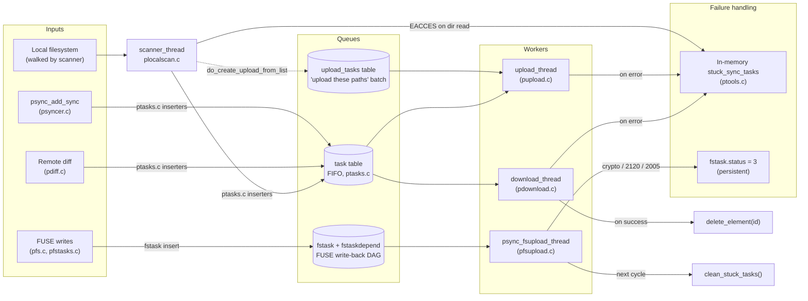

There are three independent task queues. The `task` table is what this document calls *the* task queue; the `upload_tasks` table is a small parallel queue used only by the explicit "upload these paths" workflow; `fstask` is the FUSE write-back DAG owned by `pfsupload.c`. The two stuck-item mechanisms operate at different levels: the in-memory list (`ptools.c`) is a soft, capped, advisory log; the `fstask.status=3` flag is a persistent gravestone that lives until the fsupload thread sweeps it.

## Part 1 — How the Scanner Works

### Thread lifecycle

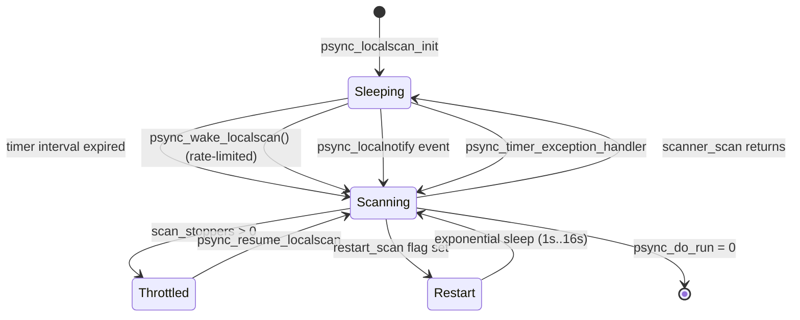

`psync_localscan_init()` (`plocalscan.c:1413`) does three things at engine start:

1. Spawns a single `localscan` thread running `scanner_thread()`.
2. Starts platform `localnotify` (inotify on Linux, FSEvents on macOS, ReadDirectoryChangesW on Windows) which can wake the scanner.
3. Registers a timer-exception handler so that any wallclock jump or suspend/resume cycle wakes the scanner immediately (`psync_wake_localscan_noscan`).

The thread waits on `scan_cond` either for `PSYNC_LOCALSCAN_RESCAN_INTERVAL` (no notify) or `PSYNC_LOCALSCAN_RESCAN_NOTIFY_SUPPORTED` (a much longer interval if the platform sends FS events). External producers wake it via `psync_wake_localscan()` which is wrapped in `psync_run_ratelimited(... PSYNC_LOCALSCAN_MIN_INTERVAL)` to prevent burst storms.

### One scan cycle (`scanner_scan`)

A single run of `scanner_scan()` (`plocalscan.c:1024`) is split into two passes separated by a database transaction boundary. Between them, folder structural changes are committed early so that file-level operations see a stable parent tree.

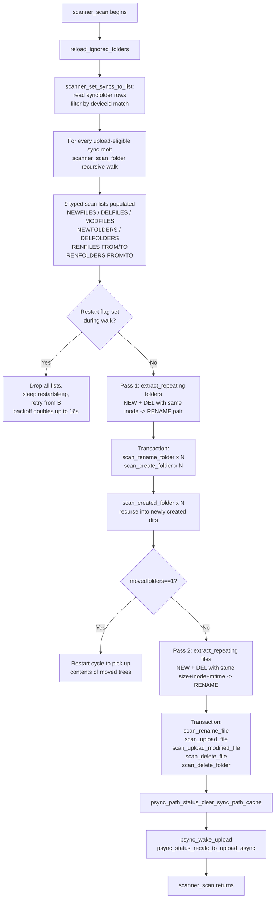

Two details deserve emphasis:

* **`psync_list_extract_repeating()`** is the function that turns a "delete X + create Y" pair into a "rename X→Y" event. It looks for entries with matching identity keys: by inode for folders (`compare_inode`) and by size+inode+mtime for files (`compare_sizeinodemtime`). Without this, a rename would be implemented as a remote delete followed by a fresh upload of the same content, and inode-stable rename detection is the reason the code is structured around four lists per type (NEW, DEL, RENFROM, RENTO).
* **The two-pass split** is why folder operations restart the cycle when `movedfolders=1`. After folders are renamed/created in the first transaction, the freshly-visible subtrees may contain files the scanner has not yet listed, so the loop restarts so `scanner_scan_folder()` can descend into them.

### Per-folder diff (`scanner_scan_folder`)

`scanner_scan_folder()` (`plocalscan.c:467`) compares the contents of one filesystem folder against the `localfolder`+`localfile` rows for that folder, and dispatches to the typed scan lists.

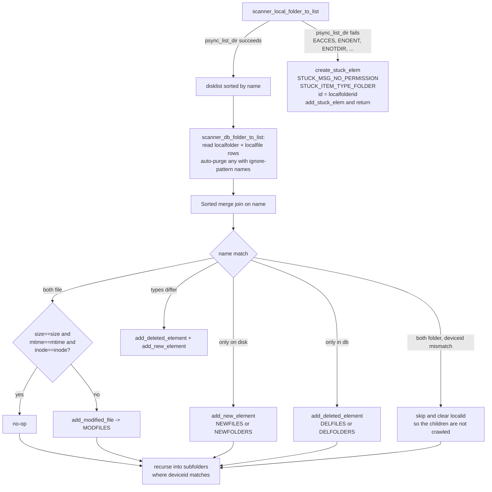

The diff is filtered by three rules at the moment of insertion:

1. **`is_path_to_ignore`** — `(deviceid, inode)` pairs derived from `_PS(ignorepaths)` are blacklisted. The scanner walks but never inserts entries inside these directories.
2. **`psync_is_name_to_ignore`** — name-based pattern match against `_PS(ignorepatterns)`.
3. **`psync_is_valid_utf8`** — names that fail strict UTF-8 validation are skipped with a warning. (The validator was tightened recently; see commit `6d650ab`.)

Anything that survives all three becomes a `task` row.

### From scan list to `task` row

The eight functions in `plocalscan.c` that turn list entries into queued work all flow into the inserters in `ptasks.c`:

| Scan list | Handler | `ptasks.c` entry point | Resulting `task.type` |
|-----------|---------|------------------------|-----------------------|
| NEWFOLDERS | `scan_create_folder` | `psync_task_create_remote_folder` | `PSYNC_CREATE_REMOTE_FOLDER` |
| NEWFILES | `scan_upload_file` | `psync_task_upload_file_silent` | `PSYNC_UPLOAD_FILE` |
| MODFILES | `scan_upload_modified_file` | `psync_create_task_full` (with paused/waiting status) | `PSYNC_UPLOAD_FILE` |
| DELFILES | `scan_delete_file` | `psync_task_delete_remote_file` | `PSYNC_DELETE_REMOTE_FILE` |
| DELFOLDERS | `scan_delete_folder` | `psync_task_delete_remote_folder` | `PSYNC_DELREC_REMOTE_FOLDER` |
| RENFILES FROM/TO | `scan_rename_file` | `psync_task_rename_remote_file` | `PSYNC_RENAME_REMOTE_FILE` |
| RENFOLDERS FROM/TO | `scan_rename_folder` | `psync_task_rename_remote_folder` | `PSYNC_RENAME_REMOTE_FOLDER` |

Modified-file handling is the most subtle: `scan_upload_modified_file()` (`plocalscan.c:706`) **first** deletes any existing `PSYNC_UPLOAD_FILE` row for the same `localfileid` via `psync_delete_upload_tasks_for_file()`. This is the mechanism that prevents stacking pending uploads when a file is rewritten while a previous upload is still queued. If the file's mtime is younger than `PSYNC_UPLOAD_OLDER_THAN_PARAM_SEC`, the new task is inserted with `inprogress=PSYNC_TASK_PAUSED` and a "scanner reminder" thread is started to re-wake the scanner once the file has aged enough.

### A separate pipeline: `do_create_upload_from_list`

`do_create_upload_from_list()` (`plocalscan.c:1495`) is the user-driven "upload these paths" path: invoked from the public API to add a batch of explicit paths into the FUSE-side `upload_tasks` table. It walks the paths recursively via `uptask_scan()` and emits rows with `PUPTASK_STATUS_WAITING`. The upload worker's main `SELECT` already unions the `task` and `upload_tasks` tables, so both feeds drain through the same thread, but the failure-handling, dependency, and stuck-item semantics differ — `upload_tasks` rows are never deduplicated against the `task` table, do not participate in the `inprogress=3` retry mechanism, and have their own `error_code` column for audit. This pipeline is otherwise out of scope for this document.

## Part 2 — Stuck Items

### Two mechanisms, same name

The codebase calls two different things "stuck": an in-memory advisory list owned by `ptools.c`, and a persistent flag on `fstask` rows. They are not synchronised, target different layers, and have different lifetimes.

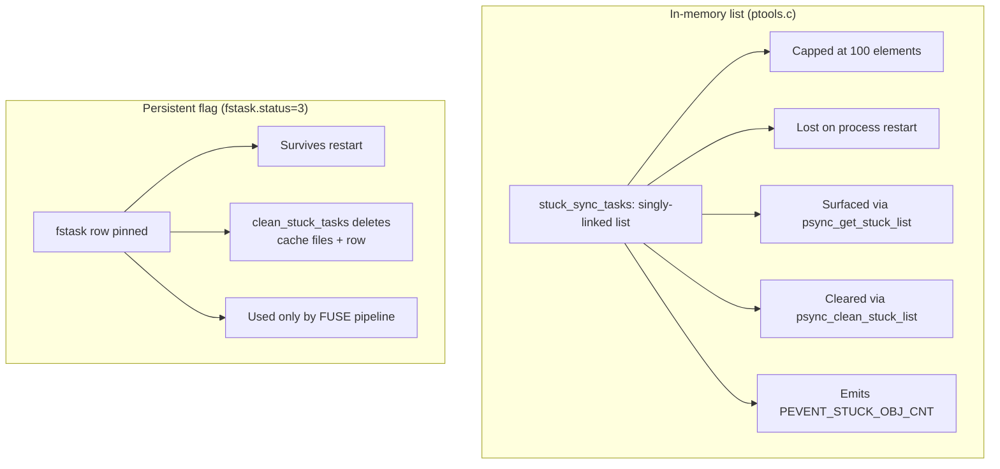

### The in-memory list (`ptools.c`)

The list element is small:

```c
typedef struct stuck_item_type {
    uint64_t id;
    int      msg_id;        // STUCK_MSG_*
    int      item_type;     // STUCK_ITEM_TYPE_FOLDER (1) | STUCK_ITEM_TYPE_FILE (2)
    int      retry_cnt;
    struct stuck_item_type* next_elem;
    const char* path;
    const char* name;
} stuck_item;
```

`add_stuck_elem()` (`ptools.c:855`) is the only entry point. It either appends a new element or, when `search_list(id)` finds an existing entry with the same `id`, it just bumps `retry_cnt`. This is how the same failure can be reported many times without unbounded list growth.

There is one currently-emitted `msg_id`:

| Constant | Value | Meaning today |
|----------|-------|---------------|
| `STUCK_MSG_UKNOWN` | 0 | Defined but unused. |
| `STUCK_MSG_NO_PERMISSION` | 1 | Catch-all; emitted by every active call site regardless of the underlying errno. |

Two `item_type` values exist (`STUCK_ITEM_TYPE_FOLDER=1`, `STUCK_ITEM_TYPE_FILE=2`).

#### Add and remove sites

This is the full active inventory of `add_stuck_elem` callers.

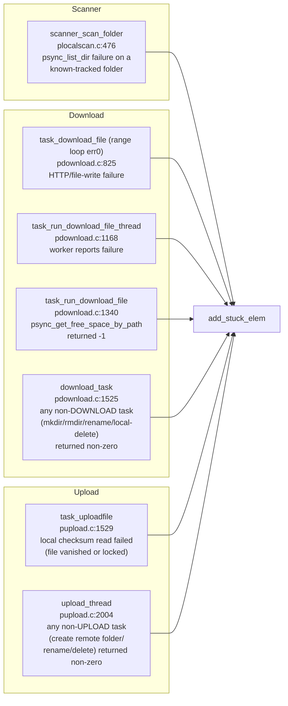

Removal is symmetric and equally implicit:

| Trigger | Code path |
|---------|-----------|
| Download main loop after `download_task` returns 0 | `pdownload.c:1586` `delete_element(itemid)` |
| Download worker after `task_download_file` returns 0 | `pdownload.c:1184–1185` `delete_element(hash)` then `delete_element(localfolderid)` |
| Download path-already-exists short-circuit | `pdownload.c:1317` |
| Upload main loop after `upload_task` returns 0 | `pupload.c:1988` `delete_element(itemid)` |
| Public `psync_clean_stuck_list()` | wipes the entire list |

The remove-on-success contract has one quirk: download removes by **two different keys** (`hash` *and* `localfolderid`) because the download pipeline inserts entries under either key depending on which call site failed — a permission failure detected at folder-list time uses `localfolderid`, while a transfer failure uses the file `hash`.

### Retry counter semantics

`add_stuck_elem` increments `retry_cnt` on duplicate id. `STUCK_ITEM_RETRY_COUNT` is currently `0`, so:

- **First sighting** (`retry_cnt=0`): the entry is added, `stuck_cnt` is incremented, `PEVENT_STUCK_OBJ_CNT` fires.
- **Second sighting** (existing entry, `retry_cnt 0→1`): no `stuck_cnt` change; counter logged.
- **Third sighting** (`retry_cnt 1→2`): clamped at `STUCK_ITEM_RETRY_COUNT+2`; no further bumps.

`get_stuck_list()` returns only entries with `retry_cnt >= STUCK_ITEM_RETRY_COUNT`, which means the visible list **always** includes everything that has reached the threshold. This is a long way of saying: in the present configuration, every added stuck item is immediately user-visible.

The cap `stuck_cnt > STUCK_ITEM_TOTAL_COUNT` (100) silently drops further additions. The list itself is unbounded; only the *event-emitting* counter is capped.

### The persistent variant: `fstask.status=3`

`pfsupload.c` parks unrecoverable tasks rather than reporting them. `set_task_to_stuck()` (`pfsupload.c:178`) just sets the status column to 3, which causes the dispatch query in `psync_fsupload_check_tasks()` (`pfsupload.c:2083`) to skip the row — that query selects only `status IN (0, 11)`.

The cleanup path is run on every fsupload cycle:

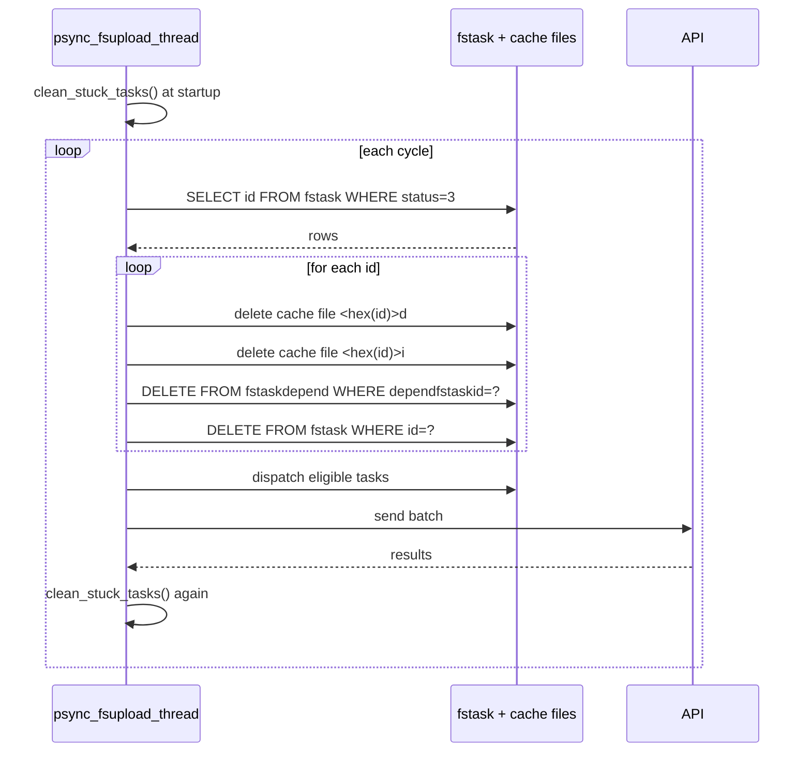

`status=3` is set in only three situations, all in `pfsupload.c`:

| API result | Condition | Why parked |
|------------|-----------|------------|
| 2002 *parent does not exist* | task is a crypto folder mkdir | Re-parenting a crypto task to lost+found would orphan the encrypted key chain. |
| 2005 *folder does not exist* | task is a crypto file upload | Same reasoning — the parent's encryption key is unrecoverable from the lost+found path. |
| 2120 *encrypted file in non-encrypted folder* | always | The task is fundamentally invalid. |

Non-crypto equivalents of 2002/2005 do **not** mark the task stuck; they re-parent it to the lost-and-found folder by updating `fstask.folderid` and continue.

## Part 3 — Task Arrangement and Dependency Model

### The `task` table

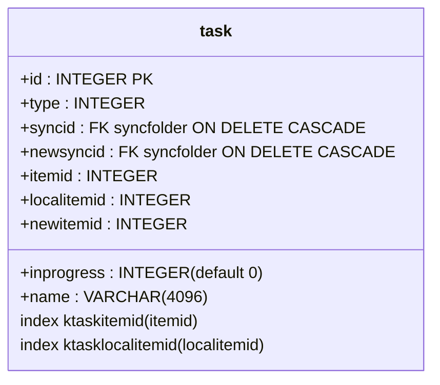

The `type` column is a 4-bit composite encoded by macros in `ptasks.h`:

```
type = (operation << PSYNC_TASK_TYPE_OFF) | folder_or_file_bit | download_or_upload_bit
       (3..2)                              | (1)                | (0)
```

| Bit | Mask | Meaning |
|-----|------|---------|
| 0 | `PSYNC_TASK_DWLUPL_MASK` | 0=download (cloud→local), 1=upload (local→cloud) |
| 1 | `PSYNC_TASK_FOLDER`/`PSYNC_TASK_FILE` | 0=folder, 2=file |
| 2..3 | shifted operation | CREATE=0, DELETE=1, DELREC=2, RENAME=3, COPY=4 |

The 11 concrete types this yields are:

| Constant | Workflow |
|----------|----------|
| `PSYNC_CREATE_LOCAL_FOLDER` | mkdir under a sync root in response to a remote create |
| `PSYNC_DELETE_LOCAL_FOLDER` | rmdir empty folder removed remotely |
| `PSYNC_DELREC_LOCAL_FOLDER` | recursive rmdir |
| `PSYNC_RENAME_LOCAL_FOLDER` | rename/move folder locally |
| `PSYNC_DOWNLOAD_FILE` | fetch new/modified file |
| `PSYNC_RENAME_LOCAL_FILE` | rename/move file locally |
| `PSYNC_DELETE_LOCAL_FILE` | unlink file |
| `PSYNC_CREATE_REMOTE_FOLDER` | mkdir on the server |
| `PSYNC_RENAME_REMOTE_FOLDER` | rename on the server |
| `PSYNC_UPLOAD_FILE` | upload local file |
| `PSYNC_RENAME_REMOTE_FILE` | rename file on the server |
| `PSYNC_DELETE_REMOTE_FILE` | delete file on the server |
| `PSYNC_DELREC_REMOTE_FOLDER` | server-side recursive delete |

`COPY` is reserved by the bit layout but unused.

### Producers and consumers

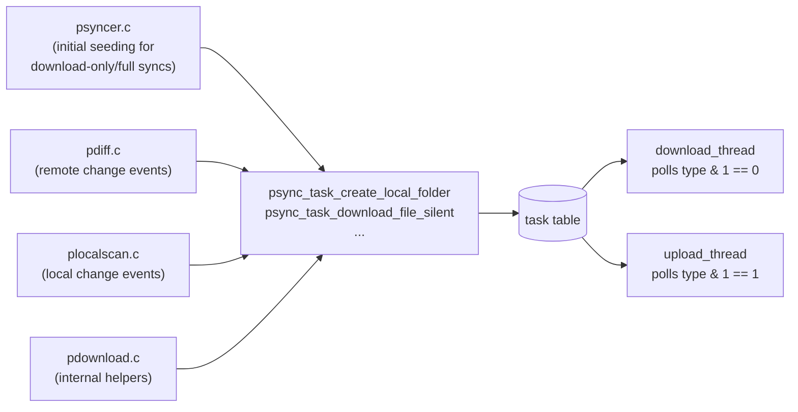

Both worker threads use the same dispatch pattern:

```sql
SELECT id, type, syncid, itemid, localitemid, newitemid, name, newsyncid
FROM   task
WHERE  inprogress = 0
  AND  type & PSYNC_TASK_DWLUPL_MASK = <DOWNLOAD or UPLOAD>
ORDER  BY id
LIMIT  1
```

Strict FIFO by row id. There is no priority field, no scheduled start time, no per-item retry counter on the row.

### Dependency model — explicit vs implicit

The `task` table has **no explicit dependency rows**. It compares unfavourably with the `fstask` queue, which has an `fstaskdepend` table that the FUSE upload thread joins against to find tasks whose dependencies have all completed:

```sql
-- fstask: explicit dependency graph
SELECT f.id, ...
FROM   fstask f
LEFT JOIN fstaskdepend d ON f.id = d.fstaskid
WHERE  d.fstaskid IS NULL          -- no unfulfilled dependency
  AND  status IN (0, 11)
```

vs

```sql
-- task: no dependency graph at all
SELECT id, ...
FROM   task
WHERE  inprogress = 0
  AND  type & ? = ?
ORDER  BY id
LIMIT  1
```

In the sync engine, ordering is achieved by **three implicit invariants**:

1. **Insertion order = causal order.** The scanner's two-pass commit (folders first, files second) guarantees that `PSYNC_CREATE_REMOTE_FOLDER` rows appear with smaller ids than the `PSYNC_UPLOAD_FILE` rows that depend on them. The same holds for the diff side: `process_createfolder` runs before `process_modifyfile` for the same diff batch, so download tasks for files inserted into a freshly-created folder come after the local-folder-create task.
2. **Foreign-key joins as data-driven gating.** Each task's `localitemid` references a `localfolder.id` or `localfile.id`. The worker resolves that FK at execution time via helpers like `psync_local_path_for_local_folder()` and `psync_local_path_for_local_file()`. If the row has been deleted or is not yet usable, the helper returns NULL, the worker returns 0, and the main loop deletes the orphan task. This converts "missing context" into "drop the task silently."
3. **NULL-but-not-yet folder ids.** When a local folder is created, its remote `folder.id` is NULL until the server-side mkdir completes and `pdiff` writes the row. Tasks like uploads that need the parent's remote folderid query `localfolder.folderid` at execution time; if it is still NULL, the worker returns 0 (or a non-zero "try later" depending on the path). For a particularly important case, `scan_delete_folder()` (`plocalscan.c:955`) implements a bounded retry — up to 50 commit/sleep iterations waiting for the parent's CREATE_REMOTE_FOLDER task to populate the folderid. After the deadline lapses it directly issues `DELETE FROM task WHERE type=PSYNC_CREATE_REMOTE_FOLDER ...` to break the cycle.

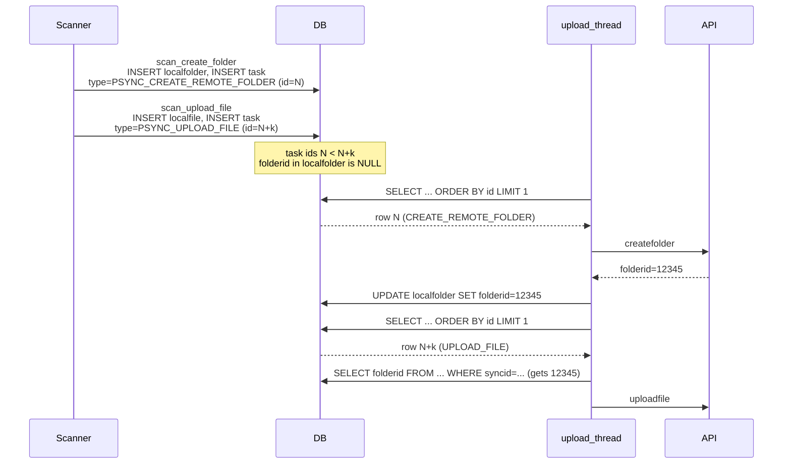

### The `inprogress` state machine

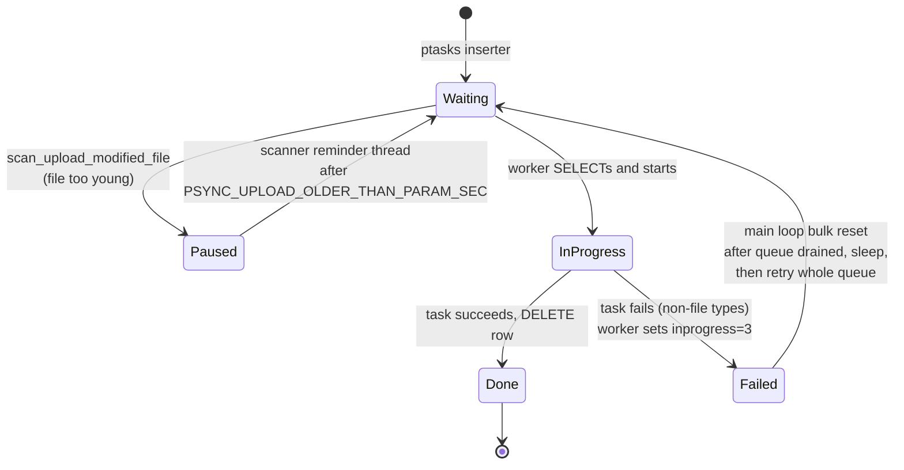

`inprogress` values are `PSYNC_TASK_WAITING (0)`, `PSYNC_TASK_INPROGR (1)`, `PSYNC_TASK_PAUSED (2)`, `PSYNC_TASK_FAILED (3)`. The Failed state is the queue-level safety net that prevents one persistently-failing task from monopolising the queue: when no `inprogress=0` rows remain, both worker threads bulk-reset all `inprogress=3` rows back to `0` (after a sleep) and start over.

### Missing-context handling on transfers

A representative example: download of a file whose containing local folder has been deleted between insertion and execution.

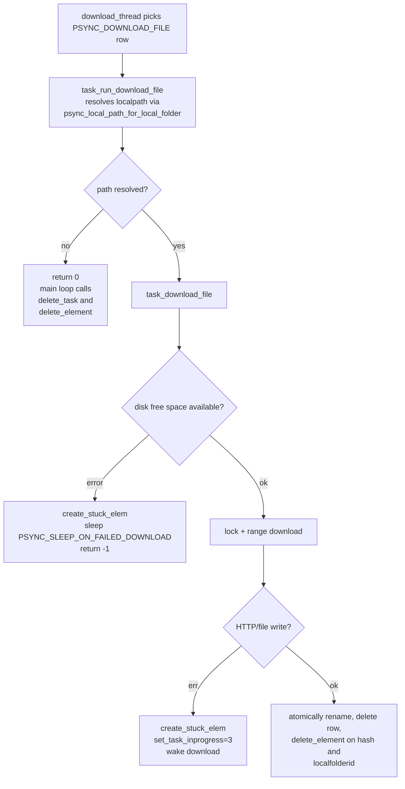

The same pattern applies to all non-file task types: the resolution layer is the FK join performed by helpers like `psync_get_path_by_fileid`, and an unresolved join becomes "return 0, drop the task."

### Obsolete-task cleanup

There are several explicit cleanup hooks beyond the worker-side "drop on missing context" behaviour. They exist where the engine knows a queued task has become provably obsolete because its target is gone or because a newer task supersedes it.

| Hook | Caller(s) | Effect |
|------|-----------|--------|
| `psync_delete_upload_tasks_for_file(localfileid)` | `scan_upload_modified_file`, `scan_delete_file`, `delete_local_folder_rec`, `delete_local_folder_from_db`, `task_del_folder_rec_do` | Removes any pending `PSYNC_UPLOAD_FILE` row for the file. Also stops in-flight uploads via `upload_list_t.stop`. |
| `psync_delete_download_tasks_for_file(fileid, syncid, deltemp)` | `pdiff.process_modifyfile`, `pdiff.process_deletefile` | Removes pending `PSYNC_DOWNLOAD_FILE` rows when the remote file changed/disappeared, optionally also deleting the partial download. |
| `psync_stop_sync_upload(syncid)` / `psync_stop_sync_download(syncid)` | sync-pair removal | Bulk-deletes all upload or download tasks for a syncid. (FK `ON DELETE CASCADE` from `syncfolder` ultimately handles the same rows, but this path lets the workers be told to stop too.) |
| Inline `DELETE FROM task WHERE type=PSYNC_CREATE_REMOTE_FOLDER ...` | `scan_delete_folder` after 50 retries | Drops a stuck folder-create when the same folder has been deleted locally before mkdir completed. |
| `delete_task(taskid)` | both worker main loops on success | The default "task is done" path. |

A useful concrete example is the modified-file flow:

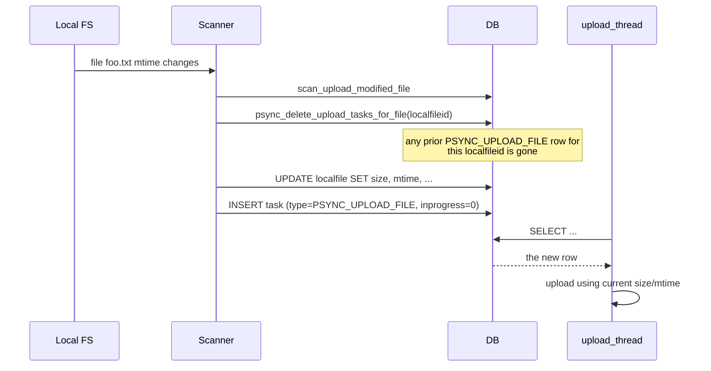

Without the proactive `psync_delete_upload_tasks_for_file`, a sequence of "modify, modify, modify" while offline would queue three uploads; with it, the queue collapses to a single upload of the latest content.

There are also specific cleanups inside `pfsupload.c`'s `clean_stuck_tasks()`, but those operate on the `fstask` table and are described in the previous section.

## Implications and Pitfalls

A few non-obvious behaviours that follow from the design above:

* **No backoff on transient errors.** A folder permission failure adds a stuck item; the next scanner cycle will rediscover the same folder and add the item again (only `retry_cnt` bumps). There is no mechanism that keeps a known-failing path *out* of the next scan; the only protection against repeated PEVENT firing is the `STUCK_ITEM_RETRY_COUNT+2` clamp inside `add_stuck_elem`.
* **`STUCK_MSG_NO_PERMISSION` is overloaded.** Every active call site uses this message, regardless of whether the underlying error was actually a permission denial, an ENOENT, an out-of-space, or a locked file. UI consumers should not treat it literally.
* **Stuck list is process-local.** Restarting the engine clears it. The user-visible "stuck count" emitted via `PEVENT_STUCK_OBJ_CNT` is therefore monotonically reset to 0 on every start.
* **Stuck list is decoupled from the queue.** A `task` row can be successfully drained (e.g. retried after a transient I/O error) without the matching stuck item being removed if the success path used a different id (path-hash vs file hash vs localfolderid). The dual-key `delete_element` calls in `task_run_download_file_thread` exist precisely because this is a known issue, but the symmetry is not enforced.
* **No global ordering across producers.** `pdiff` and `plocalscan` insert into the same table without coordination. If a remote create races with a local delete of the same name, the resulting two tasks are interleaved by row id alone. The bounded retry inside `scan_delete_folder` is the only place this is acknowledged in code.
* **`upload_tasks` rows have a separate state machine.** They use `PUPTASK_STATUS_*` constants and an explicit `error_code` column. Failure handling diverges from the `task` table: failures in this lane are reported only via `PEVENT_*` events, never via the in-memory stuck list.
* **`fstask.status=3` is not surfaced in the public stuck list.** UIs that show "stuck items" via `psync_get_stuck_list()` do not see crypto upload/mkdir tasks that have been parked for incompatibility reasons.

These observations point at concrete improvement directions for any future error-handling rework: typed `msg_id` values that survive into the UI, a unified retry/backoff policy that distinguishes *transient* from *terminal* errors, and a single source of truth that joins both stuck mechanisms with the queue rows that produced them.

## Cross-references

* `07-sync-engine.md` — outside view of the scanner, sync types, sync-pair management, platform notify backends.
* `08-file-transfers.md` — the upload/download workers, task-state diagrams, retry timing constants, P2P transfer fast-path.
* `09-fuse-filesystem.md` — `fstask`/`fstaskdepend` semantics and the FUSE write-back DAG.
* `02-database-and-storage.md` — full schema reference for `task`, `fstask`, `localfolder`, `localfile`, `upload_tasks`.
