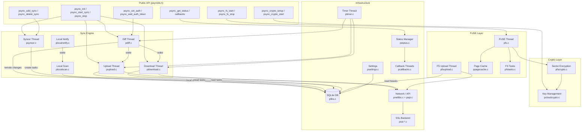

# pclsync Library Internals

This documentation set covers the internal architecture and design of the **pclsync** C library -- a ~96K LOC sync engine that powers the pCloud desktop client. It handles cloud file synchronization, a FUSE virtual filesystem, and client-side AES-256/RSA encryption.

The library is built in **GNU C99**, produces a static archive (`psynclib.a`), and runs on Linux, macOS, Windows, and BSD. It uses SQLite for persistent state, pthreads for concurrency, and a custom binary API protocol for server communication.

## What's in This Wiki

These documents explain *how the library works internally* -- not how to use the public API (see `psynclib.h` for that). They are ordered for progressive understanding: start at the top and each topic builds on the ones before it.

## Table of Contents

### Foundations

| # | Document                                                       | Summary                                                                                                       |
|---|----------------------------------------------------------------|---------------------------------------------------------------------------------------------------------------|
| 1 | [Library Lifecycle](01-library-lifecycle.md)                   | Init/start/stop/destroy sequence, lifecycle state machine, complete thread map, global state                  |
| 2 | [Database and Storage](02-database-and-storage.md)             | SQLite schema (20+ tables), pragma configuration, metadata organization, page cache, SQL helper API           |
| 3 | [Settings and Configuration](03-settings-and-configuration.md) | Two-tier settings system, all 23 settings with defaults, typed getters/setters, ignore patterns, speed limits |

### Identity and Observation

| # | Document                                           | Summary                                                                                                    |
|---|----------------------------------------------------|------------------------------------------------------------------------------------------------------------|
| 4 | [Authentication](04-authentication.md)             | Web-based login, token lifecycle, saveauth mechanism, logout vs unlink comparison                          |
| 5 | [Status and Callbacks](05-status-and-callbacks.md) | Six status dimensions, composite status calculation, callback delivery threads, event types and dispatch   |

### Core Sync Engine

| # | Document                               | Summary                                                                                                     |
|---|----------------------------------------|-------------------------------------------------------------------------------------------------------------|
| 6 | [Diff Engine](06-diff-engine.md)       | Remote change polling via subscribe/long-poll, diff processing pipeline, 27 event handlers, exception pipe  |
| 7 | [Sync Engine](07-sync-engine.md)       | Sync types, folder pair management, delayed syncs, local scanning, filesystem notifications, task creation  |
| 8 | [File Transfers](08-file-transfers.md) | Upload/download threads, task state machine, concurrency control, retry logic, P2P transfers, speed shaping |

### Specialized Subsystems

| #  | Document                                 | Summary                                                                                                     |
|----|------------------------------------------|-------------------------------------------------------------------------------------------------------------|
| 9  | [FUSE Filesystem](09-fuse-filesystem.md) | Virtual filesystem mount, all FUSE operations, path resolution, open file tracking, fstask system, fsupload |
| 10 | [Crypto Folder](10-crypto-folder.md)     | Key hierarchy (password → AES → RSA → per-folder/file keys), setup/start/stop flows, sector encryption      |
| 11 | [Scanner, Tasks and Stuck Items](11-scanner-tasks-and-stuck-items.md) | Scanner internals, task-table dependency model, in-memory stuck list, fstask.status=3, obsolete-task cleanup |

### Infrastructure

| #  | Document                                                     | Summary                                                                                                              |
|----|--------------------------------------------------------------|----------------------------------------------------------------------------------------------------------------------|
| 11 | [Debounce Rate Limiter](11-debounce-rate-limiter.md)         | Leading-edge + trailing/ceiling debounce for `prunratelimit.c`, timer state machine, anti-starvation ceiling mechanism |

## Architecture at a Glance



## Quick Reference

### Key Source Files

| File                                   | Purpose                                 |
|----------------------------------------|-----------------------------------------|
| `psynclib.c` / `psynclib.h`            | Public API, lifecycle management        |
| `pdiff.c`                              | Remote change detection and application |
| `psyncer.c`                            | Sync orchestration                      |
| `pupload.c` / `pdownload.c`            | File transfer threads                   |
| `plocalscan.c` / `plocalnotify.c`      | Local change detection                  |
| `pfs.c` / `pfsfolder.c` / `pfstasks.c` | FUSE filesystem                         |
| `pfsupload.c`                          | FUSE write-back uploads                 |
| `pcloudcrypto.c` / `pfscrypto.c`       | Encryption subsystem                    |
| `pstatus.c` / `pcallbacks.c`           | Status tracking and callback delivery   |
| `psettings.c` / `psettings.h`          | Configuration system                    |
| `plibs.c` / `pdatabase.h`              | SQLite database layer                   |
| `pcompat.c` / `pcompat.h`              | Platform abstraction                    |
| `pnetlibs.c` / `papi.c` / `papi.h`     | Network and binary API protocol         |
| `ptimer.c`                             | Timer infrastructure                    |
| `plocks.c`                             | Custom read-write locks                 |

### Threading Model

The library spawns 10-13 persistent threads at startup (depending on configuration) plus short-lived workers for individual file transfers and callback dispatch. All threads are pthreads. The master shutdown flag `psync_do_run` signals cooperative termination.

### Error Convention

Functions return `0` for success, `-1` for failure. The thread-local `psync_error` variable (read via `psync_get_last_error()`) holds the specific error code (`PERROR_*` constants).

### Debug Levels

```c
D_NONE(0)  D_BUG(10)  D_CRITICAL(20)  D_ERROR(30)  D_WARNING(40)  D_NOTICE(50)
```

Use the `debug(level, "format", ...)` macro which wraps `psync_debug()` with automatic file/function/line context.
